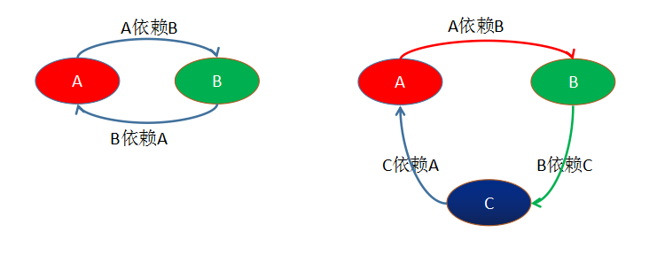
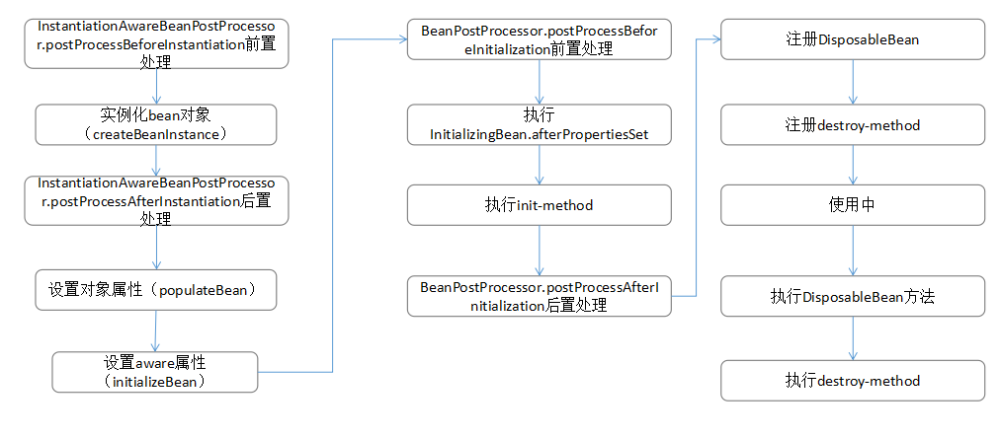
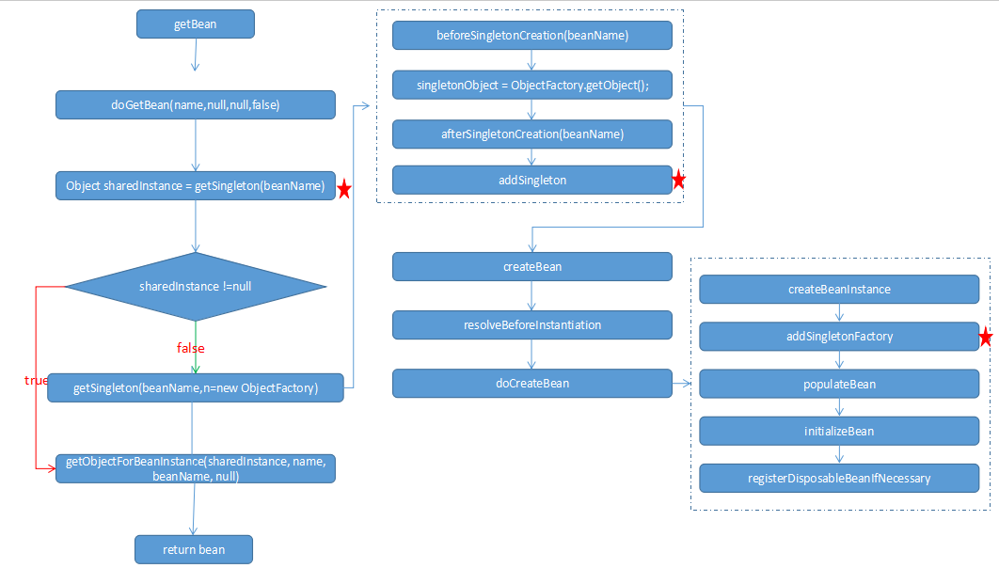

   循环依赖就是N个类中循环嵌套引用，如果在日常开发中我们用new 对象的方式发生这种循环依赖的话程序会在运行时一直循环调用，直至内存溢出报错，如下图所示：
   

循环依赖的情况：
- 构造器参数依赖
- setter方式singleton单例
- setter方式prototype多例

#### 1、构造器参数依赖
   Spring容器会将每一个正在创建的Bean 标识符放在一个“当前创建Bean池”中，Bean标识符在创建过程中将一直保持在这个池中，因此如果在创建Bean过程中发现自己已经在“当前创建Bean池”里时将抛出
BeanCurrentlyInCreationException异常表示循环依赖；而对于创建完毕的Bean将从“当前创建Bean池”中清除掉。
```java
public class StudentA {  

    private StudentB studentB ;  

    public void setStudentB(StudentB studentB) {  
        this.studentB = studentB;  
    }  

    public StudentA() {  
    }  

    public StudentA(StudentB studentB) {  
        this.studentB = studentB;  
    }  
}
public class StudentB {  

    private StudentC studentC ;  

    public void setStudentC(StudentC studentC) {  
        this.studentC = studentC;  
    }  

    public StudentB() {  
    }  

    public StudentB(StudentC studentC) {  
        this.studentC = studentC;  
    }  
}
public class StudentC {  

    private StudentA studentA ;  

    public void setStudentA(StudentA studentA) {  
        this.studentA = studentA;  
    }  

    public StudentC() {  
    }  

    public StudentC(StudentA studentA) {  
        this.studentA = studentA;  
    }  
}  
```
OK，上面是很基本的3个类，，StudentA有参构造是StudentB。StudentB的有参构造是StudentC，StudentC的有参构造是StudentA ，这样就产生了一个循环依赖的情况，我们都把这三个Bean交给Spring管理，并用有参构造实例化。
```xml
<bean id="a" class="com.zfx.student.StudentA">  
    <constructor-arg index="0" ref="b"></constructor-arg>  
</bean>  
<bean id="b" class="com.zfx.student.StudentB">  
    <constructor-arg index="0" ref="c"></constructor-arg>  
</bean>  
<bean id="c" class="com.zfx.student.StudentC">  
    <constructor-arg index="0" ref="a"></constructor-arg>  
</bean>
```
测试类：
```java
public class Test {  
    public static void main(String[] args) {  
        ApplicationContext context = new ClassPathXmlApplicationContext("com/zfx/student/applicationContext.xml");  
        //System.out.println(context.getBean("a", StudentA.class));  
    }  
}  
```
执行结果报错：
```console
Caused by: org.springframework.beans.factory.BeanCurrentlyInCreationException:   
    Error creating bean with name 'a': Requested bean is currently in creation: Is there an unresolvable circular reference?
```
>报错原因：
Spring容器先创建单例StudentA，StudentA依赖StudentB，然后将A放在“当前创建Bean池”中，此时创建StudentB,StudentB依赖StudentC ,然后将B放在“当前创建Bean池”中,此时创建StudentC，StudentC又依赖StudentA， 但是，此时Student已经在池中，所以会报错，，因为在池中的Bean都是未初始化完的，所以会依赖错误 ，（初始化完的Bean会从池中移除）

#### 2、setter的singleton依赖
bean的生命周期如下图：

##### 2.1缓存的定义
先看`DefaultSingletonBeanRegistry`关于缓存的定义
```java
/** Cache of singleton objects: bean name --> bean instance */
private final Map<String, Object> singletonObjects = new ConcurrentHashMap<String, Object>(256);

/** Cache of singleton factories: bean name --> ObjectFactory */
private final Map<String, ObjectFactory<?>> singletonFactories = new HashMap<String, ObjectFactory<?>>(16);

/** Cache of early singleton objects: bean name --> bean instance */
private final Map<String, Object> earlySingletonObjects = new HashMap<String, Object>(16);
/** Names of beans that are currently in creation */
private final Set<String> singletonsCurrentlyInCreation =
			Collections.newSetFromMap(new ConcurrentHashMap<String, Boolean>(16));
```
功能介绍：

| 缓存 | 用途 |
|-----|------|
| singletonObjects | 用于存放完全初始化好的 bean，从该缓存中取出的 bean 可以直接使用 |
| earlySingletonObjects | 存放原始的 bean 对象（尚未填充属性），用于解决循环依赖 |
| singletonFactories |  存放 bean 工厂对象，用于解决循环依赖 |

可以把`singletonObjects` 看做一级缓存，bean创建时默认会先从`singletonObjects `中取bean，并且在创建后直接将对象放入`singletonObjects `中缓存；`earlySingletonObjects `看做二级缓存，在bean创建时提前将ObjectFactory暴露给`singletonFactories `，这样就可以在对象创建完成之前也可以获得对象的引用。

##### 2.2bean创建的过程
bean的实例化流程图如下：

从`AbstarctBeanFactory`的`getBean`开始，是个空壳方法，直接调用`doGetBean(name, null, null, false)`，该方法的分析如下(只分析了比较重要部分的代码，其他地方有所省略)：
```java
protected <T> T doGetBean(
			final String name, final Class<T> requiredType, final Object[] args, boolean typeCheckOnly)
			throws BeansException {

	final String beanName = transformedBeanName(name);
	Object bean;

	// 在获取bean的时候优先从缓存中获取，对于新创建的对象，这里是无法获得值；对于依赖的对象，可能已经创建或者正在创建，
	//直接从缓存中获取，可以避免重复创建
	Object sharedInstance = getSingleton(beanName);①
	if (sharedInstance != null && args == null) {
		//判断你是否FactoryBean,如果是FactoryBean类型，则调用getObject方法注入的实际对象
		bean = getObjectForBeanInstance(sharedInstance, name, beanName, null);
	}

	else {
		// 对于作用域为prototype的bean，每次请求都会创建一个实例对象，
		// 如果正在创建或已经创建，则异常，原因为：对于prototype作用域的bean，
		// Spring不会进行缓存，因此无法提前暴露一个创建中的bean
		if (isPrototypeCurrentlyInCreation(beanName)) {
			throw new BeanCurrentlyInCreationException(beanName);
		}

		...

		try {
			final RootBeanDefinition mbd = getMergedLocalBeanDefinition(beanName);

			// 此处用于实例化bean的依赖，比如A依赖B，如果B还未实例化，则先实例化B；
			// 即调用getBean对B进行实例化
			String[] dependsOn = mbd.getDependsOn();
			if (dependsOn != null) {
				for (String dep : dependsOn) {
					registerDependentBean(dep, beanName);
					getBean(dep);
				}
			}

			// socpe="singleton"的情况
			if (mbd.isSingleton()) {
				// 此处的关键在于创建的匿名对象ObjectFactory及getObject方法，getObject为实际创建bean实例的地方
				sharedInstance = getSingleton(beanName, new ObjectFactory<Object>() {
					@Override
					public Object getObject() throws BeansException {
						try {
							// 创建bean的关键
							return createBean(beanName, mbd, args);
						}
						catch (BeansException ex) {
							destroySingleton(beanName);
							throw ex;
						}
					}
				});②
				bean = getObjectForBeanInstance(sharedInstance, name, beanName, mbd);
			}
			// scope="prototype"的情况
			else if (mbd.isPrototype()) {
				Object prototypeInstance = null;
				try {
					//创建prototype对象时的前置处理：用于设置ThreadLocal变量，表示bean正在创建
					beforePrototypeCreation(beanName);
					//prototype的核心依然是调用createBean
					prototypeInstance = createBean(beanName, mbd, args);
				}
				finally {
					//创建prototype对象时的后置处理：移除ThreadLocal变量
					afterPrototypeCreation(beanName);
				}
				bean = getObjectForBeanInstance(prototypeInstance, name, beanName, mbd);
			}
			//scope作用域为其他值的情况：比如request、session及globalSession
			else {
				String scopeName = mbd.getScope();
				final Scope scope = this.scopes.get(scopeName);
				if (scope == null) {
					throw new IllegalStateException("No Scope registered for scope name '" + scopeName + "'");
				}
				try {
					//调用实际作用域处理方法，此处也设置了ObjectFactory对象及调用的createBean方法
					Object scopedInstance = scope.get(beanName, new ObjectFactory<Object>() {
						@Override
						public Object getObject() throws BeansException {
							beforePrototypeCreation(beanName);
							try {
								return createBean(beanName, mbd, args);
							}
							finally {
								afterPrototypeCreation(beanName);
							}
						}
					});
					bean = getObjectForBeanInstance(scopedInstance, name, beanName, mbd);
				}
				catch (IllegalStateException ex) {
					throw new BeanCreationException(beanName,
							"Scope '" + scopeName + "' is not active for the current thread; consider " +
							"defining a scoped proxy for this bean if you intend to refer to it from a singleton",
							ex);
				}
			}
		}
		catch (BeansException ex) {
			cleanupAfterBeanCreationFailure(beanName);
			throw ex;
		}
	}

	return (T) bean;
}
```
代码中已经标识比较重要的部分，现在对其进行分析，其中①处：
**`Object sharedInstance = getSingleton(beanName)`**，具体调用的方法为：
```java
//用于解决单例循环依赖的问题，此处allowEarlyReference为true，即允许早期引用（可能对象刚使用构造函数实例化，还未设置实例的属性等，属于未完全实例化的对象，但是持有该对象的引用，等对象完全初始化后可直接使用）
protected Object getSingleton(String beanName, boolean allowEarlyReference) {
        //先从singletonObjects中获取，新创建的此处为空，新建对象在此处返回null后并不会执行
        //下面的代码，会返回，调用②出的getSingleton(beanName, ObjectFactory)方法；
        //只有在存在被依赖并且该实例正在创建的的情况下才会继续执行
		Object singletonObject = this.singletonObjects.get(beanName);
        //如果尚未创建并且此对象为正在创建的单例
		if (singletonObject == null && isSingletonCurrentlyInCreation(beanName)) {
			synchronized (this.singletonObjects) {
               //从earlySingletonObjects中获取，ObjectFactory调用后会将对象放到此处缓存
				singletonObject = this.earlySingletonObjects.get(beanName);
                //此处允许早期引用
				if (singletonObject == null && allowEarlyReference) {
                    //获取ObjectFactory工厂，使用对应的ObjectFactory创建bean
					ObjectFactory<?> singletonFactory = this.singletonFactories.get(beanName);
					if (singletonFactory != null) {
                        //此处调用注册的匿名ObjectFactory方法，实际调用的是getEarlyBeanReference方法（AbstractAutowireCapableBeanFactory的doCreateBean中注册的，暴露出的实例引用）
						singletonObject = singletonFactory.getObject();
                        //创建后将此单例设置到earlySingletonObjects缓存
						this.earlySingletonObjects.put(beanName, singletonObject);
						this.singletonFactories.remove(beanName);
					}
				}
			}
		}
		return (singletonObject != NULL_OBJECT ? singletonObject : null);
	}
```
标识②中的代码，即：
**getSingleton(String beanName, ObjectFactory<?> singletonFactory)**方法，此处对对bean进行实例化操作，并将其加入到缓存，代码如下：

```java
public Object getSingleton(String beanName, ObjectFactory<?> singletonFactory) {
	//加锁，避免重复执行创建
	synchronized (this.singletonObjects) {
		//双重检查singletonObjects缓存，避免被其他依赖的对象创建完成
		Object singletonObject = this.singletonObjects.get(beanName);
		if (singletonObject == null) {
		     ...
		    //前置处理：设置到singletonsCurrentlyInCreation中，表示此单例正在创建
			beforeSingletonCreation(beanName);
			boolean newSingleton = false;
			...

			try {
			    //调用getObject方法，实际就是调用createBean方法
				singletonObject = singletonFactory.getObject();③
				newSingleton = true;
			}
			catch (IllegalStateException ex) {
			    throw ex
			}
			catch (BeanCreationException ex) {
				throw ex;
			}
			finally {
				//后置处理：从singletonsCurrentlyInCreation中移除，表示对象创建完毕
				afterSingletonCreation(beanName);
			}
			if (newSingleton) {
				//bean完成实例化将其放入singletonObjects缓存，并清除singletonFactories和earlySingletonObjects
				addSingleton(beanName, singletonObject);
			}
		}
		return (singletonObject != NULL_OBJECT ? singletonObject : null);
	}
}
```
在创建实例后将其放入缓存中：
```java
protected void addSingleton(String beanName, Object singletonObject) {
		synchronized (this.singletonObjects) {
			this.singletonObjects.put(beanName, (singletonObject != null ? singletonObject : NULL_OBJECT));
			this.singletonFactories.remove(beanName);
			this.earlySingletonObjects.remove(beanName);
			this.registeredSingletons.add(beanName);
		}
}
```
下面分析上面标识③的代码，实际执行的就是注册ObjectFactory的getObject方法，即createBean方法：
```java
@Override
protected Object createBean(String beanName, RootBeanDefinition mbd, Object[] args) throws BeanCreationException {

	RootBeanDefinition mbdToUse = mbd;
	....

	try {
		// 此处针对存在targetClass的bean，在实例化之前执行注册InstantiationAwareBeanPostProcessor
		//的postProcessBeforeInstantiation方法，比如执行AbstractAutoProxyCreateor创建代理类，此处以后介绍
		Object bean = resolveBeforeInstantiation(beanName, mbdToUse);
		if (bean != null) {
			return bean;
		}
	}
	catch (Throwable ex) {
		throw new BeanCreationException(mbdToUse.getResourceDescription(), beanName,
				"BeanPostProcessor before instantiation of bean failed", ex);
	}
	//创建bean的实例
	Object beanInstance = doCreateBean(beanName, mbdToUse, args);
	if (logger.isDebugEnabled()) {
		logger.debug("Finished creating instance of bean '" + beanName + "'");
	}
	return beanInstance;
}
```
最终创建bean实例的地方是doCreateBean，此方法比较复杂，单最关键的就几处，分别为：
- [x] createBeanInstance(beanName, mbd, args)
- [ ] applyMergedBeanDefinitionPostProcessors(mbd, beanType, beanName)
- [ ] addSingletonFactory(beanName, ObjectFactory)
- [x] populateBean(beanName, mbd, instanceWrapper)
- [x] initializeBean(beanName, exposedObject, mbd)
- [ ] getSingleton(beanName, false)
- [x] registerDisposableBeanIfNecessary
其中最重要的为上面重点标识的部分
```java
protected Object doCreateBean(final String beanName, final RootBeanDefinition mbd, final Object[] args)
			throws BeanCreationException {

	// Instantiate the bean.
	BeanWrapper instanceWrapper = null;
	...
	if (instanceWrapper == null) {
		//创建bean的实例：实际调用构造方法进行反射创建实例
		instanceWrapper = createBeanInstance(beanName, mbd, args);①
	}
	...
	// Allow post-processors to modify the merged bean definition.
	synchronized (mbd.postProcessingLock) {
		if (!mbd.postProcessed) {
			try {
				//bean合并后的处理，Autowired注解正是通过此方法实现诸如类型的预解析
				applyMergedBeanDefinitionPostProcessors(mbd, beanType, beanName);②
			}
			catch (Throwable ex) {
				throw new BeanCreationException(mbd.getResourceDescription(), beanName,
						"Post-processing of merged bean definition failed", ex);
			}
			mbd.postProcessed = true;
		}
	}

	// 判断是否需要早期暴露：即是单例、允许循环依赖并且已经正在创建中，
	// 此处设置bean的ObjectFactory，用于bean的暴露，处理循环依赖的情况
	boolean earlySingletonExposure = (mbd.isSingleton() && this.allowCircularReferences &&
			isSingletonCurrentlyInCreation(beanName));
	if (earlySingletonExposure) {
		if (logger.isDebugEnabled()) {
			logger.debug("Eagerly caching bean '" + beanName +
					"' to allow for resolving potential circular references");
		}
		//实例化后就暴露到singletonFactories缓存中
		addSingletonFactory(beanName, new ObjectFactory<Object>() {
			@Override
			public Object getObject() throws BeansException {
				//如果不存在代理，则直接返回，否则调用SmartInstantiationAwareBeanPostProcessor
				//的getEarlyBeanReference方法，即做增强处理
				return getEarlyBeanReference(beanName, mbd, bean);
			}
		});③
	}

	// Initialize the bean instance.
	Object exposedObject = bean;
	try {
		//处理属性依赖
		populateBean(beanName, mbd, instanceWrapper);④
		if (exposedObject != null) {
			//执行aware、BeanPostProcessor及InitializeBean、init-method处理
			exposedObject = initializeBean(beanName, exposedObject, mbd);⑤
		}
	}
	catch (Throwable ex) {
		if (ex instanceof BeanCreationException && beanName.equals(((BeanCreationException) ex).getBeanName())) {
			throw (BeanCreationException) ex;
		}
		else {
			throw new BeanCreationException(
					mbd.getResourceDescription(), beanName, "Initialization of bean failed", ex);
		}
	}

	if (earlySingletonExposure) {
		//调用getSingleton方法，此处最多执行到earlySingletonObjects缓存中取对象
		Object earlySingletonReference = getSingleton(beanName, false);
		if (earlySingletonReference != null) {
			//如果对bean进行了增强处理，此处为false
			if (exposedObject == bean) {
				exposedObject = earlySingletonReference;
			}
			//处理存在依赖此bean的其他bean的情况
			else if (!this.allowRawInjectionDespiteWrapping && hasDependentBean(beanName)) {
				//获得依赖此bean的bean名称
				String[] dependentBeans = getDependentBeans(beanName);
				Set<String> actualDependentBeans = new LinkedHashSet<String>(dependentBeans.length);
				for (String dependentBean : dependentBeans) {
					//如果dependentBean已经实例化，则放入actualDependentBeans中
					if (!removeSingletonIfCreatedForTypeCheckOnly(dependentBean)) {
						actualDependentBeans.add(dependentBean);
					}
				}
				//在此bean实例化完成之前，依赖此bean的其他bean存在已经实例化完成的情况，
				//不如何先处理依赖bean，再处理被依赖bean的情况
				if (!actualDependentBeans.isEmpty()) {
					throw new BeanCurrentlyInCreationException(beanName,
							"Bean with name '" + beanName + "' has been injected into other beans [" +
							StringUtils.collectionToCommaDelimitedString(actualDependentBeans) +
							"] in its raw version as part of a circular reference, but has eventually been " +
							"wrapped. This means that said other beans do not use the final version of the " +
							"bean. This is often the result of over-eager type matching - consider using " +
							"'getBeanNamesOfType' with the 'allowEagerInit' flag turned off, for example.");
				}
			}
		}
	}

	// 注册DisposableBean和destory-method，用于bean销毁时的回调处理
	try {
		registerDisposableBeanIfNecessary(beanName, bean, mbd);
	}
	catch (BeanDefinitionValidationException ex) {
		throw new BeanCreationException(
				mbd.getResourceDescription(), beanName, "Invalid destruction signature", ex);
	}

	return exposedObject;
}
```

综上所述，对于循环依赖，比如A依赖B，B依赖A，在A进行实例化的时候，即调用getBean的时候，执行完createBeanInstance方法，会将A的实例通过ObjectFactory注册到singletonFactories中提前暴露，在设置A的属性的时候，即执行populateBean的时候，发现依赖的属性B尚未实例化，则针对B调用getBean方法，再处理B的实例化时，针对依赖的A会调用getBean的getSingleton方法，进而调用singletonFactories缓存中注册ObjectFactory的getObject方法，即getEarlyBeanReference方法，得到A的实例引用，然后返回处理完成B的实例化，再进行A的实例化处理，进而处理了循环依赖的问题。
####3、setter的prototype依赖
Spring无法处理prototype的循环依赖问题，因为无法对prototype作用域的对象进行缓存，会报如下异常：
```console
Caused by: org.springframework.beans.factory.BeanCurrentlyInCreationException:
```
Spring针对循环依赖的分析暂时到这里，其中包含了部分对bean实例化过程的分析，接下来实例化bean的时候具体的处理过程，即上述标识的三个部分，会在下一章节进行分析。
