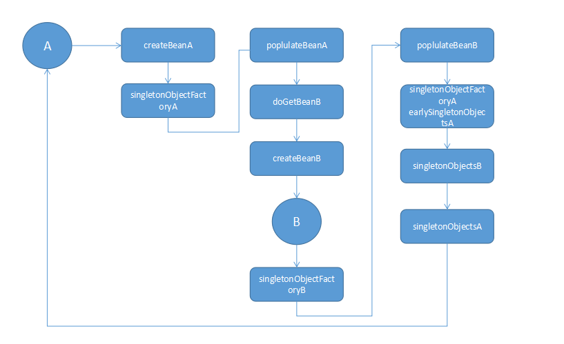

## Spring循环依赖补充

 在前面已经分析过Spring的循环依赖，现在对Spring的循环依赖进行下总结：
我们知道在bean实例化的时候，比如A依赖B，B依赖A，这就构成了循环依赖，而且只有在单例情况下才允许循环依赖，prototype情况下循环依赖会报异常，无法处理，所以所说的循环依赖就是指单例下的循环依赖。
> 1、实例化A：在A实例化createBeanInstance之后，会调用addSingletonFactory将A的实例引用提前暴露到singletonFactories中。
2、处理A的依赖：通过populateBean处理依赖，这时B尚未实例化，则会通过调用AbstractBeanFactory的getBean获取B，最终也是调用了createBeanInstance完成B的实例化，
同样调用addSingletonFactory将B的实例提前暴露到singletonFactories中。
3、B在处理依赖的时候发现依赖A，也会调用getBean获取A，调用到doGetBean，默认先从缓冲中取（为什么？因为单例情况，避免重复初始化），即调用getSingleton方法，通过singletonObjects、
earlySingletonObjects和singletonFactories三级缓存的判断，最终调用singletonFactory获取A，此时将A的实例引用设置到B中，B就持有了A的实例引用，虽然A现在还没有处理完成。通过singletonFactory获得A的实例之后，会将该实例放入到earlySingletonObjects中，下次再有A的就不用到最后一级singletonFactories获取了。
4、B完成了实例化，会将实例放入到earlySingletonObjects中，最后返回到A的依赖处理，设置B，最终完成A的实例化依赖处理，将A也放入到earlySingletonObjects中。
整个过程大致是如此，文字描述比较啰嗦，可以通过下面代码进行分析。

### 创建bean的实例
对于尚未初始化的单例bean来说，是通过调用getSingleton方法，方法参数包含注册的匿名函数ObjectFactory，然后实际调用objectFactory.getObject完成实例化，objectFactory.getObject实际调用的为createBean方法，在objectFactory.getObject调用完成即实例化完成后会将bean让入到singletonObjects中。
```
protected <T> T doGetBean(
			final String name, final Class<T> requiredType, final Object[] args, boolean typeCheckOnly)
			throws BeansException {
      //...

      //1、先缓存取：
      //①如果是第一次获取bean并且bean尚未实例化，则此处为null
      //②如果bean已经实例化，其他bean依赖此bean，分为两种情况：
      //bean完全实例化，直接从singleObject获取；
      //bean只是调用了构造函数完成实例化，则从注册的singletonObjectFatory调
      //用ObjectFactory的getObject方法，并放入earlySingletonObjects中。
      Object sharedInstance = getSingleton(beanName);

      //2、调用getSingleton方法，第二个参数为注册的匿名函数，实际调用createBean方法
      if (mbd.isSingleton()) {
					sharedInstance = getSingleton(beanName, new ObjectFactory<Object>() {
						@Override
						public Object getObject() throws BeansException {
							try {
								return createBean(beanName, mbd, args);
							}
							catch (BeansException ex) {
							}
						}
					});
					bean = getObjectForBeanInstance(sharedInstance, name, beanName, mbd);
				}
    //...
}

//获取单例实例
public Object getSingleton(String beanName, ObjectFactory<?> singletonFactory) {
  //...
  //1、前置：设置实例化进行中标识：放入singletonsCurrentlyInCreation中，其他实例引用的时候会有判断，用于提前暴露实例
  beforeSingletonCreation(beanName);

  //...
  //2、整个实例化过程就是在这一步发生，就是上面说的createBean方法
  singletonObject = singletonFactory.getObject();
	newSingleton = true;

  //3、实例化完成，清除singletonsCurrentlyInCreation标识
  afterSingletonCreation(beanName);

  //4、将完成实例化的bean放入到singletonObjects中，再有其他bean引用的时候，就可以直接
  //从缓存中取到完全实例化的bean，并清除singletonFactories、earlySingletonObjects关于此bean的缓存
  if (newSingleton) {
		addSingleton(beanName, singletonObject);
	}
}

//完全实例化完成后放入singletonObjects缓存
protected void addSingleton(String beanName, Object singletonObject) {
		synchronized (this.singletonObjects) {
		this.singletonObjects.put(beanName, (singletonObject != null ? singletonObject : NULL_OBJECT));
		this.singletonFactories.remove(beanName);
		this.earlySingletonObjects.remove(beanName);
		this.registeredSingletons.add(beanName);
	}
}
```
### bean的实例化过程
调用AbstractAutowireCapableBeanFactory的createBean创建bean，将bean的引用放入到缓存
```
protected Object doCreateBean(final String beanName, final RootBeanDefinition mbd, final Object[] args)
			throws BeanCreationException {

    //1、实例化bean，即调用构造函数实例化
    createBeanInstance(beanName, mbd, args);

    //2、判断是否允许循序依赖，如果允许，则将bean实例放入到ObjectFactory工厂
    //其他实例调用则通过getEarlyBeanReference得到实例化数据
    //此处是循环依赖的第一步：将实例引用放入singletonFactories
    boolean earlySingletonExposure = (mbd.isSingleton() && this.allowCircularReferences &&
				isSingletonCurrentlyInCreation(beanName));
		if (earlySingletonExposure) {
			if (logger.isDebugEnabled()) {
				logger.debug("Eagerly caching bean '" + beanName +
						"' to allow for resolving potential circular references");
			}
			addSingletonFactory(beanName, new singletonFactories<Object>() {
				@Override
				public Object getObject() throws BeansException {
					return getEarlyBeanReference(beanName, mbd, bean);
				}
			});
		}


    //3、处理依赖
    populateBean(beanName, mbd, instanceWrapper);

    //设置BeanNameAware、BeanClassLoaderAware、BeanFactoryAware
    //调用BeanPostProcessor的applyBeanPostProcessorsBeforeInitialization方法
    //调用InitializingBean、init-method
    //调用BeanPostProcessor的applyBeanPostProcessorsAfterInitialization方法
    Object exposedObject = initializeBean(beanName, exposedObject, mbd);

    //4、注册DisposableBean和distory-method方法
    registerDisposableBeanIfNecessary(beanName, bean, mbd);

}
```
### 初步实例化的bean放入缓存工厂singletonFactories
调用DefaultSingletonBeanRegistry的addSingletonFactory提前暴露bean的实例引用。
```
protected void addSingletonFactory(String beanName, ObjectFactory<?> singletonFactory) {
	Assert.notNull(singletonFactory, "Singleton factory must not be null");
	synchronized (this.singletonObjects) {
		if (!this.singletonObjects.containsKey(beanName)) {
      //将实现的匿名函数ObjectFactory放入到singletonFactories中
			this.singletonFactories.put(beanName, singletonFactory);
			this.earlySingletonObjects.remove(beanName);
			this.registeredSingletons.add(beanName);
		}
	}
}
```
### ObjectFactory调用getObject方法
此处调用是在AbstractBeanFatory的doGetBean方法，通过getSingleton方法最终调用到之前注册的ObjectFactory的getObject方法，即调用getEarlyBeanReference方法。
```
//如果没有SmartInstantiationAwareBeanPostProcessor相关，直接返回bean实例
protected Object getEarlyBeanReference(String beanName, RootBeanDefinition mbd, Object bean) {
	Object exposedObject = bean;
	if (bean != null && !mbd.isSynthetic() && hasInstantiationAwareBeanPostProcessors()) {
		for (BeanPostProcessor bp : getBeanPostProcessors()) {
			if (bp instanceof SmartInstantiationAwareBeanPostProcessor) {
				SmartInstantiationAwareBeanPostProcessor ibp = (SmartInstantiationAwareBeanPostProcessor) bp;
				exposedObject = ibp.getEarlyBeanReference(exposedObject, beanName);
				if (exposedObject == null) {
					return null;
				}
			}
		}
	}
	return exposedObject;
}
```
### DefaultSingletonBeanRegistry的getSingleton方法获取实例
```
protected Object getSingleton(String beanName, boolean allowEarlyReference) {
  //1、如果完全初始化，则此处singletonObject不为空，下面的if判断就为false为什么？下面会分析：
		Object singletonObject = this.singletonObjects.get(beanName);
    //2、尚未完全初始化，即ObjectFatory.getObject方法还没有执行完成，
	if (singletonObject == null && isSingletonCurrentlyInCreation(beanName)) {
		synchronized (this.singletonObjects) {
      //3、如果调用了singletonFactory.getObject()，即getEarlyBeanReference方法，则此处不为空，
			singletonObject = this.earlySingletonObjects.get(beanName);
      //尚未完全初始化，并且允许循环依赖，则调用objectFatory.getObject方法，即
      //getEarlyBeanReference方法，并放入earlySingletonObjects中
			if (singletonObject == null && allowEarlyReference) {
				ObjectFactory<?> singletonFactory = this.singletonFactories.get(beanName);
				if (singletonFactory != null) {
					singletonObject = singletonFactory.getObject();
					this.earlySingletonObjects.put(beanName, singletonObject);
					this.singletonFactories.remove(beanName);
				}
			}
		}
	}
	return (singletonObject != NULL_OBJECT ? singletonObject : null);
}
```
整体处理过程如图：

