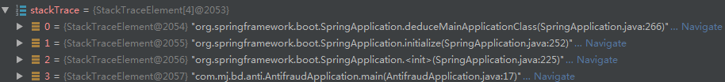

### SpringBoot启动流程

SpringBoot的启动从main方法开始：
```java
@SpringBootApplication
public class DemoApplication {

	public static void main(String[] args) {
		SpringApplication.run(DemoApplication.class, args);
	}
}
```
整个流程从这一行代码开始，先执行SpringApplication的构造函数。
#### 1.initialize
此方法用于web环境的判断、初始化器、监听器的配置获取，是启动前的准备工作。
```java
private void initialize(Object[] sources) {
		if (sources != null && sources.length > 0) {
			this.sources.addAll(Arrays.asList(sources));
		}
        //检测是否web环境，根据此参数决定使用上下文applicationContext
		this.webEnvironment = deduceWebEnvironment();
        //设置ApplicationContextInitializer实现类
		setInitializers((Collection) getSpringFactoriesInstances(
				ApplicationContextInitializer.class));
        //设置监听器
		setListeners((Collection) getSpringFactoriesInstances(ApplicationListener.class));
        //获取主类，通过线程栈得到
		this.mainApplicationClass = deduceMainApplicationClass();
	}
```
1>、deduceWebEnvironment通过判断当前环境中是否包含**javax.servlet.Servlet**,
**org.springframework.web.context.ConfigurableWebApplicationContext**这两个类来判断是否为web环境；
```java
private boolean deduceWebEnvironment() {
		for (String className : WEB_ENVIRONMENT_CLASSES) {
			if (!ClassUtils.isPresent(className, null)) {
				return false;
			}
		}
		return true;
	}
```
2>、其中Initializer和Listeners实现，是通过SpringFactoriesLoader加载器加载各jar包中`META-INF/spring.factories`文件的配置信息。
spring.factories配置结构如下：
```
# Initializers
org.springframework.context.ApplicationContextInitializer=\
org.springframework.boot.autoconfigure.SharedMetadataReaderFactoryContextInitializer,\
org.springframework.boot.autoconfigure.logging.AutoConfigurationReportLoggingInitializer
```
3>、mainApplicationClass的获取通过栈帧查找main函数获取的，其结构图如下：

2、run方法
```java
public ConfigurableApplicationContext run(String... args) {
	StopWatch stopWatch = new StopWatch();
	//启动计时器
	stopWatch.start();
	ConfigurableApplicationContext context = null;
	FailureAnalyzers analyzers = null;
	configureHeadlessProperty();
	//获得SpringApplicationRunListener实例，然后使用SimpleApplicationEventMulticaster
	//ApplicationStartedEvent事件
	SpringApplicationRunListeners listeners = getRunListeners(args);
	listeners.starting();
	try {
		ApplicationArguments applicationArguments = new DefaultApplicationArguments(
				args);
		//配置环境变量，加载application.properties配置文件信息，包括spring.profile.active配置
		//及相关配置文件的读取
		ConfigurableEnvironment environment = prepareEnvironment(listeners,
				applicationArguments);
		//banner打印
		Banner printedBanner = printBanner(environment);
		//实例化applicationContext，如果为web环境，则为AnnotationConfigEmbeddedWebApplicationContext，
		//否则为AnnotationConfigApplicationContext
		context = createApplicationContext();
		analyzers = new FailureAnalyzers(context);
		//进行applicationContext的装配工作，比如设置Evironment环境变量，beanNameGenerator和resourceLoader，
		//
		prepareContext(context, environment, listeners, applicationArguments,
				printedBanner);
		refreshContext(context);
		afterRefresh(context, applicationArguments);
		listeners.finished(context, null);
		stopWatch.stop();
		if (this.logStartupInfo) {
			new StartupInfoLogger(this.mainApplicationClass)
					.logStarted(getApplicationLog(), stopWatch);
		}
		return context;
	}
	catch (Throwable ex) {
		handleRunFailure(context, listeners, analyzers, ex);
		throw new IllegalStateException(ex);
	}
}
```
