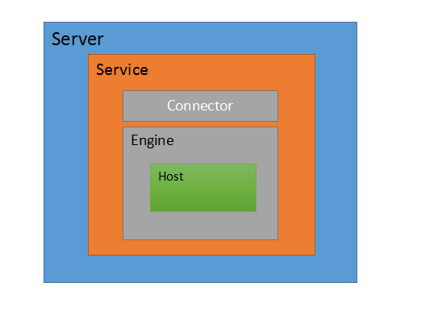

## SpringBoot使用内嵌tomcat启动处理流程代码分析

> SpringBoot通过使用内嵌Tomcat，避免了直接安装tomcat并打包成war包形式部署的繁琐，基于自动配置，直接打成fatjar形式运行，便于开发和微服务使用。

SpringBoot的启动代码如下：
```java
@SpringBootApplication
public class MyApplication {
	public static void main(String[] args) {
    SpringApplication.run(MyApplication.class, args);
	}
}
```
代码分析就从SpringApplication开始，会进行创建此类的实例，执行以下方法：
```java
public SpringApplication(Object... sources) {
		initialize(sources);
}
```
在`initialize`方法中
```java
private void initialize(Object[] sources) {
	  //...省略
    //检测是否为web环境的关键，决定ApplicationContext使用哪个类进行实例化
		this.webEnvironment = deduceWebEnvironment();
		//...省略
}
```
检测是否为web环境的判断：
```java
private static final String[] WEB_ENVIRONMENT_CLASSES = { "javax.servlet.Servlet",
			"org.springframework.web.context.ConfigurableWebApplicationContext" };
private boolean deduceWebEnvironment() {
		for (String className : WEB_ENVIRONMENT_CLASSES) {
			if (!ClassUtils.isPresent(className, null)) {
				return false;
			}
		}
		return true;
}
```
也就是说必须有`javax.servlet.Servlet`和`org.springframework.web.context.ConfigurableWebApplicationContext`的存在，web环境依赖于这两个类，Servlet不必说，ConfigurableWebApplicationContext用于web环境的ApplicationContext，设置ServletContext和ServletConfig等。
在SpringApplication类中的`run`方法中关于创建ApplicationContext的代码如下：
```java
//SpringBoot启动运行的关键方法
public ConfigurableApplicationContext run(String... args) {
    //...省略
    ConfigurableApplicationContext context = null;
    //...省略
    context = createApplicationContext();
    //...省略
    refreshContext(context);
    //...省略
}

//创建Spring应用上下文
protected ConfigurableApplicationContext createApplicationContext() {
		Class<?> contextClass = this.applicationContextClass;
		if (contextClass == null) {
			try {
        //根据当前环境选择使用的实例化类，可以看到web环境下使用的类为：
        //org.springframework.boot.context.embedded.AnnotationConfigEmbeddedWebApplicationContext
				contextClass = Class.forName(this.webEnvironment
						? DEFAULT_WEB_CONTEXT_CLASS : DEFAULT_CONTEXT_CLASS);
			}
			catch (ClassNotFoundException ex) {
				throw new IllegalStateException(
						"Unable create a default ApplicationContext, "
								+ "please specify an ApplicationContextClass",
						ex);
			}
		}
		return (ConfigurableApplicationContext) BeanUtils.instantiate(contextClass);
	}

public static final String DEFAULT_WEB_CONTEXT_CLASS = "org.springframework."
			+ "boot.context.embedded.AnnotationConfigEmbeddedWebApplicationContext";
public static final String DEFAULT_CONTEXT_CLASS = "org.springframework.context."
			+ "annotation.AnnotationConfigApplicationContext";
```
其中`AnnotationConfigEmbeddedWebApplicationContext`继承至`mbeddedWebApplicationContext`，最终也是继承至`AbstractApplicationContext`，具体的可以查看该类的集成关系。
已经知道了web环境上下文使用的实例化类，那么SpringBoot何时进行tomcat相关的初始化和启动工作的呢？答案就在refreshContext中，此类是Spring处理的关键，最终会调用到AbstractApplicationContext类中：
```java
protected void refresh(ApplicationContext applicationContext) {
		Assert.isInstanceOf(AbstractApplicationContext.class, applicationContext);
		((AbstractApplicationContext) applicationContext).refresh();
}
```
关于`refresh`方法的具体分析不多做处理，在之前的SpringBoot启动中已经分析过了，直接步入正题：
```java
public void refresh() throws BeansException, IllegalStateException {
		synchronized (this.startupShutdownMonitor) {
		  //...省略

			try {
				//...省略

				// tomcat的处理就在此方法，EmbeddedWebApplicationContext对此方法进行了重写
				onRefresh();

				//...省略
			}

			catch (BeansException ex) {
				//...省略
			}

			finally {
			 //...省略
			}
		}
}

//EmbeddedWebApplicationContext中的onRefresh方法
protected void onRefresh() {
    //先调用父类，即最终AbstractApplicationContext的此方法
		super.onRefresh();
		try {
      //创建内嵌Servlet容器，不止tomcat，SpringBoot会根据依赖的容器进行实例化，可以使用jetty、tomcat、undertow等
			createEmbeddedServletContainer();
		}
		catch (Throwable ex) {
			throw new ApplicationContextException("Unable to start embedded container",
					ex);
		}
	}
```
下面看`createEmbeddedServletContainer`方法：
```java
private void createEmbeddedServletContainer() {
		EmbeddedServletContainer localContainer = this.embeddedServletContainer;
		ServletContext localServletContext = getServletContext();
		if (localContainer == null && localServletContext == null) {
      //①创建容器工厂，即选择哪个内嵌服务器
			EmbeddedServletContainerFactory containerFactory = getEmbeddedServletContainerFactory();
      //②创建内嵌容器：包括容器的初始化、启动及请求处理
			this.embeddedServletContainer = containerFactory
					.getEmbeddedServletContainer(getSelfInitializer());
		}
		else if (localServletContext != null) {
			try {
				getSelfInitializer().onStartup(localServletContext);
			}
			catch (ServletException ex) {
				throw new ApplicationContextException("Cannot initialize servlet context",
						ex);
			}
		}
		initPropertySources();
}
```
①处`getEmbeddedServletContainerFactory`方法如下：
```java
protected EmbeddedServletContainerFactory getEmbeddedServletContainerFactory() {
		// Use bean names so that we don't consider the hierarchy
		String[] beanNames = getBeanFactory()
				.getBeanNamesForType(EmbeddedServletContainerFactory.class);
		if (beanNames.length == 0) {
			throw new ApplicationContextException(
					"Unable to start EmbeddedWebApplicationContext due to missing "
							+ "EmbeddedServletContainerFactory bean.");
		}
		if (beanNames.length > 1) {
			throw new ApplicationContextException(
					"Unable to start EmbeddedWebApplicationContext due to multiple "
							+ "EmbeddedServletContainerFactory beans : "
							+ StringUtils.arrayToCommaDelimitedString(beanNames));
		}
		return getBeanFactory().getBean(beanNames[0],
				EmbeddedServletContainerFactory.class);
}
```
②处代码会进入到`TomcatEmbeddedServletContainerFactory`类中，如下：
```java
//使用哪种应用协议
public static final String DEFAULT_PROTOCOL = "org.apache.coyote.http11.Http11NioProtocol";

public EmbeddedServletContainer getEmbeddedServletContainer(
			ServletContextInitializer... initializers) {
    //终于找到tomcat实例化的地方
		Tomcat tomcat = new Tomcat();
		File baseDir = (this.baseDirectory != null ? this.baseDirectory
				: createTempDir("tomcat"));
		tomcat.setBaseDir(baseDir.getAbsolutePath());
    //connector初始化，会将protocol实例化（即ProtocolHandler类为org.apache.coyote.http11.Http11NioProtocol）
		Connector connector = new Connector(this.protocol);
		tomcat.getService().addConnector(connector);
    //设置connector相关连接配置，如端口、连接地址、是否使用ssl、是否压缩等
		customizeConnector(connector);
		tomcat.setConnector(connector);
    //创建host，并添加到engine容器中
		tomcat.getHost().setAutoDeploy(false);
    //
		configureEngine(tomcat.getEngine());
		for (Connector additionalConnector : this.additionalTomcatConnectors) {
			tomcat.getService().addConnector(additionalConnector);
		}
    //创建应用上下文TomcatEmbeddedContext并配置上下文路径、文件目录，是否注册默认Servlet、jspServlet，并添加到Host容器中
		prepareContext(tomcat.getHost(), initializers);
    //启动tomcat容器，下面关于tomcat启动代码主要是对它进行讲解
		return getTomcatEmbeddedServletContainer(tomcat);
}
```
tomcat的容器结构如下：


`getTomcatEmbeddedServletContainer`方法如下：
```java
protected TomcatEmbeddedServletContainer getTomcatEmbeddedServletContainer(
			Tomcat tomcat) {
        //执行容器初始化
		return new TomcatEmbeddedServletContainer(tomcat, getPort() >= 0);
}

public TomcatEmbeddedServletContainer(Tomcat tomcat) {
		this(tomcat, true);
}

//调用此方法，设置默认自动启动
public TomcatEmbeddedServletContainer(Tomcat tomcat, boolean autoStart) {
		Assert.notNull(tomcat, "Tomcat Server must not be null");
		this.tomcat = tomcat;
		this.autoStart = autoStart;
    //主要此方法处理
		initialize();
	}
```
分析`initialize`方法：
```java
private void initialize() throws EmbeddedServletContainerException {

		synchronized (this.monitor) {
      //...省略

			// 启动
			this.tomcat.start();

			//...省略

      //因为tomcat处理线程是守护线程，而java虚拟机如果没有非守护线程，会导致守护线程退出，此处启动一个非守护线程
      startDaemonAwaitThread();
		}
}
```
