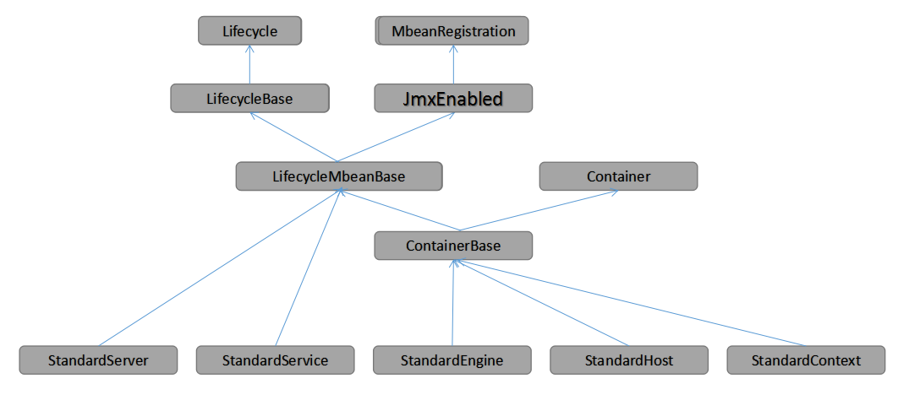

## Tomcat的启动流程分析之tomcat启动

上面讲了SpringBoot内嵌Tomcat的过程，现在进入到Tomcat类中，看看Tomcat之间的容器关系及Tomcat如何启动的，启动时都做了什么，如何处理请求。
直接进入Tomcat的start方法：
```java
public void start() throws LifecycleException {
    //判断StandardServer是否初始化，server在之前getEmbeddedServletContainer方法中已完成实例化
    getServer();
    //同server一样，判断Connector是否创建，在getEmbeddedServletContainer已完成初始化
    getConnector();
    //准备就绪，进行server启动操作，因为StandardServer继承至LifecycleBase，最终会执行
    //LifeCycleBase方法的start方法
    server.start();
}
```
在tomcat相关代码中，`LifecycleBase`类是各容器的父类，比如StandardServer、StandardService、StandardEngine、StandardHost及StandardContext容器，负责容器的生命周期管理，比如init、start、stop、destory及容器状态state（LifecyleState枚举）管理：
```java
public enum LifecycleState {
    NEW(false, null),
    INITIALIZING(false, Lifecycle.BEFORE_INIT_EVENT),
    INITIALIZED(false, Lifecycle.AFTER_INIT_EVENT),
    STARTING_PREP(false, Lifecycle.BEFORE_START_EVENT),
    STARTING(true, Lifecycle.START_EVENT),
    STARTED(true, Lifecycle.AFTER_START_EVENT),
    STOPPING_PREP(true, Lifecycle.BEFORE_STOP_EVENT),
    STOPPING(false, Lifecycle.STOP_EVENT),
    STOPPED(false, Lifecycle.AFTER_STOP_EVENT),
    DESTROYING(false, Lifecycle.BEFORE_DESTROY_EVENT),
    DESTROYED(false, Lifecycle.AFTER_DESTROY_EVENT),
    FAILED(false, null);

    private final boolean available;//
    private final String lifecycleEvent;
}
```
`Lifecycle`类定义了tomcat容器的声明周期，各个容器都是实现此类管理自身容器的初始化、启动、停止、销毁等操作。其中Lifecycle的接口定义如图：


`LifecycleBase`是`Lifecycle`的实现基类，实现了管理容器的模板，完成了init、start、stop等方法的基本实现，各容器和子类通过实现此基类的钩子方法完成自身容器的操作，下面看下容器的继承关系，如图：

分析中会多次进入到此方法中，要区分各容器的层次结构，不然每次进入到LifecycleBase中的方法，却不晓得是哪个容器在执行，各容器的执行顺序为StandardServer->StandardService->StandardEngine->StandardHost->StandardContext。
其中上述StandardServer执行的Lifecyle的start方法为：
```java
public final synchronized void start() throws LifecycleException {
    //判断容器是否重复启动
    if (LifecycleState.STARTING_PREP.equals(state) || LifecycleState.STARTING.equals(state) ||
            LifecycleState.STARTED.equals(state)) {

        if (log.isDebugEnabled()) {
            Exception e = new LifecycleException();
            log.debug(sm.getString("lifecycleBase.alreadyStarted", toString()), e);
        } else if (log.isInfoEnabled()) {
            log.info(sm.getString("lifecycleBase.alreadyStarted", toString()));
        }

        return;
    }

    //初始state状态为LifecycleState.NEW，会先执行此方法进行各容器启动前的初始化工作，容器会按照LifecycleState状态进行有序变化
    if (state.equals(LifecycleState.NEW)) {
        init();
    } else if (state.equals(LifecycleState.FAILED)) {
        stop();
    } else if (!state.equals(LifecycleState.INITIALIZED) &&
            !state.equals(LifecycleState.STOPPED)) {
        invalidTransition(Lifecycle.BEFORE_START_EVENT);
    }

    try {
        //设置state状态
        setStateInternal(LifecycleState.STARTING_PREP, null, false);
        //正式启动
        startInternal();
        if (state.equals(LifecycleState.FAILED)) {
            // This is a 'controlled' failure. The component put itself into the
            // FAILED state so call stop() to complete the clean-up.
            stop();
        } else if (!state.equals(LifecycleState.STARTING)) {
            // Shouldn't be necessary but acts as a check that sub-classes are
            // doing what they are supposed to.
            invalidTransition(Lifecycle.AFTER_START_EVENT);
        } else {
            setStateInternal(LifecycleState.STARTED, null, false);
        }
    } catch (Throwable t) {
        // This is an 'uncontrolled' failure so put the component into the
        // FAILED state and throw an exception.
        ExceptionUtils.handleThrowable(t);
        setStateInternal(LifecycleState.FAILED, null, false);
        throw new LifecycleException(sm.getString("lifecycleBase.startFail", toString()), t);
    }
}
```
tomcat的启动后生命周期主要分为三个阶段：init->startINternal->stop，根据容器状态state的值分别进入不同的阶段。接下来会重点分析init()和startInternal()方法。
