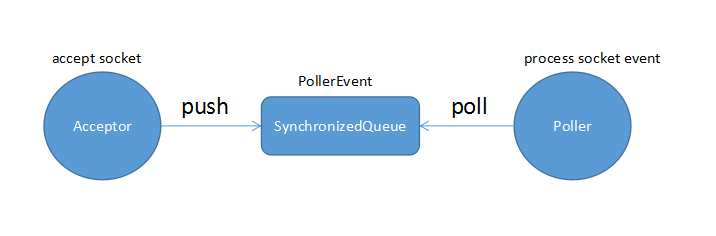

## Tomcat的启动流程分析

### tomcat的start过程分析

#### StandardServer的start

现在分析StandardServer的startInternal方法：
```java
protected void startInternal() throws LifecycleException {

    fireLifecycleEvent(CONFIGURE_START_EVENT, null);
    setState(LifecycleState.STARTING);

    globalNamingResources.start();

    // 启动StandardService
    synchronized (servicesLock) {
        for (int i = 0; i < services.length; i++) {
            services[i].start();
        }
    }
}
```

#### StandardService的start

同样的，StandardService的startInternal方法如下：
```java
protected void startInternal() throws LifecycleException {

    if(log.isInfoEnabled())
        log.info(sm.getString("standardService.start.name", this.name));
    setState(LifecycleState.STARTING);

    // 启动StandardEngine容器及子容器
    if (engine != null) {
        synchronized (engine) {
            engine.start();
        }
    }

		//初始化executor线程池
    synchronized (executors) {
        for (Executor executor: executors) {
            executor.start();
        }
    }

    mapperListener.start();

    // 启动连接器
    synchronized (connectorsLock) {
        for (Connector connector: connectors) {
            try {
                // If it has already failed, don't try and start it
                if (connector.getState() != LifecycleState.FAILED) {
                    connector.start();
                }
            } catch (Exception e) {
                log.error(sm.getString(
                        "standardService.connector.startFailed",
                        connector), e);
            }
        }
    }
}
```
##### StandardEngine的start

其中StandardEngine的start方法执行为：
```
protected synchronized void startInternal() throws LifecycleException {

  	//集群的启动
    Cluster cluster = getClusterInternal();
    if (cluster instanceof Lifecycle) {
        ((Lifecycle) cluster).start();
    }

    //认证的启动
    Realm realm = getRealmInternal();
    if (realm instanceof Lifecycle) {
        ((Lifecycle) realm).start();
    }

    // 启动engine的子容器，即host、context等容器
    Container children[] = findChildren();
    List<Future<Void>> results = new ArrayList<>();
    for (int i = 0; i < children.length; i++) {
        results.add(startStopExecutor.submit(new StartChild(children[i])));
    }

    boolean fail = false;
    for (Future<Void> result : results) {
        try {
            result.get();
        } catch (Exception e) {
            log.error(sm.getString("containerBase.threadedStartFailed"), e);
            fail = true;
        }

    }
    if (fail) {
        throw new LifecycleException(
                sm.getString("containerBase.threadedStartFailed"));
    }

    // 设置pipeline中ValueBase的state值
    if (pipeline instanceof Lifecycle)
        ((Lifecycle) pipeline).start();


    setState(LifecycleState.STARTING);

    // 如果设置backgroundProcessorDelay<0则启动容器后台线程ContainerBackgroundProcessor，
		//StandardEngine设置此值为10，其余容器默认ContainerBase的值为-1，所以只有StandardEngine启动了此线程
		//作用就是保证所有的子容器都是用web容器的classloader
    threadStart();

}
```
##### Connector的start

Connector启动设置的通信协议，的startInternal方法如下：
```java
protected void startInternal() throws LifecycleException {

    // 省略...

    setState(LifecycleState.STARTING);

    try {
				//执行AbstractProtocol的start方法
        protocolHandler.start();
    } catch (Exception e) {

    }
}

###### Protocol的start

//AbstractProtocol类的方法：protocolHandler.start();
public void start() throws Exception {
    //...
    try {
        endpoint.start();
    } catch (Exception ex) {
      //...
    }

    // 启动超时处理线程，处理waitingProcessors中等待请求
    asyncTimeout = new AsyncTimeout();
    Thread timeoutThread = new Thread(asyncTimeout, getNameInternal() + "-AsyncTimeout");
    int priority = endpoint.getThreadPriority();
    if (priority < Thread.MIN_PRIORITY || priority > Thread.MAX_PRIORITY) {
        priority = Thread.NORM_PRIORITY;
    }
    timeoutThread.setPriority(priority);
    timeoutThread.setDaemon(true);
    timeoutThread.start();
}
```
###### AsyncTimeout分析

再来看timeoutThread方法的情况：
```java
//处理超时的异步请求
//如果状态是long长轮询并且异步的socket，则会放入waitingProcessors中，等待超时处理。
protected class AsyncTimeout implements Runnable {

    private volatile boolean asyncTimeoutRunning = true;
    @Override
    public void run() {

        // Loop until we receive a shutdown command
        while (asyncTimeoutRunning) {
            try {
                Thread.sleep(1000);
            } catch (InterruptedException e) {
                // Ignore
            }
            long now = System.currentTimeMillis();
						//处理超时socket请求，最终会走到AbstractProtocol的processSocket方法
            for (Processor processor : waitingProcessors) {
               processor.timeoutAsync(now);
            }

            // Loop if endpoint is paused
            while (endpoint.isPaused() && asyncTimeoutRunning) {
                try {
                    Thread.sleep(1000);
                } catch (InterruptedException e) {
                    // Ignore
                }
            }
        }
    }


    protected void stop() {
        asyncTimeoutRunning = false;

        // Timeout any pending async request
        for (Processor processor : waitingProcessors) {
            processor.timeoutAsync(-1);
        }
    }
}
```
###### Endpoint的启动

以NioEndpoint为例,执行startInternal方法：
```java
public void startInternal() throws Exception {

    if (!running) {
        running = true;
        paused = false;

        processorCache = new SynchronizedStack<>(SynchronizedStack.DEFAULT_SIZE,
                socketProperties.getProcessorCache());
        eventCache = new SynchronizedStack<>(SynchronizedStack.DEFAULT_SIZE,
                        socketProperties.getEventCache());
        nioChannels = new SynchronizedStack<>(SynchronizedStack.DEFAULT_SIZE,
                socketProperties.getBufferPool());

        // Create worker collection
        if ( getExecutor() == null ) {
            createExecutor();
        }

        initializeConnectionLatch();

        // 启动poller线程，即socket请求消费者线程，poller数组大小为：多处理器下为2，即最多为两个元素
        pollers = new Poller[getPollerThreadCount()];
        for (int i=0; i<pollers.length; i++) {
            pollers[i] = new Poller();
            Thread pollerThread = new Thread(pollers[i], getName() + "-ClientPoller-"+i);
            pollerThread.setPriority(threadPriority);
            pollerThread.setDaemon(true);
            pollerThread.start();
        }

        //启动Acceptor线程，接收socket连接，然后将请求放入到队列，poller线程遍历队列处理socket读写请求
        startAcceptorThreads();
    }
}
```
到这里，进入到tomcat的核心部分，tomcat使用Poller线程（相当于消费线程）和Acceptor线程（相当于生产者线程）和同步队列SynchronizedQueue<PollerEvent>构成了tomcat的socket处理流程，关系如下图：

