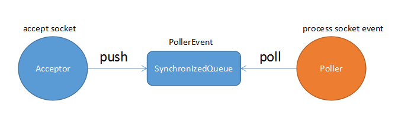
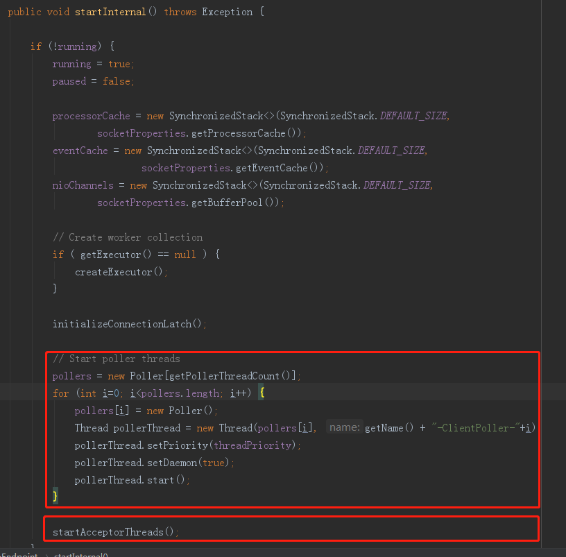

## Tomcat的线程模型：Acceptor

前面讲了tomcat的Poller线程模型，即消费者，如图：

接下来将分析tomcat的Acceptor线程模型，即生产者，看看tomcat如何接受socket请求并将请求传递给消费者线程的。其中Endpoint中关于启动的代码如下：

可以看到Poller线程先启动，然后再启动Acceptor线程，这样做的原因也很好理解，避免生产者生产了请求需要等待消费者的情况。

### Acceptor线程组创建
```
protected final void startAcceptorThreads() {
    //acceptorThreadCount属性默认为1
    int count = getAcceptorThreadCount();
    //定义Acceptor线程组
    acceptors = new Acceptor[count];

    for (int i = 0; i < count; i++) {
        //创建Acceptor
        acceptors[i] = createAcceptor();
        String threadName = getName() + "-Acceptor-" + i;
        acceptors[i].setThreadName(threadName);
        Thread t = new Thread(acceptors[i], threadName);
        t.setPriority(getAcceptorThreadPriority());
        t.setDaemon(getDaemon());
        //启动Acceptor线程
        t.start();
    }
}
```
### Acceptor线程创建
```
//直接new一个Acceptor线程
protected AbstractEndpoint.Acceptor createAcceptor() {
    return new Acceptor();
}

//Acceptor类：定义了Acceptor线程启动的功能
protected class Acceptor extends AbstractEndpoint.Acceptor {

    @Override
    public void run() {

        int errorDelay = 0;

        // 无限循环：只要tomcat进程服务还在，就一直运行
        while (running) {

            //...

            if (!running) {
                break;
            }
            state = AcceptorState.RUNNING;

            try {
                //////连接计数：如果达到最大连接，会等待，利用AQS的共享节点
                countUpOrAwaitConnection();

                SocketChannel socket = null;
                try {
                    //接受连接请求的socket
                    socket = serverSock.accept();
                } catch (IOException ioe) {
                    //...
                }
                // Successful accept, reset the error delay
                errorDelay = 0;

                // Configure the socket
                if (running && !paused) {
                    ///////处理socket事件的关键
                    if (!setSocketOptions(socket)) {
                        closeSocket(socket);
                    }
                } else {
                    closeSocket(socket);
                }
            } catch (Throwable t) {
                ExceptionUtils.handleThrowable(t);
                log.error(sm.getString("endpoint.accept.fail"), t);
            }
        }
        state = AcceptorState.ENDED;
    }

    //...
}
```

### setSocketOptions处理socket连接
```
protected boolean setSocketOptions(SocketChannel socket) {
    // Process the connection
    try {
        //设置为非阻塞
        socket.configureBlocking(false);
        Socket sock = socket.socket();
        //设置socket定义的属性
        socketProperties.setProperties(sock);

        NioChannel channel = nioChannels.pop();
        if (channel == null) {
            //定义socket读写缓冲区，根据属性中定义决定是否使用直接内存directBuffer
            SocketBufferHandler bufhandler = new SocketBufferHandler(
                    socketProperties.getAppReadBufSize(),
                    socketProperties.getAppWriteBufSize(),
                    socketProperties.getDirectBuffer());
            //ssl请求封装
            if (isSSLEnabled()) {
                channel = new SecureNioChannel(socket, bufhandler, selectorPool, this);
            } else {//非ssl请求
                channel = new NioChannel(socket, bufhandler);
            }
        } else {
            channel.setIOChannel(socket);
            channel.reset();
        }

        //从Poller线程组中取一个Poller线程绑定到socket上
        //取Poller的方法：pollers[Math.abs(pollerRotater.incrementAndGet()) % pollers.length]
        getPoller0().register(channel);
    } catch (Throwable t) {
        ExceptionUtils.handleThrowable(t);
        try {
            log.error("",t);
        } catch (Throwable tt) {
            ExceptionUtils.handleThrowable(tt);
        }
        // Tell to close the socket
        return false;
    }
    return true;
}
```
### Poller绑定socket
```
public void register(final NioChannel socket) {
    //设置处理socket的poller线程
    socket.setPoller(this);
    //定义selectorkey的attachment
    NioSocketWrapper ka = new NioSocketWrapper(socket, NioEndpoint.this);
    socket.setSocketWrapper(ka);
    //设置socket参数
    ka.setPoller(this);
    ka.setReadTimeout(getSocketProperties().getSoTimeout());
    ka.setWriteTimeout(getSocketProperties().getSoTimeout());
    ka.setKeepAliveLeft(NioEndpoint.this.getMaxKeepAliveRequests());
    ka.setSecure(isSSLEnabled());
    ka.setReadTimeout(getSoTimeout());
    ka.setWriteTimeout(getSoTimeout());
    PollerEvent r = eventCache.pop();
    ka.interestOps(SelectionKey.OP_READ);//this is what OP_REGISTER turns into.
    //将socket包装成PollerEvent线程任务
    if ( r==null) r = new PollerEvent(socket,ka,OP_REGISTER);
    else r.reset(socket,ka,OP_REGISTER);
    //将PollerEvent线程任务添加到同步队列
    addEvent(r);
}
```
### PollerEvent
Poller和Acceptor是通过PollerEvent关联的，Acceptor通过PollerEvent向Poller的selector注册事件，并绑定attachment，Poller通过处理PollerEvent任务，正式将socket的感兴趣事件注册到自己的selector上面，其中PollerEvent实现了Runnable。

```
public static class PollerEvent implements Runnable {

    private NioChannel socket;
    private int interestOps;
    private NioSocketWrapper socketWrapper;

    public PollerEvent(NioChannel ch, NioSocketWrapper w, int intOps) {
        reset(ch, w, intOps);
    }

    //重置
    public void reset(NioChannel ch, NioSocketWrapper w, int intOps) {
        socket = ch;
        interestOps = intOps;
        socketWrapper = w;
    }

    public void reset() {
        reset(null, null, 0);
    }

    @Override
    public void run() {
        //开始时走到这一步：上面创建PollerEvent时，设置的interestOps为OP_REGISTER
        if (interestOps == OP_REGISTER) {
            try {
                //向绑定的poller的selector注册读事件，并设置Attachment；
                //Poller会轮询selector注册的事件                                    
                socket.getIOChannel().register(
                        socket.getPoller().getSelector(), SelectionKey.OP_READ, socketWrapper);
            } catch (Exception x) {
                log.error(sm.getString("endpoint.nio.registerFail"), x);
            }
        } else {
            //...
        }
    }
}
```
### 调用Poller的addEvent加入PollerEvent
```
private void addEvent(PollerEvent event) {
    //events为SynchronizedQueue<PollerEvent>队列
    events.offer(event);
    //如果selector在等待，则唤醒selector
    if ( wakeupCounter.incrementAndGet() == 0 ) selector.wakeup();
}
```
Acceptor线程处理比较简单，就是接受的socket连接，封装成PollerEvent任务放入到同步队列，，Poller线程获取PollerEvent任务，并将scoket事件注册到自身的selector上面，p并通过轮询
selector，处理到达的事件。
