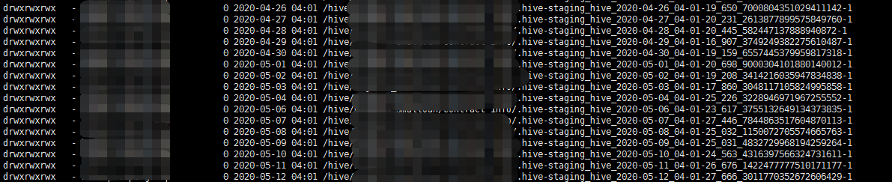

### hive爬坑记

> 现在有个需求，需要将hive数据导出到mysql，赶鸭子上架，look look，操作看着挺简单的，遇到的小坑也不断，mark下。
注意：这只是本人当前情况下导出数据的手段，其他方法暂时没去了解，这里不做讨论。

先谈以下hive导出工具sqoop，平常加工数据导出到mysql也是用到sqoop，但是sqoop限定了mysql的表结构必须和hive字段对应（想吐槽，我mysql多些字段不行啊，如果mysql字段多于hive，hive找不到对应的字段与之对应，会报错的？）。
由于hive数据来源于其他系统，有全量同步的，有增量同步的，以下是我这小白将hive表数据同步到mysql下几种方法：

### 1、sqoop导出

> 调度任务使用的这种方法，要求：最好mysql表与hive表字段名称和类型一致（sqoop数据设值按照index索引设值）。
如果hive表使用了分区，导出数据指定对应的分区路径。

```shell
sqoop -export --connect jdbc:mysql://localhost:3306/mydb --username hive --password hive --table test --export-dir "/hive/hive_db/hive_table/year=2020/month=06/day=01" --fields-terminated-by '|' --input-null-string "\\\\N" --input-null-non-string "\\\\N" -m 1
```
> sqoop命令参数：
--update-key id: 更新标识，即根据某个字段进行更新，例如id，可以指定多个更新标识的字段，多个字段之间用逗号分隔。   
--update-mode updateonly/allowinsert：指定更新方式，其中updateonly模式，仅仅更新已存在的数据，不会插入新记录；allowinsert模式更新已存在的数据，同时插入新记录。
--columns：指定mysql导入的字段。

如果是那种增量的，使用这种方法只能具体到某一天，这种情况写个脚本执行下吧。

```shell
#!/bin/bash

first=$1
second=$2
while [ "$first" -le "$second" ]
do
year=${first:0:4}
month=${first:4:2}
day=${first:6:2}
sqoop -export --connect jdbc:mysql://localhost:3306/transport --username hive --password hive --table test --export-dir --columns "id,name,age" "/hive/hive_db/hive_table/year=${year}/month=${month}/day=${day}" --fields-terminated-by '|' --input-null-string "\\\\N" --input-null-non-string "\\\\N" -m 1

let first=`date -d "-1 days ago ${first}" +%Y%m%d`
done
```
执行`sh export_data_from_hive_to_mysql.sh 20200101 20200601`，如果数据量大，慢慢等结果吧。

### 2、hive导出

> 可以直接使用hive命令将数据导出TXT格式数据

```shell
hive -e "select * from my_db.my_table where createtime='20200601'" >> /hive/export/20200602/my_table_20200601.txt
```

如果数据量大，使用insert语句开销较大， 速度慢，可以使用load data方式，简单便捷。比如：
```shell
mysql>load data local infile '/hive/export/my_table_20200601.txt'  ignore into table my_table fields terminated by '\t' lines terminated by '\n';
```
这里在本地执行的使用的是`load data infile`执行成功，但是到linux环境下报权限问题，需要使用`load data local infile`来代替`load data infile`。

### hive-staging文件
先上图：


> 在查看hdfs下文件时，发现在路径下有好多.hive-staging文件，这是因为spark-sql执行hive语句，会在hive的目录下回产生很多.staging_hive文件，而且是操作哪个表，就在哪个表中产生，其实hive也会产生.hive-staging，但是hive产生后会被移除，而spark-sql不会移除，所以我们需要手动处理这种情况。
网上查询了下，可以修改下hive-site.xml，增加如下属性配置，将所有的.hive-staging*文件都产生到/tmp/staging/目录下，不过这一部分的配置需要加在`hive-site.xml 的 Hive 客户端高级配置代码段（安全阀）`这一项中，因为这一部分的配置是生效在hive的客户端中，加在服务器端是没用的，不生效。`.hive-staging`只是产生文件的前缀，不是目录。

```xml
<property>
    <name>hive.exec.stagingdir</name>
    <value>/tmp/staging/.hive-staging</value>
</property>
```
写shell脚本，定时去/tmp/hive/staging/.staging目录下清除文件，注意，清除文件一定要清除昨天的，今天产生的有可能正好在用，如果被移除了，则会报错。
