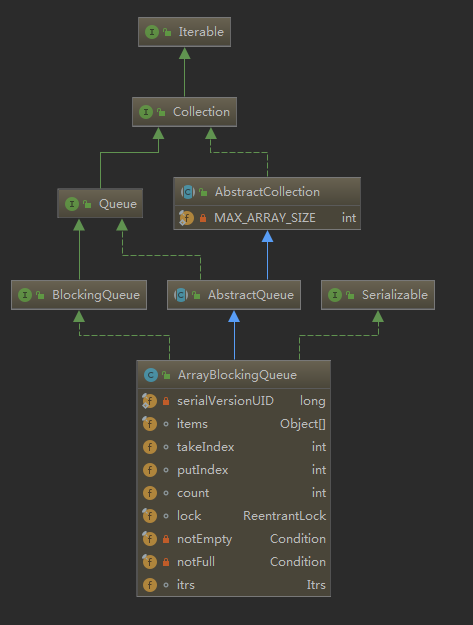
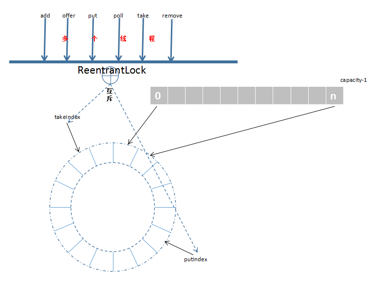

## ArrayBlockingQueue源码分析
> ArrayBlockingQueue作为先进先出的有界阻塞队列，一旦确定容量大小，便不可更改；队列为同步容器，使用全局加锁，即同一时间只能有一个线程添加元素或者移除元素。
内部主要数据结构包括：
- 1、Object数组，循环数组充当队列存储元素。
- 2、takeIndex，poll/peek/remove元素时的索引。
- 3、putIndex，put/offer/add元素时的索引。
- 4、count，记录容器元素个数。
- 5、ReentrantLock，全局锁。
- 6、notEmpty，poll操作时等待队列元素。
- 7、notFull，put操作时等待队列有空余位置存放元素。

先上一张类结构图：



ArrayBlockingQueue各方法使用特点如下：

| 方法名称 | 是否阻塞等待 | 是否（可）抛出异常 | 是否可设置超时 |
|:--------:|:--------:|:------------------:|:--------------:|
|   add    |    ×     |         √          |       ×        |
|  offer   |    ×     |         √          |       √        |
|   put    |    √     |         √          |       ×        |
|   poll   |    ×     |         √          |       √        |
|   peek   |    ×     |         ×          |       ×        |
|   take   |    √     |         √          |       ×        |

### 初始化
> 数组使用final修饰，初始化后，长度固定且不可改变，默认非公平锁策略。

```
public ArrayBlockingQueue(int capacity) {
    this(capacity, false);
}

public ArrayBlockingQueue(int capacity, boolean fair) {
    if (capacity <= 0)
        throw new IllegalArgumentException();
    this.items = new Object[capacity];
    lock = new ReentrantLock(fair);
    notEmpty = lock.newCondition();
    notFull =  lock.newCondition();
}
```

#### add
> 内部调用了offer，与offer不同之处在于，如果添加不成功，抛出异常。

```
public boolean add(E e) {
    if (offer(e))
        return true;
    else
        throw new IllegalStateException("Queue full");
}
```

#### offer 非阻塞
> add内部调用offer实现元素的存放，插入元素不能为null。

```
public boolean offer(E e) {
    //元素null判断
    checkNotNull(e);
    final ReentrantLock lock = this.lock;
    //加锁，因为全局锁，所以同步容器
    lock.lock();
    try {
        //容器满则返回
        if (count == items.length)
            return false;
        else {
            //入队
            enqueue(e);
            return true;
        }
    } finally {
        //释放锁
        lock.unlock();
    }
}

private void enqueue(E x) {
    // assert lock.getHoldCount() == 1;
    // assert items[putIndex] == null;
    final Object[] items = this.items;
    //因为全局加锁，同一时间只能一个线程添加元素，获取锁后，前面已经判断了count == items.length，走到此步，说明容器未满
    //在putIndex出存放元素
    items[putIndex] = x;
    //使用数组达到循环队列的效果，需要判断新的putIndex索引位置是否重置
    if (++putIndex == items.length)
        putIndex = 0;
    count++;
    //元素添加成功，队列非空，唤醒等待notEmpty条件的线程
    notEmpty.signal();
}
```
#### put 阻塞
> 如果条件不满足，阻塞等待，直到满足条件存放元素。

```
public void put(E e) throws InterruptedException {
    //校验元素非空
    checkNotNull(e);
    final ReentrantLock lock = this.lock;
    //可中断加锁
    lock.lockInterruptibly();
    try {
        //如果当前队列满了，则阻塞等待，等待notFull条件唤醒
        while (count == items.length)
            notFull.await();
        //入队
        enqueue(e);
    } finally {
        lock.unlock();
    }
}
```

#### poll 非阻塞
> 非阻塞获取元素，不管存在满不满足的元素，都直接返回结果。

```
public E poll() {
    final ReentrantLock lock = this.lock;
    lock.lock();
    try {
        return (count == 0) ? null : dequeue();
    } finally {
        lock.unlock();
    }
}

private E dequeue() {
    // assert lock.getHoldCount() == 1;
    // assert items[takeIndex] != null;
    final Object[] items = this.items;
    @SuppressWarnings("unchecked")
    //全局锁直接操作
    E x = (E) items[takeIndex];
    items[takeIndex] = null;
    //循环数组更新takeIndex
    if (++takeIndex == items.length)
        takeIndex = 0;
    count--;
    if (itrs != null)
        itrs.elementDequeued();
    //取出了元素，唤醒等待notFull条件的线程
    notFull.signal();
    return x;
}
```

#### take 阻塞
> 如果队列中不存在元素，则阻塞等待，直到其他线程唤醒notEmpty。

```
public E take() throws InterruptedException {
    final ReentrantLock lock = this.lock;
    lock.lockInterruptibly();
    try {
        //如果队列为空，则阻塞等待notEmpty线程唤醒
        while (count == 0)
            notEmpty.await();
        return dequeue();
    } finally {
        lock.unlock();
    }
}
```
#### peek
> 获取takeIndex处的元素，但不移除。

```
public E peek() {
    final ReentrantLock lock = this.lock;
    lock.lock();
    try {
        return itemAt(takeIndex); // null when queue is empty
    } finally {
        lock.unlock();
    }
}
```

#### remove
> 队列先进先出的特性，从takeIndex位置开始，至putIndex找到需要移除的元素，因为循环队列，要注意索引位置的重置，避免数组溢出。

```
public boolean remove(Object o) {
    if (o == null) return false;
    final Object[] items = this.items;
    final ReentrantLock lock = this.lock;
    lock.lock();
    try {
        if (count > 0) {
            final int putIndex = this.putIndex;
            int i = takeIndex;
            do {
                if (o.equals(items[i])) {
                    removeAt(i);
                    return true;
                }
                if (++i == items.length)
                    i = 0;
            } while (i != putIndex);
        }
        return false;
    } finally {
        lock.unlock();
    }
}

void removeAt(final int removeIndex) {
    // assert lock.getHoldCount() == 1;
    // assert items[removeIndex] != null;
    // assert removeIndex >= 0 && removeIndex < items.length;
    final Object[] items = this.items;
    //如果移除的位置为头部位置元素，则直接移除
    if (removeIndex == takeIndex) {
        // removing front item; just advance
        items[takeIndex] = null;
        if (++takeIndex == items.length)
            takeIndex = 0;
        count--;
        if (itrs != null)
            itrs.elementDequeued();
    } else {
        // an "interior" remove

        // slide over all others up through putIndex.
        final int putIndex = this.putIndex;
        //移除removeIndex位置的元素，并将数组removeIndex之后至putIndex的元素顺序前移
        for (int i = removeIndex;;) {
            int next = i + 1;
            if (next == items.length)
                next = 0;
            if (next != putIndex) {
                items[i] = items[next];
                i = next;
            } else {
                items[i] = null;
                this.putIndex = i;
                break;
            }
        }
        count--;
        if (itrs != null)
            itrs.removedAt(removeIndex);
    }

    //唤醒等待notFull条件的线程
    notFull.signal();
}
```

最后附上一张ArrayBlockingQueue概览图：

