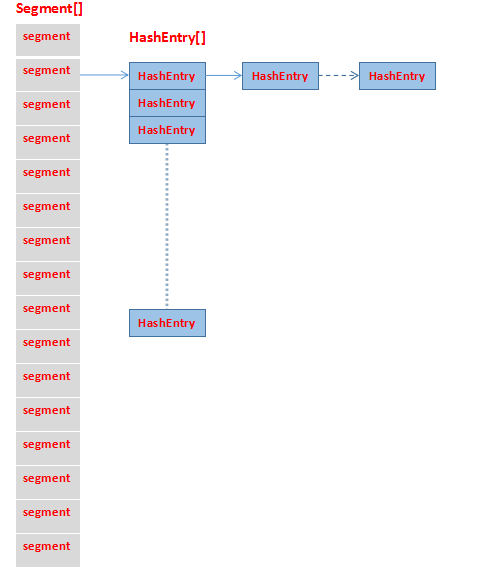

## ConcurrentHashMap的源码分析（jdk7）

> HashMap在多线程的情况下是不安全的，如果使用线程安全的字典，可以使用HashTable和Collections.synchronizedMap()，但是这两个都是使用synchronized修饰的，是阻塞的，处理效率低，在并发包下，可以使用ConcurrentHashMap支持多线程并发操作的集合。

先看以下ConcurrentHashMap的结构图：


ConcurrentHashMap基于ReentrantLock，使用锁分离技术，以数组+链表的数据结构实现的多线程并发容器。

#### Segment结构
> 基于segment数组的长度形成并发度，每次操作只需要针对hash对应的segment加锁，这样保证最大的并发度为segments数组的长度，从而支持多线程安全访问。

```java
  static final class Segment<K,V> extends ReentrantLock implements Serializable {
      //尝试获取锁的最大次数，即自旋次数
      static final int MAX_SCAN_RETRIES =
            Runtime.getRuntime().availableProcessors() > 1 ? 64 : 1;
      //每个segment元素对应了一个HashEntry数组
      transient volatile HashEntry<K,V>[] table;
      //当前segment中元素的数量
      transient int count;
      //当前segment被修改的次数
      transient int modCount;
      //判断HashEntry是否进行rehash的阈值（capcity*loadFactor）
      transient int threshold;
      //加载因子
      final float loadFactor;
  }
```

#### HashEntry结构
> 相当于一个普通的的HashMap结构。

```java
    //相当于一个HashMap，hash和key不变，添加的新值总是放入链表尾端，value和next为volatile修饰，保证可见性
    static final class HashEntry<K,V> {
        final int hash;
        final K key;
        volatile V value;
        volatile HashEntry<K,V> next;

        HashEntry(int hash, K key, V value, HashEntry<K,V> next) {
            this.hash = hash;
            this.key = key;
            this.value = value;
            this.next = next;
        }

        /**
         * Sets next field with volatile write semantics.  (See above
         * about use of putOrderedObject.)
         */
        final void setNext(HashEntry<K,V> n) {
            UNSAFE.putOrderedObject(this, nextOffset, n);
        }

        // 使用Unsafe设置next值
        static final sun.misc.Unsafe UNSAFE;
        static final long nextOffset;
        static {
            try {
                UNSAFE = sun.misc.Unsafe.getUnsafe();
                Class k = HashEntry.class;
                nextOffset = UNSAFE.objectFieldOffset
                    (k.getDeclaredField("next"));
            } catch (Exception e) {
                throw new Error(e);
            }
        }
    }
```

### ConcurrentHashMap定义

```java
public class ConcurrentHashMap<K, V> extends AbstractMap<K, V>
        implements ConcurrentMap<K, V>, Serializable {
    //默认的初始容量
    static final int DEFAULT_INITIAL_CAPACITY = 16;
    //加载因子
    static final float DEFAULT_LOAD_FACTOR = 0.75f;
    //默认并发度大小，也就是默认的segment数组长度
    static final int DEFAULT_CONCURRENCY_LEVEL = 16;
    //最大容量
    static final int MAXIMUM_CAPACITY = 1 << 30;
    //每个segment中table的长度，必须是2^n，最小为2
    static final int MIN_SEGMENT_TABLE_CAPACITY = 2;
    //允许最大的segment数量，用于限定concurrencyLevel的边界，必须是2^n
    static final int MAX_SEGMENTS = 1 << 16;
    //非锁定情况下调用size和containsValue方法的次数，避免在使用两个方法时table被修改导致的无限重试
    static final int RETRIES_BEFORE_LOCK = 2;
    //根据key的hash计算segment位置的掩码值
    final int segmentMask;
    //用于计算segment位置时hash参与计算的位数
    final int segmentShift;
    //segment数组
    final Segment<K,V>[] segments;

    //指定初始容量的构造函数
    public ConcurrentHashMap(int initialCapacity) {
        this(initialCapacity, DEFAULT_LOAD_FACTOR, DEFAULT_CONCURRENCY_LEVEL);
    }

    //默认的构造函数
    public ConcurrentHashMap() {
        this(DEFAULT_INITIAL_CAPACITY, DEFAULT_LOAD_FACTOR, DEFAULT_CONCURRENCY_LEVEL);
    }

    public ConcurrentHashMap(int initialCapacity,
                             float loadFactor, int concurrencyLevel) {
        if (!(loadFactor > 0) || initialCapacity < 0 || concurrencyLevel <= 0)
            throw new IllegalArgumentException();
        if (concurrencyLevel > MAX_SEGMENTS)
            concurrencyLevel = MAX_SEGMENTS;
        //找到大于等于concurrencyLevel的2^n值作为ssize值，即segment数组长度必须为2^n
        int sshift = 0;
        int ssize = 1;
        while (ssize < concurrencyLevel) {
            ++sshift;
            ssize <<= 1;
        }
        this.segmentShift = 32 - sshift;
        this.segmentMask = ssize - 1;
        if (initialCapacity > MAXIMUM_CAPACITY)
            initialCapacity = MAXIMUM_CAPACITY;

        //计算每个segment中包含的table长度平均值
        int c = initialCapacity / ssize;
        if (c * ssize < initialCapacity)
            ++c;
        //计算segment中table的初始容量
        int cap = MIN_SEGMENT_TABLE_CAPACITY;
        while (cap < c)
            cap <<= 1;
        // 创建segments[0]，并定义HashEntry的初始容量
        Segment<K,V> s0 =
            new Segment<K,V>(loadFactor, (int)(cap * loadFactor),
                             (HashEntry<K,V>[])new HashEntry[cap]);
        //定义Segment数组，并设置segments[0]
        Segment<K,V>[] ss = (Segment<K,V>[])new Segment[ssize];
        UNSAFE.putOrderedObject(ss, SBASE, s0);
        this.segments = ss;
    }
}
```
concurrencyLevel用于定义Segment数组的长度，必须为2^n，即计算出来的ssize值，其中segmentMask和segmentShift用于根据key计算segment片段的位置。

### Segment和HashEntry元素寻址
UNSAFE方法计算Segment数组和HashEntry数组的偏移量
```java
    private static final sun.misc.Unsafe UNSAFE;
    private static final long SBASE;
    private static final int SSHIFT;
    private static final long TBASE;
    private static final int TSHIFT;
    private static final long HASHSEED_OFFSET;
    private static final long SEGSHIFT_OFFSET;
    private static final long SEGMASK_OFFSET;
    private static final long SEGMENTS_OFFSET;

    static {
        int ss, ts;
        try {
            UNSAFE = sun.misc.Unsafe.getUnsafe();
            Class tc = HashEntry[].class;
            Class sc = Segment[].class;
            //HashEntry数组的第一个元素的偏移量
            TBASE = UNSAFE.arrayBaseOffset(tc);
            //Segment数组的第一个元素的偏移量
            SBASE = UNSAFE.arrayBaseOffset(sc);
            //HashEntry数组元素的增量长度
            ts = UNSAFE.arrayIndexScale(tc);
            //Segment数组元素的增量长度
            ss = UNSAFE.arrayIndexScale(sc);
            HASHSEED_OFFSET = UNSAFE.objectFieldOffset(
                ConcurrentHashMap.class.getDeclaredField("hashSeed"));
            SEGSHIFT_OFFSET = UNSAFE.objectFieldOffset(
                ConcurrentHashMap.class.getDeclaredField("segmentShift"));
            SEGMASK_OFFSET = UNSAFE.objectFieldOffset(
                ConcurrentHashMap.class.getDeclaredField("segmentMask"));
            SEGMENTS_OFFSET = UNSAFE.objectFieldOffset(
                ConcurrentHashMap.class.getDeclaredField("segments"));
        } catch (Exception e) {
            throw new Error(e);
        }
        //ss和ts必须为2^n，即如果ss如果为2^n，则ss&(ss-1)必为0，ts同理
        if ((ss & (ss-1)) != 0 || (ts & (ts-1)) != 0)
            throw new Error("data type scale not a power of two");
        //Integer.numberOfLeadingZeros(ss)用于计算ss用二进制表示时高位0的数量，31-Integer.numberOfLeadingZeros(ss)实际用于计算ss中除去高位0后有效的位数，即高位1所处的位置，也是唯一的1所处的位置（因为2^n二进制表示的特点是只有一个位置为1，其他位为0），这样Segment数组第i个元素位置为i<<SSHIFT
        SSHIFT = 31 - Integer.numberOfLeadingZeros(ss);
        TSHIFT = 31 - Integer.numberOfLeadingZeros(ts);
    }
```
以下参考来源：`[https://blog.coderap.com/article/239]`
> ConcurrentHashMap也使用到了大量的Unsafe方法直接操作内存，在静态代码块中，ConcurrentHashMap首先初始化了几个重要的常量：SBASE、TBASE、SSHIFT和TSHIFT；其中SBASE和TBASE是通过Unsafe类的静态方法arrayBaseOffset(Class)获取的，分别表示Segment数组和HashEntry数组里第一个元素的地址偏移量。
而SSHIFT和TSHIFT的计算相对复杂，以TSHIFT为例，首先通过Unsafe方法的arrayIndexScale(Class)方法获取HashEntry数组中元素的增量地址ts，Integer.numberOfLeadingZeros(ts)可以获得ts在用二进制表示时高位0的数量，因此31 - Integer.numberOfLeadingZeros(ts)为ts二进制表示下去除高位0后的有效位数；我们需要注意的是代码中有一段if判断如下：
```java
if ((ss & (ss - 1)) != 0 || (ts & (ts - 1)) != 0)
        throw new Error("data type scale not a power of two");
```
(ts & (ts - 1)) != 0是用来判断ts的值是否是2的次方，如果不是就会直接抛出Error，因此此处可以保证ss和ts的值都是2的次方。2的次方的数值在用二进制表示时有一个特点，即它只有一个二进制位为1，其他的都为0。所以其实最后得出的SSHIFT和TSHIFT是ss和ts在使用二进制表示时唯一的一个1所处的位置。
注：得出了TSHIFT后，以1 << TSHIFT计算就可以得到ts；对于SSHIFT和ss也是如此。
为什么要这么设计呢？以前面提到的用到了TBASE和TSHIFT两个常量的两个方法为例：
```java
// 获取tab数组上i位置的元素
@SuppressWarnings("unchecked")
static final <K, V> HashEntry<K, V> entryAt(HashEntry<K, V>[] tab, int i) {
    return (tab == null) ? null : (HashEntry<K, V>) UNSAFE.getObjectVolatile(tab, ((long) i << TSHIFT) + TBASE);
}
// 设置tab数组上i位置的元素为e
static final <K, V> void setEntryAt(HashEntry<K, V>[] tab, int i, HashEntry<K, V> e) {
    UNSAFE.putOrderedObject(tab, ((long) i << TSHIFT) + TBASE, e);
}
```
在获取或设置类型为HashEntry<K, V>[]的tab数组上的元素时，都是用了((long) i << TSHIFT) + TBASE的方式定位元素；其中TBASE表示HashEntry数组里第一个元素的地址偏移量，在这里也即是表示tab数组里第一个元素的地址偏移量，由于数组是线性存储的，而HashEntry数组里每个元素的增量地址为ts，ts可以表示为1 << TSHIFT，因此，第i个元素相对于第一个元素的地址偏移量TBASE的偏移量即为i << TSHIFT。
同理，ConcurrentHashMap中对SBASE和SSHIFT运用也一样，如方法segmentAt(Segment[], int)，用于获取Segment数组特定索引位置上的元素：
```java
@SuppressWarnings("unchecked")
static final <K, V> Segment<K, V> segmentAt(Segment<K, V>[] ss, int j) {
    long u = (j << SSHIFT) + SBASE;
    return ss == null ? null : (Segment<K, V>) UNSAFE.getObjectVolatile(ss, u);
}
```
通过对地址偏移量和位运算的计算，可以快速地定位内存中数组里的元素。

### put使用
```java
  public V put(K key, V value) {
        Segment<K,V> s;
        if (value == null)
            throw new NullPointerException();
        int hash = hash(key);
        int j = (hash >>> segmentShift) & segmentMask;
        //获取segment数组中索引为j的segment元素
        if ((s = (Segment<K,V>)UNSAFE.getObject          
             (segments, (j << SSHIFT) + SBASE)) == null)
            //如果获取j位置的segment为空，则根据segment[0]创建该位置的segment元素
            s = ensureSegment(j);
        //将元素设置到segment中的HashEntry中去
        return s.put(key, hash, value, false);
  }
```
#### segment元素初始化
put元素定位到指定segment元素时，如果segment尚未初始化，则执行初始化操作。
```java
  private Segment<K,V> ensureSegment(int k) {
        final Segment<K,V>[] ss = this.segments;
        //segment[k]的内存地址
        long u = (k << SSHIFT) + SBASE;
        Segment<K,V> seg;
        //该元素为空，尚未初始化
        if ((seg = (Segment<K,V>)UNSAFE.getObjectVolatile(ss, u)) == null) {
            //根据segment[0]的容量和负载因子创建该出的segment[k]
            Segment<K,V> proto = ss[0];
            int cap = proto.table.length;
            float lf = proto.loadFactor;
            int threshold = (int)(cap * lf);
            HashEntry<K,V>[] tab = (HashEntry<K,V>[])new HashEntry[cap];
            //双重检查，多线程下避免重复初始化
            if ((seg = (Segment<K,V>)UNSAFE.getObjectVolatile(ss, u))
                == null) {
                Segment<K,V> s = new Segment<K,V>(lf, threshold, tab);
                //自旋将segment元素设置到segment[k]
                while ((seg = (Segment<K,V>)UNSAFE.getObjectVolatile(ss, u))
                       == null) {
                    if (UNSAFE.compareAndSwapObject(ss, u, null, seg = s))
                        break;
                }
            }
        }
        return seg;
  }
```
#### 调用segment的put
定址到segment后，因为segment继承ReentrantLock，获取分段锁后进行设值操作。
```java
  //向HashEntry中添加元素
  final V put(K key, int hash, V value, boolean onlyIfAbsent) {
      //尝试获取锁（默认非公平锁），如果获取锁成功，则为null，否则自旋加锁（不受其他线程新插入链表头结点影响的情况下，自旋次数不超过设置的MAX_SCAN_RETRIES值），
      HashEntry<K,V> node = tryLock() ? null :
          scanAndLockForPut(key, hash, value);
      //进入到这里，表示已经获取锁begin
      V oldValue;
      try {
          HashEntry<K,V>[] tab = table;
          int index = (tab.length - 1) & hash;
          //获取HashEntry的index位置的元素，也是链表头结点
          HashEntry<K,V> first = entryAt(tab, index);
          for (HashEntry<K,V> e = first;;) {
              //当前节点不为空的情况下
              if (e != null) {
                  K k;
                  //根据key，hash比较待操作节点，判断是否需要变更value
                  if ((k = e.key) == key ||
                      (e.hash == hash && key.equals(k))) {
                      oldValue = e.value;
                      if (!onlyIfAbsent) {
                          e.value = value;
                          ++modCount;
                      }
                      break;
                  }
                  //继续往后判断
                  e = e.next;
              }
              else {
                  if (node != null)
                      node.setNext(first);
                  else
                      node = new HashEntry<K,V>(hash, key, value, first);
                  //当前segment中元素计数（因为segment是独占锁，针对当前segment元素计数是原子的）
                  int c = count + 1;
                  // 超过阈值并且小于最大容量，进行扩容重新hash
                  if (c > threshold && tab.length < MAXIMUM_CAPACITY)
                      rehash(node);
                  else
                      //将node设置到HashEntry的index位置，即每次新的节点插入链表头部位置
                      setEntryAt(tab, index, node);
                  ++modCount;
                  //更新count
                  count = c;
                  oldValue = null;
                  break;
              }
          }
      } finally {
          //释放锁
          unlock();
      }
      return oldValue;
  }

  /**
   * 整个方法核心是为了获取锁
   * 疑问：如果多线程竞争激烈，就是获取不到锁，头结点不断变化，自旋次数一直重置？
   * 根据hash找到HashEntry中的待操作的索引位置，自旋尝试加锁，
   * 成功则返回，否则自旋MAX_SCAN_RETRIES次执行最后一次加锁lock方法，
   * 成功则获取锁，否则进入等待队列
   */
  private HashEntry<K,V> scanAndLockForPut(K key, int hash, V value) {
      //获取HashEntry中hash对应的索引元素，即待插入的链表头结点
      HashEntry<K,V> first = entryForHash(this, hash);
      HashEntry<K,V> e = first;
      //只有头结点为空的时候会进行初始化，否则node还是返回空，整个操作就是为了获取锁
      HashEntry<K,V> node = null;
      int retries = -1; // negative while locating node
      //自旋尝试加锁
      while (!tryLock()) {
          HashEntry<K,V> f;
          //第一次必定执行，如果有其他线程也执行了操作，导致first跟本线程获取的first不一致，将会重新执行
          if (retries < 0) {
              if (e == null) {
                  if (node == null)
                      node = new HashEntry<K,V>(hash, key, value, null);
                  retries = 0;
              }
              //表示需要改变值，自旋次数重新计数
              else if (key.equals(e.key))
                  retries = 0;
              else
                  e = e.next;
          }
          //判断自旋次数是否操作了最大次数
          else if (++retries > MAX_SCAN_RETRIES) {
              //最后再执行一次加锁操作，失败则放入锁等待队列，退出自旋
              lock();
              break;
          }
          //每偶数次检查一次first节点是否变更
          else if ((retries & 1) == 0 &&
                   (f = entryForHash(this, hash)) != first) {
              //重新定位到头结点
              e = first = f;
              //自旋次数重新计数
              retries = -1;
          }
      }
      return node;
  }
```
#### rehash
如果当前Segment中HashEntry元素的数量超过阈值，会进行扩容，并将原来HashEntry中的元素重新hash，以便尽量达到均匀分布的特点。
```java
    /**
     * 重新hash，双倍扩容
     * given node to new table
     */
    @SuppressWarnings("unchecked")
    private void rehash(HashEntry<K,V> node) {
        HashEntry<K,V>[] oldTable = table;
        int oldCapacity = oldTable.length;
        //双倍扩容
        int newCapacity = oldCapacity << 1;
        //扩容后的新阈值
        threshold = (int)(newCapacity * loadFactor);
        //定义新的双倍容量的table
        HashEntry<K,V>[] newTable =
            (HashEntry<K,V>[]) new HashEntry[newCapacity];
        int sizeMask = newCapacity - 1;
        for (int i = 0; i < oldCapacity ; i++) {
            HashEntry<K,V> e = oldTable[i];
            if (e != null) {
                HashEntry<K,V> next = e.next;
                int idx = e.hash & sizeMask;
                //当前HashEntry位置只有一个元素，将该元素放入新table新的位置
                if (next == null)
                    newTable[idx] = e;
                else {
                    /*
                     * 找到链表中最后一个进行新hash后HashEntry索引位置与头结点不同的*节点，
                     * 实际上是将旧链表中的元素分成两部分，头结点（包括）与lastRun（不包括）
                     * 节点之间的元素放入到idx位置，后面会将这部分元素倒置放入idx,lastRun(包括)节点及后面的元素放到lastIdx位置，防止顺序与原来一样
                     */
                    HashEntry<K,V> lastRun = e;
                    int lastIdx = idx;
                    for (HashEntry<K,V> last = next;
                         last != null;
                         last = last.next) {
                        int k = last.hash & sizeMask;
                        if (k != lastIdx) {
                            lastIdx = k;
                            lastRun = last;
                        }
                    }

                    将头结点与lastRun之间的元素采用头插方式放入idx位置
                    for (HashEntry<K,V> p = e; p != lastRun; p = p.next) {
                        V v = p.value;
                        int h = p.hash;
                        int k = h & sizeMask;
                        HashEntry<K,V> n = newTable[k];
                        newTable[k] = new HashEntry<K,V>(h, p.key, v, n);
                    }
                }
            }
        }

        //将新节点放入新table指定位置
        int nodeIndex = node.hash & sizeMask;
        node.setNext(newTable[nodeIndex]);
        newTable[nodeIndex] = node;
        table = newTable;
    }
```

#### remove
remove操作较为简单，找到对应的索引位置元素，然后比较找到待删除的节点，然后重新设置链表节点的关系。
```java
  final V remove(Object key, int hash, Object value) {
      //获取锁
      if (!tryLock())
          scanAndLock(key, hash);
      V oldValue = null;
      try {
          HashEntry<K,V>[] tab = table;
          int index = (tab.length - 1) & hash;
          HashEntry<K,V> e = entryAt(tab, index);
          HashEntry<K,V> pred = null;
          //删除指定节点，如果当前节点为头结点，则将删除节点的next设置为头结点位置，否则同链表删除操作
          while (e != null) {
              K k;
              HashEntry<K,V> next = e.next;
              if ((k = e.key) == key ||
                  (e.hash == hash && key.equals(k))) {
                  V v = e.value;
                  if (value == null || value == v || value.equals(v)) {
                      if (pred == null)
                          setEntryAt(tab, index, next);
                      else
                          pred.setNext(next);
                      ++modCount;
                      --count;
                      oldValue = v;
                  }
                  break;
              }
              pred = e;
              e = next;
          }
      } finally {
          unlock();
      }
      return oldValue;
  }
```

### isEmpty
判断ConcurrentHashMap是否为空，非加锁方式:
1、先判断segment的count值，如果某一个segment的count不为0，肯定存在元素；否则累加每个segment的modeCount值；
2、如果累加值不为0，表示存在变更，进行重复检查，中间但凡有segment的count值不为0，都可以判断为非空，否则利用第一步的累加值再减每个segment的modeCount，如果最后sum==0，那么ConcurrentHashMap为空。
```java
    public boolean isEmpty() {

        long sum = 0L;
        final Segment<K,V>[] segments = this.segments;
        for (int j = 0; j < segments.length; ++j) {
            Segment<K,V> seg = segmentAt(segments, j);
            if (seg != null) {
                if (seg.count != 0)
                    return false;
                sum += seg.modCount;
            }
        }
        if (sum != 0L) { // recheck unless no modifications
            for (int j = 0; j < segments.length; ++j) {
                Segment<K,V> seg = segmentAt(segments, j);
                if (seg != null) {
                    if (seg.count != 0)
                        return false;
                    sum -= seg.modCount;
                }
            }
            if (sum != 0L)
                return false;
        }
        return true;
    }
```

### size
同isEmpty判断是否非空不同，isEmpty只要判断出ConcurrentHashMap中有元素就能得到非空，而size需要得到整个容器中元素的个数，而容器使用分段加锁的，可能元素时刻在变，得到精准值比较麻烦，而ConcurrentHashMap采用了比较巧妙的方式，尽可能的避免加锁，因为加锁就会阻塞，虽然采用了分段锁，但是比较会阻塞住某一个segment。
```
    public int size() {  
        final Segment<K,V>[] segments = this.segments;
        int size;
        boolean overflow; // true if size overflows 32 bits
        long sum;         // sum of modCounts
        long last = 0L;   // previous sum
        int retries = -1; // first iteration isn't retry
        try {
            for (;;) {
                //判断是否达到加锁前重试次数，期间使用不加锁的方式计算变化次数，如果两次获得值相等，表示没有变化，累加每个segment的count值得到size，否则元素存在变化，则对每个segment加锁计算
                if (retries++ == RETRIES_BEFORE_LOCK) {
                    for (int j = 0; j < segments.length; ++j)
                        ensureSegment(j).lock(); // force creation
                }
                sum = 0L;
                size = 0;
                overflow = false;
                for (int j = 0; j < segments.length; ++j) {
                    Segment<K,V> seg = segmentAt(segments, j);
                    if (seg != null) {
                        sum += seg.modCount;
                        int c = seg.count;
                        if (c < 0 || (size += c) < 0)
                            overflow = true;
                    }
                }
                if (sum == last)
                    break;
                last = sum;
            }
        } finally {
            if (retries > RETRIES_BEFORE_LOCK) {
                for (int j = 0; j < segments.length; ++j)
                    segmentAt(segments, j).unlock();
            }
        }
        return overflow ? Integer.MAX_VALUE : size;
    }
```
### get
get比较简单，不需要加锁，只需要在hash到的索引位置，判断元素是否存在，然后返回值即可。

```java
    public V get(Object key) {
        Segment<K,V> s; // manually integrate access methods to reduce overhead
        HashEntry<K,V>[] tab;
        int h = hash(key);
        long u = (((h >>> segmentShift) & segmentMask) << SSHIFT) + SBASE;
        if ((s = (Segment<K,V>)UNSAFE.getObjectVolatile(segments, u)) != null &&
            (tab = s.table) != null) {
            for (HashEntry<K,V> e = (HashEntry<K,V>) UNSAFE.getObjectVolatile
                     (tab, ((long)(((tab.length - 1) & h)) << TSHIFT) + TBASE);
                 e != null; e = e.next) {
                K k;
                if ((k = e.key) == key || (e.hash == h && key.equals(k)))
                    return e.value;
            }
        }
        return null;
    }
```
到此，ConcurrentHashMap的jdk7代码主要的代码就分析完了，分段锁的使用使得容器提高了并发度，接下来会进行jdk8的代码分析，jdk8对ConcurrentHashMap进行了优化，数据结构增加了二叉树的使用，以及链表与二叉树的转换，同时针对将Segment改为Node，使用cas和Synchronized替换了ReentrantLock。
