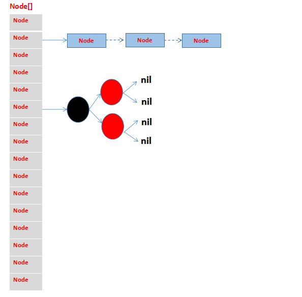

## ConcurrentHashMap的源码分析（jdk8）

> 之前分析了jdk7版本的ConcurrentHashMap，接下来看下jdk8的ConcurrentHashMap做了哪些修改，其中包括数据结构和非阻塞实现方式。

先看以下jdk8下ConcurrentHashMap的结构图：


ConcurrentHashMap基于使用锁分离技术，使用cas和synchronized实现非阻塞更新，以数组+链表+树的数据结构实现的多线程并发容器。

### Node结构
> Node中val和next使用volatile修饰，保证内存可见性。

```java
  static class Node<K,V> implements Map.Entry<K,V> {
      final int hash;
      final K key;
      volatile V val;
      volatile Node<K,V> next;

      Node(int hash, K key, V val, Node<K,V> next) {
          this.hash = hash;
          this.key = key;
          this.val = val;
          this.next = next;
      }

      public final K getKey()       { return key; }
      public final V getValue()     { return val; }
      public final int hashCode()   { return key.hashCode() ^ val.hashCode(); }
      public final String toString(){ return key + "=" + val; }
      public final V setValue(V value) {
          throw new UnsupportedOperationException();
      }

      //查询节点
      Node<K,V> find(int h, Object k) {
          Node<K,V> e = this;
          if (k != null) {
              do {
                  K ek;
                  if (e.hash == h &&
                      ((ek = e.key) == k || (ek != null && k.equals(ek))))
                      return e;
              } while ((e = e.next) != null);
          }
          return null;
      }
  }

  //特殊类型的Node，标识正在迁移，可以索引到新的table，以便在还没有完全迁移完时定位到昂前hash桶时数据的操作
  static final class ForwardingNode<K,V> extends Node<K,V> {
      final Node<K,V>[] nextTable;
      ForwardingNode(Node<K,V>[] tab) {
          super(MOVED, null, null, null);
          this.nextTable = tab;
      }

      Node<K,V> find(int h, Object k) {
          // loop to avoid arbitrarily deep recursion on forwarding nodes
          outer: for (Node<K,V>[] tab = nextTable;;) {
              Node<K,V> e; int n;
              if (k == null || tab == null || (n = tab.length) == 0 ||
                  (e = tabAt(tab, (n - 1) & h)) == null)
                  return null;
              for (;;) {
                  int eh; K ek;
                  if ((eh = e.hash) == h &&
                      ((ek = e.key) == k || (ek != null && k.equals(ek))))
                      return e;
                  if (eh < 0) {
                      if (e instanceof ForwardingNode) {
                          tab = ((ForwardingNode<K,V>)e).nextTable;
                          continue outer;
                      }
                      else
                          return e.find(h, k);
                  }
                  if ((e = e.next) == null)
                      return null;
              }
          }
      }
  }
```
### ConcurrentHashMap定义

```java
public class ConcurrentHashMap<K, V> extends AbstractMap<K, V>
        implements ConcurrentMap<K, V>, Serializable {
    //最大容量
    private static final int MAXIMUM_CAPACITY = 1 << 30;
    //默认容量
    private static final int DEFAULT_CAPACITY = 16;
    //最大数组长度
    static final int MAX_ARRAY_SIZE = Integer.MAX_VALUE - 8;
    //默认并发度：jdk8的并发度是不断变化的，扩容会导致增加
    private static final int DEFAULT_CONCURRENCY_LEVEL = 16;
    //加载因子
    private static final float LOAD_FACTOR = 0.75f;
    //链表转为树结构的阈值：一个hash桶中hash冲突的数目大于此值时，将链表转为红黑树，加快hash冲突下的查找速度
    static final int TREEIFY_THRESHOLD = 8;
    //将树转为链表结构的阈值：一个hash桶中冲突数目小于此值时，将红黑树转为链表
    static final int UNTREEIFY_THRESHOLD = 6;
    //当table数组长度小于此值时，不会将链表转为红黑树，所以链表转化为红黑树有两个条件：hash桶中冲突数目大于TREEIFY_THRESHOLD且容器中的数据大于此值
    static final int MIN_TREEIFY_CAPACITY = 64;
    //每个线程负责迁移Node数组的长度，该值最起码要大于等于DEFAULT_CAPACITY
    private static final int MIN_TRANSFER_STRIDE = 16;
    //用于每次扩容生成戳的数
    private static int RESIZE_STAMP_BITS = 16;
    //最大的扩容线程的数量，如果按照默认值的话，那就是2^16-1个线程进行扩容
    private static final int MAX_RESIZERS = (1 << (32 - RESIZE_STAMP_BITS)) - 1;
    //移位量，把生成戳移位后保存在sizeCtl中当做扩容线程计数的基数，相反方向移位后能够反解出生成戳
    private static final int RESIZE_STAMP_SHIFT = 32 - RESIZE_STAMP_BITS;

    // 下面几个是特殊的节点的hash值，正常节点的hash值在hash函数中都处理过了，不会出现负数的情况，特殊节点在各自的实现类中有特殊的遍历方法
    // ForwardingNode的hash值，ForwardingNode是一种临时节点，在扩进行中才会出现，并且它不存储实际的数据
    // 如果旧数组的一个hash桶中全部的节点都迁移到新数组中，旧数组就在这个hash桶中放置一个ForwardingNode
    // 读操作或者迭代读时碰到ForwardingNode时，将操作转发到扩容后的新的table数组上去执行，写操作碰见它时，则尝试帮助扩容
    static final int MOVED     = -1;
    //红黑树根节点的hash值
    static final int TREEBIN   = -2;
    static final int RESERVED  = -3;
    static final int HASH_BITS = 0x7fffffff;

    //CPU数，用于扩容时计算每个线程负责迁移的槽数
    static final int NCPU = Runtime.getRuntime().availableProcessors();

    //ConcurrentHashMap的实际容器，Node数组
    transient volatile Node<K,V>[] table;
    //扩容用，正常情况下为null
    private transient volatile Node<K,V>[] nextTable;

    /**
     * 多线程之间，以volatile的方式读取sizeCtl属性，来判断ConcurrentHashMap当前所处的状态。通过cas设置sizeCtl属性，告知其他线程ConcurrentHashMap的状态变更。
     * sizeCtl为负数是表示正在初始化或者扩容
     * sizeCtl=0：未初始化
     * sizeCtl>0：未初始化状态，表示初始容量
     * sizeCtl=-1：标记作用，告诉其他线程正在初始化
     * sizeCtl=-(1 + nThreads)：表示有nThreads个线程正在进行迁移操作
     * sizeCtl=0.75n：正常状态，表示扩容阈值
     */
    private transient volatile int sizeCtl;
    //下一个执行transfer任务的下标，有transferIndex和bound决定了线程处理的槽数，transfer时下标index从length-1往0的递减的方向变化
    private transient volatile int transferIndex;

    // CAS自旋锁标志位，用于初始化，或者counterCells扩容时
    private transient volatile int cellsBusy;    
    // 用于高并发的计数单元，如果初始化了这些计数单元，那么跟table数组一样，长度必须是2^n的形式
    private transient volatile CounterCell[] counterCells;

    public ConcurrentHashMap() {
    }

    //指定初始容量的构造函数
    public ConcurrentHashMap(int initialCapacity) {
        if (initialCapacity < 0)
            throw new IllegalArgumentException();
        int cap = ((initialCapacity >= (MAXIMUM_CAPACITY >>> 1)) ?
                   MAXIMUM_CAPACITY :
                   tableSizeFor(initialCapacity + (initialCapacity >>> 1) + 1));
        this.sizeCtl = cap;
    }

    public ConcurrentHashMap(int initialCapacity, float loadFactor) {
        this(initialCapacity, loadFactor, 1);
    }

    public ConcurrentHashMap(int initialCapacity,
                             float loadFactor, int concurrencyLevel) {
        if (!(loadFactor > 0.0f) || initialCapacity < 0 || concurrencyLevel <= 0)
            throw new IllegalArgumentException();
        //设置的初始容量应该大于等于并发度
        if (initialCapacity < concurrencyLevel)
            initialCapacity = concurrencyLevel;
        //计算实际的容量，必须是2^n，该值为大于等于size的最小2^n
        long size = (long)(1.0 + (long)initialCapacity / loadFactor);
        int cap = (size >= (long)MAXIMUM_CAPACITY) ?
            MAXIMUM_CAPACITY : tableSizeFor((int)size);
        //sizeCtl初始为实际容量值
        this.sizeCtl = cap;
    }
}
#### tableSizeFor
用户计算出大于等于给定容量的2^n，即2^n>=cap
```java
  private static final int tableSizeFor(int c) {
        //避免次数为2^n
        int n = c - 1;
        //计算后n的最高前2位为1
        n |= n >>> 1;
        //计算后n的最高前4位都为1
        n |= n >>> 2;
        //计算后n的最高前8位都为1
        n |= n >>> 4;
        //计算后n的最高前16位都为1
        n |= n >>> 8;
        //计算后n的最高前32位都为1
        n |= n >>> 16;
        //现在计算出的n每位数字都为1，执行n+1操作，就可以保证最高位为1，其他位为0，即实现了2^n
        return (n < 0) ? 1 : (n >= MAXIMUM_CAPACITY) ? MAXIMUM_CAPACITY : n + 1;
    }
```
>tableSizeFor采用位移方式计算，将cap的所有位数先变成1，在执行+1操作，就变成了2^n，此值正好>=设置的容量。

```
### put使用
```java
  public V put(K key, V value) {
      return putVal(key, value, false);
  }

  final V putVal(K key, V value, boolean onlyIfAbsent) {
      //key和value都不能为空
      if (key == null || value == null) throw new NullPointerException();
      //计算hash
      int hash = spread(key.hashCode());
      //用于hash桶节点计数
      int binCount = 0;
      for (Node<K,V>[] tab = table;;) {
          Node<K,V> f; int n, i, fh;
          //如果为空则执行初始化
          if (tab == null || (n = tab.length) == 0)
              tab = initTable();
          //如果索引到的hash桶为空，则cas设置当前节点到hash桶，结束循环
          else if ((f = tabAt(tab, i = (n - 1) & hash)) == null) {
              if (casTabAt(tab, i, null,
                           new Node<K,V>(hash, key, value, null)))
                  break;                   // no lock when adding to empty bin
          }
          //如果当前hash桶标识为MOVED，表示有线程正在执行transfer操作，则当前线程协助transfer
          else if ((fh = f.hash) == MOVED)
              tab = helpTransfer(tab, f);
          else {
              V oldVal = null;
              //当前hash槽加锁
              synchronized (f) {
                  //判断hash槽头结点是否变化，如果没变继续执行，否则重新执行for循环
                  if (tabAt(tab, i) == f) {
                      //头结点hash>=0，表示已经初始化完成，存在其他hash冲突的数据，将新节点放入链表
                      if (fh >= 0) {
                          binCount = 1;
                          for (Node<K,V> e = f;; ++binCount) {
                              K ek;
                              if (e.hash == hash &&
                                  ((ek = e.key) == key ||
                                   (ek != null && key.equals(ek)))) {
                                  oldVal = e.val;
                                  if (!onlyIfAbsent)
                                      e.val = value;
                                  break;
                              }
                              Node<K,V> pred = e;
                              if ((e = e.next) == null) {
                                  pred.next = new Node<K,V>(hash, key,
                                                            value, null);
                                  break;
                              }
                          }
                      }
                      //判断头结点是否为红黑树节点，将新节点放入红黑树
                      else if (f instanceof TreeBin) {
                          Node<K,V> p;
                          binCount = 2;
                          if ((p = ((TreeBin<K,V>)f).putTreeVal(hash, key,
                                                         value)) != null) {
                              oldVal = p.val;
                              if (!onlyIfAbsent)
                                  p.val = value;
                          }
                      }
                  }
              }
              //如果hash槽中为链表，判断当前槽中节点数是否超过转化为红黑树的阈值
              if (binCount != 0) {
                  if (binCount >= TREEIFY_THRESHOLD)
                      treeifyBin(tab, i);
                  if (oldVal != null)
                      return oldVal;
                  break;
              }
          }
      }
      addCount(1L, binCount);
      return null;
  }
```
#### initTable
>执行容器的初始化操作。
```java
  private final Node<K,V>[] initTable() {
      Node<K,V>[] tab; int sc;
      while ((tab = table) == null || tab.length == 0) {
          //如果size<0表示有其他线程在初始化或者扩容，当前线程让出CPU挂起
          if ((sc = sizeCtl) < 0)
              Thread.yield();
          //cas设置sizeCtrl值为-1，标识容器正在初始化，cas成功则标识获得了锁，其他失败线程则等待获取初始化权限的线程初始化完毕，退出当前循环
          else if (U.compareAndSwapInt(this, SIZECTL, sc, -1)) {
              try {
                  //再次检查
                  if ((tab = table) == null || tab.length == 0) {
                      //默认容量
                      int n = (sc > 0) ? sc : DEFAULT_CAPACITY;
                      @SuppressWarnings("unchecked")
                      Node<K,V>[] nt = (Node<K,V>[])new Node<?,?>[n];
                      table = tab = nt;
                      //计算sc新值，即初始化后容器的阈值：最后结果为0.75n
                      //n>>>2为n/4=0.25n
                      sc = n - (n >>> 2);
                  }
              } finally {
                  sizeCtl = sc;
              }
              break;
          }
      }
      return tab;
  }
```
#### helpTransfer
```java
  final Node<K,V>[] helpTransfer(Node<K,V>[] tab, Node<K,V> f) {
      Node<K,V>[] nextTab; int sc;
      //因为f的hash为MOVED，即为ForwardingNode类型，标识正在迁移
      if (tab != null && (f instanceof ForwardingNode) &&
          (nextTab = ((ForwardingNode<K,V>)f).nextTable) != null) {
          //最高位为1，其余为tab.length最高位1前面的0的个数，即32-index(top1)
          int rs = resizeStamp(tab.length);
          //判断是否仍在迁移操作，当前sc为-(1+nThreads)
          while (nextTab == nextTable && table == tab &&
                 (sc = sizeCtl) < 0) {
              //如果迁移完成，或者负责迁移的线程数量达到最大值，则终止循环
              if ((sc >>> RESIZE_STAMP_SHIFT) != rs || sc == rs + 1 ||
                  sc == rs + MAX_RESIZERS || transferIndex <= 0)
                  break;
              //sizeCtl表示当前迁移的线程数，当前线程设置此值+1，成功，则进入迁移操作
              if (U.compareAndSwapInt(this, SIZECTL, sc, sc + 1)) {
                  transfer(tab, nextTab);
                  break;
              }
          }
          return nextTab;
      }
      return table;
  }
```
#### putTreeVal
> 当前hash槽位节点为红黑树结构的情况，进行节点更新。

```java
  final TreeNode<K,V> putTreeVal(int h, K k, V v) {
      Class<?> kc = null;
      boolean searched = false;
      //以当前节点为根节点（其实开始为hash槽的头结点）
      for (TreeNode<K,V> p = root;;) {
          int dir, ph; K pk;
          //树为空的情况下，设置first和root节点值
          if (p == null) {
              first = root = new TreeNode<K,V>(h, k, v, null, null);
              break;
          }
          //当前节点hash值大于新节点hash值（红黑树结构：左节点值小于父节点，右节点值大于父节点值）
          else if ((ph = p.hash) > h)
              dir = -1;
          //当前节点hash值小于新节点hash值
          else if (ph < h)
              dir = 1;
          //当前节点的hash与新节点的hash值相等，判断当前节点的key与新节点的key是否相等（引用同一个对象或者key的值相等）
          else if ((pk = p.key) == k || (pk != null && k.equals(pk)))
              return p;
          //当前节点hash值相等，但是key不为同一个类
          else if ((kc == null &&
                    (kc = comparableClassFor(k)) == null) ||
                   (dir = compareComparables(kc, k, pk)) == 0) {
              if (!searched) {
                  TreeNode<K,V> q, ch;
                  searched = true;
                  if (((ch = p.left) != null &&
                       (q = ch.findTreeNode(h, k, kc)) != null) ||
                      ((ch = p.right) != null &&
                       (q = ch.findTreeNode(h, k, kc)) != null))
                      return q;
              }
              //hash值相等，但是key无法比较，则设置特殊值
              dir = tieBreakOrder(k, pk);
          }

          TreeNode<K,V> xp = p;
          //经过前面的计算，得到了当前节点和新插入节点的大小关系
          //如果当前节点没有左孩子或者右孩子才能插入，否则继续寻找
          if ((p = (dir <= 0) ? p.left : p.right) == null) {
              TreeNode<K,V> x, f = first;
              first = x = new TreeNode<K,V>(h, k, v, f, xp);
              //设置前驱节点
              if (f != null)
                  f.prev = x;
              if (dir <= 0)
                  xp.left = x;
              else
                  xp.right = x;
              //如果当前节点为黑色节点，则新插入节点为红色节点，不用调整红黑树平衡
              if (!xp.red)
                  x.red = true;
              else {
                  lockRoot();
                  try {
                      //平衡红黑树
                      root = balanceInsertion(root, x);
                  } finally {
                      //释放写锁，即设置lockState为0（此步当前线程已经持有了锁，写lockState为volatile修饰，赋值为原子操作），不需要加锁
                      unlockRoot();
                  }
              }
              break;
          }
      }
      assert checkInvariants(root);
      return null;
  }

  //获得写锁：锁住根节点
  private final void lockRoot() {
      //如果lockState为0，cas加写锁
      if (!U.compareAndSwapInt(this, LOCKSTATE, 0, WRITER))
          //加写锁失败后自旋竞争锁
          contendedLock();
  }

  //读写互斥
  //因为ConcurrentHashMap的写方法会给头节点加锁，所以不用考虑写写竞争的情况，只用考虑读写竞争的情况（前面putVal操作的时候已经加锁,即synchronized (f)）
  private final void contendedLock() {
     // WRITER = 001; WAITER = 010; READER = 100; ~表示取反
      boolean waiting = false;
      for (int s;;) {
          //~WAITER=101
          //当前lockState为0或者为WAITER时，即（0000&1101或者0010&1101），即当前不存在读锁的情况下（此情况下也不会线程持有写锁，因为synchronized使线程互斥）
          if (((s = lockState) & ~WAITER) == 0) {
              //尝试获取写锁
              if (U.compareAndSwapInt(this, LOCKSTATE, s, WRITER)) {
                  //如果设置过当前线程为等待线程，则清除waiter标识
                  if (waiting)
                      waiter = null;
                  return;
              }
          }
          //当前lockState为READER（即0100&0010），即如果有线程持有读锁，且没有别的写线程占据WAITER，设置WAITER标识位为1，即LOCKSTATE更新为0110
          else if ((s & WAITER) == 0) {
              //设置lockState的WAITER位，并且设置当前线程为等待线程
              if (U.compareAndSwapInt(this, LOCKSTATE, s, s | WAITER)) {
                  waiting = true;
                  waiter = Thread.currentThread();
              }
          }
          //当前线程没有竞争到写锁，且已经将当前线程设置为了等待线程，则挂起当前线程
          else if (waiting)
              LockSupport.park(this);
      }
  }
```

#### treeifyBin
> 链表长度达到TREEIFY_THRESHOLD阈值，判断是否转换为红黑树，转换红黑树有两个条件：
1、单链表的长度达到TREEIFY_THRESHOLD；
2、table的大小达到MIN_TREEIFY_CAPACITY；

```java
    private final void treeifyBin(Node<K,V>[] tab, int index) {
        Node<K,V> b; int n, sc;
        if (tab != null) {
            //如果table大小小于MIN_TREEIFY_CAPACITY=64，说明容器元素数量不是太多，进行双倍扩容，不进行链表转红黑树的操作
            //所以链表转红黑树有两个条件：单链表长度超过8且table的大小达到64
            if ((n = tab.length) < MIN_TREEIFY_CAPACITY)
                tryPresize(n << 1);
            //链表转红黑树
            else if ((b = tabAt(tab, index)) != null && b.hash >= 0) {
                synchronized (b) {
                    if (tabAt(tab, index) == b) {
                        TreeNode<K,V> hd = null, tl = null;
                        for (Node<K,V> e = b; e != null; e = e.next) {
                            TreeNode<K,V> p =
                                new TreeNode<K,V>(e.hash, e.key, e.val,
                                                  null, null);
                            if ((p.prev = tl) == null)
                                hd = p;
                            else
                                tl.next = p;
                            tl = p;
                        }
                        setTabAt(tab, index, new TreeBin<K,V>(hd));
                    }
                }
            }
        }
    }
```
#### tryPresize
> table按照两倍容量扩容并执行迁移操作。

```java
  private final void tryPresize(int size) {
      //根据新容量设值：MAXIMUM_CAPACITY 或者2倍扩容
      int c = (size >= (MAXIMUM_CAPACITY >>> 1)) ? MAXIMUM_CAPACITY :
          tableSizeFor(size + (size >>> 1) + 1);
      int sc;
      //当前容器处于未初始化或者正常状态，此时sizeCtl代表容器初始化标识或者初始化容量或者容器阈值
      while ((sc = sizeCtl) >= 0) {
          Node<K,V>[] tab = table; int n;
          //table尚未初始化
          if (tab == null || (n = tab.length) == 0) {
              n = (sc > c) ? sc : c;
              //设值初始化标识-1
              if (U.compareAndSwapInt(this, SIZECTL, sc, -1)) {
                  try {
                      //初始化指定容量的table，设值sizeCtl值为0.75n
                      if (table == tab) {
                          @SuppressWarnings("unchecked")
                          Node<K,V>[] nt = (Node<K,V>[])new Node<?,?>[n];
                          table = nt;
                          sc = n - (n >>> 2);
                      }
                  } finally {
                      sizeCtl = sc;
                  }
              }
          }
          //新容量尚未达到阈值或者超过最大容量，终止操作
          else if (c <= sc || n >= MAXIMUM_CAPACITY)
              break;
          //下面参考helpTransfer操作，进行容器元素迁移
          else if (tab == table) {
              int rs = resizeStamp(n);
              if (sc < 0) {
                  Node<K,V>[] nt;
                  if ((sc >>> RESIZE_STAMP_SHIFT) != rs || sc == rs + 1 ||
                      sc == rs + MAX_RESIZERS || (nt = nextTable) == null ||
                      transferIndex <= 0)
                      break;
                  if (U.compareAndSwapInt(this, SIZECTL, sc, sc + 1))
                      transfer(tab, nt);
              }
              else if (U.compareAndSwapInt(this, SIZECTL, sc,
                                           (rs << RESIZE_STAMP_SHIFT) + 2))
                  transfer(tab, null);
          }
      }
  }
```

#### addCount
> 不同于jdk7版本的对segment加锁计数，jdk8没有使用segment，而是基于volatile修饰的baseCount通过cas更新，如果更新失败，表示有其他线程正在
竞争，则会通过CounterCell进行分段统计，此处使用了LongAdder的分段统计思想，尽量减少多线程的冲突。

```java
  @sun.misc.Contended static final class CounterCell {
      volatile long value;
      CounterCell(long x) { value = x; }
  }

  //put时check为当前table槽位处元素的数量
  //remove时，check为-1
  private final void addCount(long x, int check) {
      CounterCell[] as; long b, s;
      //如果counterCells已经初始化或者在counterCells为空时，更新baseCount
      //如果counterCells已经初始化，说明存在竞争，需要将当前线程hash到counterCells槽中，通过对cell计数；
      //如果counterCells未初始化，当前没有竞争，cas更新baseCount值，如果失败，说明存在竞争，则hash到某个槽处理
      if ((as = counterCells) != null ||
          !U.compareAndSwapLong(this, BASECOUNT, b = baseCount, s = b + x)) {
          CounterCell a; long v; int m;
          boolean uncontended = true;
          //如果计数盒子是空的（尚未发现并发）
          //如果hash到数组的位置是空的或者cas更新这个槽位的变量失败了（发现了并发）
          //则执行fullAddCount初始化
          if (as == null || (m = as.length - 1) < 0 ||
              (a = as[ThreadLocalRandom.getProbe() & m]) == null ||
              !(uncontended =
                U.compareAndSwapLong(a, CELLVALUE, v = a.value, v + x))) {
              //
              fullAddCount(x, uncontended);
              return;
          }
          //此时执行remove操作，直接结束
          if (check <= 1)
              return;
          //求table元素数量，用于后面判断是否需要扩容
          s = sumCount();
      }
      //check>0表示put操作，然后判断是否需要扩容，每次put都会执行检查
      if (check >= 0) {
          Node<K,V>[] tab, nt; int n, sc;
          //判断是否需要扩容table：此处s>=0，s>=sizeCtl结合(tab = table) != null表示当前table元素数量达到扩容阈值
          while (s >= (long)(sc = sizeCtl) && (tab = table) != null &&
                 (n = tab.length) < MAXIMUM_CAPACITY) {
              int rs = resizeStamp(n);//标识，第16位为1，其余为table长度二进制表示时32-最高位1的位置，即前面0的个数
              //table在进行迁移操作
              if (sc < 0) {
                  // 如果 sc 的高16 位不等于 标识符（校验异常 sizeCtl 变化了）
                  // 如果 sc == 标识符 + 1 （扩容结束了，不再有线程进行扩容）（默认第一个线程设置 sc =rs 左移 16 位 + 2，每一个线程结束扩容了，就会将sc 减一，最后一个线程扩容结束时，sc 就等于 rs + 1）
                  // 如果 sc == 标识符 + 65535（帮助线程数已经达到最大）
                  // 如果 nextTable == null（结束扩容了）
                  // 如果 transferIndex <= 0 (转移状态变化了)
                  // 结束循环
                  if ((sc >>> RESIZE_STAMP_SHIFT) != rs || sc == rs + 1 ||
                      sc == rs + MAX_RESIZERS || (nt = nextTable) == null ||
                      transferIndex <= 0)
                      break;
                  //当前线程获得扩容权限，执行扩容，此时sc的低16位表示正在扩容的线程数
                  if (U.compareAndSwapInt(this, SIZECTL, sc, sc + 1))
                      transfer(tab, nt);
              }
              //第一个执行扩容的线程：rc<<RESIZE_STAMP_SHIFT则变成最高位为1，变成负数，低16位变成2，
              //其他线程执行扩容时都为执行+1操作，完成本线程的扩容任务后执行-1操作，所以sc的低16位表示当前正在执行扩容的线程数
              else if (U.compareAndSwapInt(this, SIZECTL, sc,
                                           (rs << RESIZE_STAMP_SHIFT) + 2))
                  transfer(tab, null);
              s = sumCount();
          }
      }
  }

  //x为更新值，wasUncontended初始为false
   private final void fullAddCount(long x, boolean wasUncontended) {
        int h;
        //取得本线程更新的定位counterCells槽位的hash值：根据线程随机数产生
        if ((h = ThreadLocalRandom.getProbe()) == 0) {
            ThreadLocalRandom.localInit();      // force initialization
            h = ThreadLocalRandom.getProbe();
            wasUncontended = true;
        }
        boolean collide = false;                // True if last slot nonempty
        //自旋
        for (;;) {
            CounterCell[] as; CounterCell a; int n; long v;
            if ((as = counterCells) != null && (n = as.length) > 0) {
                //此处cell尚未初始化
                if ((a = as[(n - 1) & h]) == null) {
                    //volatile修饰，根据值判断是否存在竞争，只有0和1两个值，设值相当于加锁释放锁的操作
                    if (cellsBusy == 0) {            
                        CounterCell r = new CounterCell(x);
                        //更新cellsBusy，设为1
                        if (cellsBusy == 0 &&
                            U.compareAndSwapInt(this, CELLSBUSY, 0, 1)) {
                            boolean created = false;
                            try {               
                                //重复检查此处cell是否为空，为空则初始化此处cell
                                CounterCell[] rs; int m, j;
                                if ((rs = counterCells) != null &&
                                    (m = rs.length) > 0 &&
                                    rs[j = (m - 1) & h] == null) {
                                    rs[j] = r;
                                    created = true;
                                }
                            } finally {
                                //更新锁
                                cellsBusy = 0;
                            }
                            //创建完成，退出循环
                            if (created)
                                break;
                            //存在竞争，再次自旋获取cell
                            continue;          
                        }
                    }
                    collide = false;
                }
                //入参addCountcas时为false，如果随机数为0，参数值会设置为true
                else if (!wasUncontended)       
                    wasUncontended = true;     
                //cas更新cell值，成功则退出，否则继续自旋
                else if (U.compareAndSwapLong(a, CELLVALUE, v = a.value, v + x))
                    break;
                //counterCells发生变化，可能发生了扩容或者当前counterCells数组长度达到了CPU核数，设置collide
                else if (counterCells != as || n >= NCPU)
                    collide = false;
                else if (!collide)
                    collide = true;
                //当前存在竞争，而且counterCells数组长度没有超过CPU核数，则加锁2倍扩容
                else if (cellsBusy == 0 &&
                         U.compareAndSwapInt(this, CELLSBUSY, 0, 1)) {
                    try {
                        if (counterCells == as) {// Expand table unless stale
                            CounterCell[] rs = new CounterCell[n << 1];
                            for (int i = 0; i < n; ++i)
                                rs[i] = as[i];
                            counterCells = rs;
                        }
                    } finally {
                        cellsBusy = 0;
                    }
                    collide = false;
                    continue;                   // Retry with expanded table
                }
                h = ThreadLocalRandom.advanceProbe(h);
            }
            //如果counterCells尚未初始化，则加锁执行初始化
            else if (cellsBusy == 0 && counterCells == as &&
                     U.compareAndSwapInt(this, CELLSBUSY, 0, 1)) {
                boolean init = false;
                try {                           // Initialize table
                    if (counterCells == as) {
                        //counterCells初始长度为2
                        CounterCell[] rs = new CounterCell[2];
                        rs[h & 1] = new CounterCell(x);
                        counterCells = rs;
                        init = true;
                    }
                } finally {
                    cellsBusy = 0;
                }
                if (init)
                    break;
            }
            //counterCells为空，或者竞争失败，尝试更新baseCount
            else if (U.compareAndSwapLong(this, BASECOUNT, v = baseCount, v + x))
                break;                          // Fall back on using base
        }
    }

  //如果counterCells为null，直接返回baseCount值，否则累加每个CounterCell的值
  final long sumCount() {
      CounterCell[] as = counterCells; CounterCell a;
      long sum = baseCount;
      if (as != null) {
          for (int i = 0; i < as.length; ++i) {
              if ((a = as[i]) != null)
                  sum += a.value;
          }
      }
      return sum;
  }
```

### transfer
> 执行Node数组的扩容和元素的迁移操作。

```java
  private final void transfer(Node<K,V>[] tab, Node<K,V>[] nextTab) {
      int n = tab.length, stride;
      //计算每个线程迁移的槽数，如果为多核机器，判断当前table的槽数/8/NCPU是否小于最少迁移槽数16
      if ((stride = (NCPU > 1) ? (n >>> 3) / NCPU : n) < MIN_TRANSFER_STRIDE)
          stride = MIN_TRANSFER_STRIDE;
      //迁移table尚未初始化
      if (nextTab == null) {
          try {
              @SuppressWarnings("unchecked")
              //双倍容量初始化
              Node<K,V>[] nt = (Node<K,V>[])new Node<?,?>[n << 1];
              nextTab = nt;
          } catch (Throwable ex) {      // try to cope with OOME
              sizeCtl = Integer.MAX_VALUE;
              return;
          }
          nextTable = nextTab;
          transferIndex = n;
      }
      int nextn = nextTab.length;
      //迁移标识节点，通过next连接到nextTable，在迁移过程中不影响该位置出元素的读取
      ForwardingNode<K,V> fwd = new ForwardingNode<K,V>(nextTab);
      //迁移使用
      boolean advance = true;
      boolean finishing = false;
      for (int i = 0, bound = 0;;) {
          Node<K,V> f; int fh;
          //刚进入for循环时执行此循环，用于设置tranferIndex，获得本线程要执行迁移的区间[transferIndex, transferIndex + stride]，通过更新transferIndex来获得多线程协同
          while (advance) {
              int nextIndex, nextBound;
              //控制本线程迁移时的节点边界（i=nextIndex-1至bound=nextIndex-stride长度或nextIndex-0的长度）
              if (--i >= bound || finishing)
                  advance = false;
              //迁移完毕
              else if ((nextIndex = transferIndex) <= 0) {
                  i = -1;
                  advance = false;
              }
              //设置transferIndex，数值从n到0倒序变化，每个线程迁移的table槽数为stride，通过设置transferIndex，其他线程就可以根据此值设置自己的迁移方案
              else if (U.compareAndSwapInt
                       (this, TRANSFERINDEX, nextIndex,
                        nextBound = (nextIndex > stride ?
                                     nextIndex - stride : 0))) {
                  bound = nextBound;
                  i = nextIndex - 1;
                  advance = false;
              }
          }
          //i如果小于0
          if (i < 0 || i >= n || i + n >= nextn) {
              int sc;
              //迁移结束，收尾工作
              if (finishing) {
                  //正常状态为空
                  nextTable = null;
                  //指向迁移完毕table
                  table = nextTab;
                  //新的阈值：2*n-0.5n=0.75*(2*n)
                  sizeCtl = (n << 1) - (n >>> 1);
                  return;
              }
              //本线程执行完分配的迁移工作，执行sc-1
              //在helpTransfer中会执行U.compareAndSwapInt(this, SIZECTL, sc, sc + 1)
              if (U.compareAndSwapInt(this, SIZECTL, sc = sizeCtl, sc - 1)) {
                  //判断是否为执行迁移操作的最后一个线程，因为执行迁移时sizeCtl=resizeStamp(n) << RESIZE_STAMP_SHIFT+2
                  if ((sc - 2) != resizeStamp(n) << RESIZE_STAMP_SHIFT)
                      return;
                  finishing = advance = true;
                  i = n; // recheck before commit
              }
          }
          //当前位置尚未初始化，即不存在元素，不需要迁移
          else if ((f = tabAt(tab, i)) == null)
              advance = casTabAt(tab, i, null, fwd);
          //其他线程正在迁执行此位置的迁移，hash标识为MOVED表示此槽位置已经迁移，需要重新获得新的迁移槽位
          else if ((fh = f.hash) == MOVED)
              advance = true; // already processed
          else {
              //加锁操作：锁住当前位置的Node
              synchronized (f) {
                  //因为多线程，再次检查节点是否变化
                  if (tabAt(tab, i) == f) {
                      Node<K,V> ln, hn;
                      //hash>=0，为链表节点，否则为红黑树节点
                      if (fh >= 0) {
                          int runBit = fh & n;
                          Node<K,V> lastRun = f;
                          //会将原来链表节分成两部分，
                          for (Node<K,V> p = f.next; p != null; p = p.next) {
                              int b = p.hash & n;
                              if (b != runBit) {
                                  runBit = b;
                                  lastRun = p;
                              }
                          }
                          //hash&n为0设置低水位索引位置，否则设置到高水位索引位置，初始化ln，hn
                          if (runBit == 0) {
                              ln = lastRun;
                              hn = null;
                          }
                          else {
                              hn = lastRun;
                              ln = null;
                          }
                          //具体拆分原链表到新链表的操作：i，i+n,采用头插法
                          for (Node<K,V> p = f; p != lastRun; p = p.next) {
                              int ph = p.hash; K pk = p.key; V pv = p.val;
                              //hash&n==0设置到低水位，即原来相同的位置i，否则设置到原来的位置i+n处
                              if ((ph & n) == 0)
                                  ln = new Node<K,V>(ph, pk, pv, ln);
                              else
                                  hn = new Node<K,V>(ph, pk, pv, hn);
                          }
                          //cas设置low，high处的链表头结点
                          setTabAt(nextTab, i, ln);
                          setTabAt(nextTab, i + n, hn);
                          //设置原来Node数组i位置的迁移标识
                          setTabAt(tab, i, fwd);
                          advance = true;
                      }
                      //红黑树的情况
                      else if (f instanceof TreeBin) {
                          TreeBin<K,V> t = (TreeBin<K,V>)f;
                          TreeNode<K,V> lo = null, loTail = null;
                          TreeNode<K,V> hi = null, hiTail = null;
                          int lc = 0, hc = 0;
                          for (Node<K,V> e = t.first; e != null; e = e.next) {
                              int h = e.hash;
                              TreeNode<K,V> p = new TreeNode<K,V>
                                  (h, e.key, e.val, null, null);
                              if ((h & n) == 0) {
                                  if ((p.prev = loTail) == null)
                                      lo = p;
                                  else
                                      loTail.next = p;
                                  loTail = p;
                                  ++lc;
                              }
                              else {
                                  if ((p.prev = hiTail) == null)
                                      hi = p;
                                  else
                                      hiTail.next = p;
                                  hiTail = p;
                                  ++hc;
                              }
                          }
                          ln = (lc <= UNTREEIFY_THRESHOLD) ? untreeify(lo) :
                              (hc != 0) ? new TreeBin<K,V>(lo) : t;
                          hn = (hc <= UNTREEIFY_THRESHOLD) ? untreeify(hi) :
                              (lc != 0) ? new TreeBin<K,V>(hi) : t;
                          setTabAt(nextTab, i, ln);
                          setTabAt(nextTab, i + n, hn);
                          setTabAt(tab, i, fwd);
                          advance = true;
                      }
                  }
              }
          }
      }
  }
```
### get

```java
  public V get(Object key) {
      Node<K,V>[] tab; Node<K,V> e, p; int n, eh; K ek;
      int h = spread(key.hashCode());
      if ((tab = table) != null && (n = tab.length) > 0 &&
          (e = tabAt(tab, (n - 1) & h)) != null) {
          //先判断头结点是否满足
          if ((eh = e.hash) == h) {
              if ((ek = e.key) == key || (ek != null && key.equals(ek)))
                  return e.val;
          }
          //如果头结点hash值小于0，可能表示MOVED、TREEBIN节点，执行对应的find操作
          else if (eh < 0)
              return (p = e.find(h, key)) != null ? p.val : null;
          //在链表中查找满足条件的节点
          while ((e = e.next) != null) {
              if (e.hash == h &&
                  ((ek = e.key) == key || (ek != null && key.equals(ek))))
                  return e.val;
          }
      }
      return null;
  }
```

### remove

```java
  public V remove(Object key) {
      return replaceNode(key, null, null);
  }
  final V replaceNode(Object key, V value, Object cv) {
      int hash = spread(key.hashCode());
      for (Node<K,V>[] tab = table;;) {
          Node<K,V> f; int n, i, fh;
          //table为空不用操作
          if (tab == null || (n = tab.length) == 0 ||
              (f = tabAt(tab, i = (n - 1) & hash)) == null)
              break;
          //正在执行迁移，协助迁移
          else if ((fh = f.hash) == MOVED)
              tab = helpTransfer(tab, f);
          else {
              V oldVal = null;
              boolean validated = false;
              synchronized (f) {
                  if (tabAt(tab, i) == f) {
                     //当前槽位为链表的情况
                      if (fh >= 0) {
                          validated = true;
                          for (Node<K,V> e = f, pred = null;;) {
                              K ek;
                              //找到要移除的节点，如果value不为空，则替换value值，否则执行链表的移除操作
                              if (e.hash == hash &&
                                  ((ek = e.key) == key ||
                                   (ek != null && key.equals(ek)))) {
                                  V ev = e.val;
                                  if (cv == null || cv == ev ||
                                      (ev != null && cv.equals(ev))) {
                                      oldVal = ev;
                                      if (value != null)
                                          e.val = value;
                                      else if (pred != null)
                                          pred.next = e.next;
                                      else
                                          setTabAt(tab, i, e.next);
                                  }
                                  break;
                              }
                              pred = e;
                              if ((e = e.next) == null)
                                  break;
                          }
                      }
                      //当前槽位头结点为红黑树的情况
                      else if (f instanceof TreeBin) {
                          validated = true;
                          TreeBin<K,V> t = (TreeBin<K,V>)f;
                          TreeNode<K,V> r, p;
                          if ((r = t.root) != null &&
                              (p = r.findTreeNode(hash, key, null)) != null) {
                              V pv = p.val;
                              if (cv == null || cv == pv ||
                                  (pv != null && cv.equals(pv))) {
                                  oldVal = pv;
                                  if (value != null)
                                      p.val = value;
                                  else if (t.removeTreeNode(p))
                                      setTabAt(tab, i, untreeify(t.first));
                              }
                          }
                      }
                  }
              }
              //校验，判断是否移除元素，执行addCount操作
              if (validated) {
                  if (oldVal != null) {
                    //value为空，表示移除操作，table的size-1
                      if (value == null)
                          addCount(-1L, -1);
                      return oldVal;
                  }
                  break;
              }
          }
      }
      return null;
  }
```
到此，jdk8版本的ConcurrentHashMap源码分析结束了，相比jdk7主要变化为：
1、使用了cas无锁话更新；
2、改变了存储数据结构，去掉了Segment这一层，增加了红黑树，避免链表过长时影响查找节点速度；
3、容器扩容时针对Node扩容，并发度不再是固定不变，随着元素增加，容器扩容，并发度也在提升；
4、支持多线程扩容，依赖于volatile修饰的游标执行任务分配。
