## ConcurrentLinkedQueue源码分析
> ConcurrentLinkedQueue是一个线程安全的非阻塞无界队列，基于链表结构实现，理论上队列的长度可以无限扩大。与其他队列相同，ConcurrentLinkedQueue也采用的FIFO入队规则，当我们向队列添加元素的时候，新插入的元素会插入队列的尾部，当我们获取一个元素的时候，会从头部取出。
注意：在判断ConcurrentLinkedQueue非空时，不要使用size()==0的做法，因为size()方法中，是通过遍历整个链表来实现的，在队列元素很多的时候，此方法非常消耗性能和时间，只是单纯判断队列为空使用isEmpty()即可。

ConcurrentLinkedQueue类图如下：
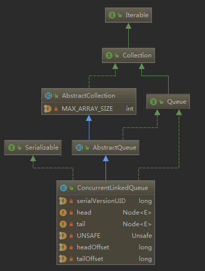

如图ConcurrentLinkedQueue有两个volatile类型的Node节点分别指向链表的首尾节点，其中head指向链表的第一个item为null的节点，tail并不是总指向最后一个节点。Node节点内部维护一个变量item存放节点的值，next用来存放下一个节点，组成一个单向无界链表
```
public ConcurrentLinkedQueue() {
    head = tail = new Node<E>(null);
}
```
初始化时head，tail指向同一个item为null的节点。
### Node定义

```
private static class Node<E> {
    volatile E item;
    volatile Node<E> next;
    Node(E item) {
        UNSAFE.putObject(this, itemOffset, item);
    }
    boolean casItem(E cmp, E val) {
        return UNSAFE.compareAndSwapObject(this, itemOffset, cmp, val);
    }
    void lazySetNext(Node<E> val) {
        UNSAFE.putOrderedObject(this, nextOffset, val);
    }
    boolean casNext(Node<E> cmp, Node<E> val) {
        return UNSAFE.compareAndSwapObject(this, nextOffset, cmp, val);
    }
    private static final sun.misc.Unsafe UNSAFE;
    private static final long itemOffset;
    private static final long nextOffset;
    static {
        try {
            UNSAFE = sun.misc.Unsafe.getUnsafe();
            Class<?> k = Node.class;
            itemOffset = UNSAFE.objectFieldOffset
                (k.getDeclaredField("item"));
            nextOffset = UNSAFE.objectFieldOffset
                (k.getDeclaredField("next"));
        } catch (Exception e) {
            throw new Error(e);
        }
    }
}
```

### ConcurrentLinkedQueue方法

### add

```
public boolean add(E e) {
    return offer(e);
}
```
#### offer

```
public boolean offer(E e) {
    //如果元素e为null，则抛出异常
    checkNotNull(e);
    //新建Node节点，内部使用UNSAFE.putObject赋值
    final Node<E> newNode = new Node<E>(e);

    //尾部插入，从tail开始操作，使用cas自旋直到操作成功
    for (Node<E> t = tail, p = t;;) {
        Node<E> q = p.next;

        //如果q为null，说明p是尾结点，则插入
        if (q == null) {
            // cas插入（1）
            //多线程执行插入的时候，此处cas只有一个线程能执行成功，失败的线程会执行到（3）
            if (p.casNext(null, newNode)) {
                //cas成功说明新增节点已经放入链表，然后尾结点位置发生变化，设置尾结点（包含head，2，4，6...个节点为尾结点）
                if (p != t)
                    //重新设置尾结点
                    casTail(t, newNode);
                return true;
            }
            // Lost CAS race to another thread; re-read next
        }
        //（2）
        else if (p == q)
            //多线程操作的时候，由于poll的时候会把老的head变为自引用，然后head的next变为新的head，所以这里需要重新找到新的head，因为新的head后面的节点才是激活的节点
            p = (t != (t = tail)) ? t : head;
        else//（3）
            // 重新定位p节点，线程在（1）cas失败后也会执行到此处，此时p定位后，p指向了尾结点，而tail=p-1处，再次插入新节点进而重新定位到新的tail
            p = (p != t && t != (t = tail)) ? t : q;
    }
}
```
从构造函数得知，初始化时head和tail指向一个item为null的哨兵节点，如图：
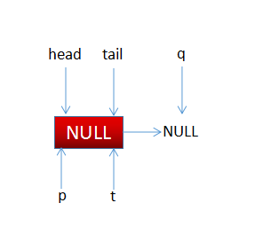

以下流程只讨论多线程执行offer的情况。

线程1初始调用offer的时候，此时tail==head，t==tail，p==t，q=p.next=null，即执行（1）处代码，p.casNext通过cas设置p的next添加新增节点，这时候p==t所以，不会执行casTail方法。由于offer可能同时多线程调用，比如两个线程同时调用到了（1）处的cas，那么只有一个会成功（加入线程1成功），成功后的链表变为：
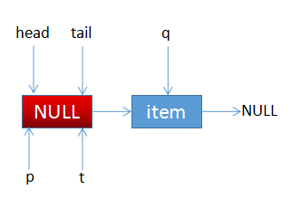

失败的线程2重新执行循环处，此时q=p.next指向了线程1插入的节点，不为null，则会执行到代码（3）处，由于此时p==t，则重新设置p=q,即p指向新的尾结点，此时链表结构如下：


再次执行循环，则此时(q=p.next) == null，此时链表结构如下：
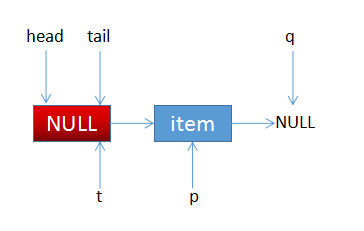

再次执行到（1）处，添加新节点，即p.next=newNode，插入成功后，此时p和t的指向已经不同，即p!=t，则设置tail指向新的尾结点。此时链表结构如下：
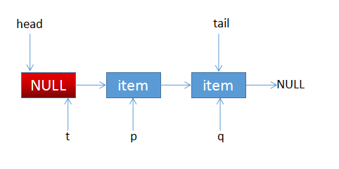

假如线程2执行（1）处cas时，又有线程3也是执行（1）处cas失败，则重新循环执行到（3）处，执行（3）处时，t重新指向tail链表结构如下：
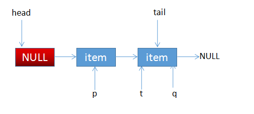

p重新指向q处，链表结构如下
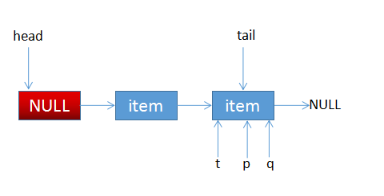

线程3再次循环时候，链表结构如下：
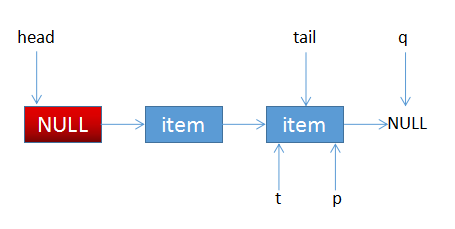

此时回归到初始插入的那种状态，tail重新指向了尾结点，所以ConcurrentLinkedQueue的tail不总是指向tail，会每间隔两个节点重新设置一次tail。

在offer的代码中还有（2）p==q的分支没走，由于q=p.next，如果p==q为true，说明p=p.next，而在updateHead方法中：
```
final void updateHead(Node<E> h, Node<E> p) {
    if (h != p && casHead(h, p))
        h.lazySetNext(h);
}
```
updateHead方法在head!=p时，会更新head节点指向，并把旧的head.next指向自己，便于回收，看代码中只有poll调用了updateHead，在poll调用后会出现下面的状态：
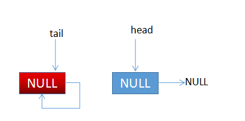

此时有线程执行offer添加元素时，链表结构为：
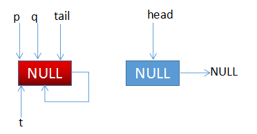

此时p=q，则重新定向p=head，此时链表结构为：
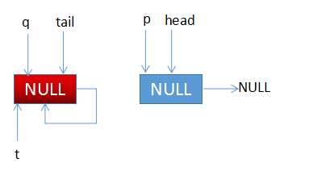

(q=p.next) == null 为true，增加新的节点，并且p!=t，更新tail节点，此时链表结构为：
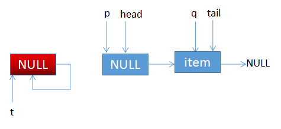

最终链表结构变为：

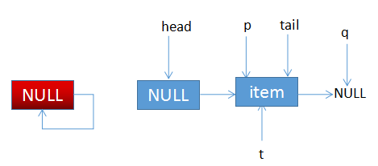

#### poll

```
public E poll() {
    //设置标识
    restartFromHead:
    //死循环
    for (;;) {
        //死循环，poll从头结点取元素
        for (Node<E> h = head, p = h, q;;) {
            E item = p.item;

            //（1）当前节点有值，将当前节点值置为null
            if (item != null && p.casItem(item, null)) {
                //（2）类似offer的tail，每间隔2个节点设置一次头结点
                if (p != h)
                    updateHead(h, ((q = p.next) != null) ? q : p);
                return item;
            }
            //（3）当前队列为空，则返回null
            else if ((q = p.next) == null) {
                updateHead(h, p);
                return null;
            }
            //自引用了，重新开始找到新的头结点(4)
            else if (p == q)
                continue restartFromHead;
            else
                p = q;
        }
    }
}
```
可知，当执行（3）处代码时，存在两种情况
1、队列为空的情况，即：

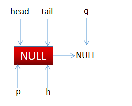

此时q==null为true，updateHead不会设置新的头节点，返回null。

2、执行q=p.next时，有线程添加了节点，即：

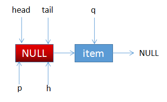

继续执行到else，则p=q，即p更新指向到next，此时链表结构为：
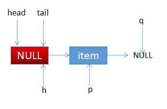

执行到（1）处，cas设置p.item=null，此时p!=h，需要更新head节点因为q==null，所以更新head指向p节点，因为会执行updateHead方法，旧的head.next会指向自己，此时链表结构为：
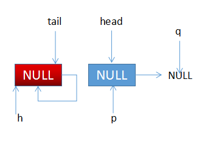

再有线程poll元素，则会执行到（3），此处返回null。
现在还有（4）处代码，假如在一个线程执行（2）updateHead时，此时一个线程进来poll元素，此时线程2的p指向原来的head（线程1尚未更新完），此时线程1执行updateHead完毕，更新了head，此时线程2指向的链表结构为：
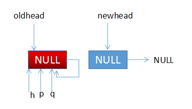

同offer的p=q的情况，此处重新定位head节点。

#### peek
> peek是读取链表头部一个元素（只读取不移除）。
代码与poll类似，只是少了casItem，并且peek会改变head的指向，offer后head指向哨兵节点，第一次peek后head会执行第一个真的节点元素。

```
public E peek() {
    restartFromHead:
    //死循环
    for (;;) {
        for (Node<E> h = head, p = h, q;;) {
            E item = p.item;
            //当head指向哨兵节点时，此处item为null，此时q=p.next存在两种情况：
            //1、当队列为空时，此时返回item为null；
            //2、当q!=null时，执行（3），然后循环在执行到此处，设置head为非空节点
            if (item != null || (q = p.next) == null) {//（1）
                updateHead(h, p);
                return item;
            }
            else if (p == q)//（2）
                continue restartFromHead;
            else//（3）
                p = q;
        }
    }
}
```

#### first
> 获取队列第一个元素，此处方法跟peek基本一致，也会将head由哨兵节点指向真实的节点。

```
Node<E> first() {
    restartFromHead:
    for (;;) {
        for (Node<E> h = head, p = h, q;;) {
            boolean hasItem = (p.item != null);
            if (hasItem || (q = p.next) == null) {
                updateHead(h, p);
                return hasItem ? p : null;
            }
            else if (p == q)
                continue restartFromHead;
            else
                p = q;
        }
    }
}
```

#### isEmpty
> 调用了first()方法，只要存在元素就不为空。

```
public boolean isEmpty() {
  return first() == null;
}
```

#### size
> 获取队列元素的个数，在并发环境下并不准确，因为使用cas没有加锁，从调用size()到返回结果中间队列元素可能发生变化。

```
public int size() {
    int count = 0;
    for (Node<E> p = first(); p != null; p = succ(p))
        if (p.item != null)
            // Collection.size() spec says to max out
            if (++count == Integer.MAX_VALUE)
                break;
    return count;
}
```


#### remove

```
public boolean remove(Object o) {
    if (o != null) {
        Node<E> next, pred = null;
        //首先定位到队列的第一个元素，并且不为空
        for (Node<E> p = first(); p != null; pred = p, p = next) {
            boolean removed = false;
            E item = p.item;
            //当前节点的item不为null，判断值是否相等，并发环境下，如果不相等，就需要找到下一节点，而不是简单的next，需要防止poll操作
            if (item != null) {
                if (!o.equals(item)) {
                    //找到下一节点
                    next = succ(p);
                    continue;
                }
                //移除
                removed = p.casItem(item, null);
            }

            //移除对应的节点
            next = succ(p);
            if (pred != null && next != null) // unlink
                pred.casNext(p, next);
            if (removed)
                return true;
        }
    }
    return false;
}
```

> ConcurrentLinkedQueue的特点：
1、使用cas非阻塞算法实现队列的offer、poll、remove等操作，解决了节点与next节点之前安全的连接和节点的赋值；
2、并发环境下size()并不能一定得到准确的元素个数，因为非加锁方式，无法阻塞offer、poll和remove的操作，导致统计结果并不准确；
3、使用volatile修饰的head和tail，保证内存可见性，通过cas设值保证操作的原子性，进而保证多线程环境下的安全性。
