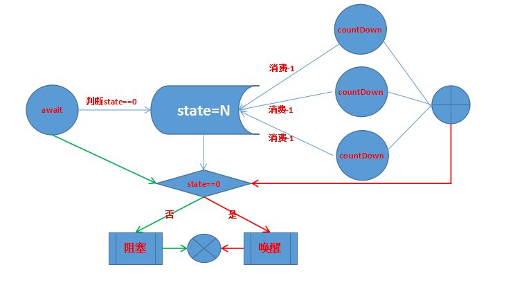
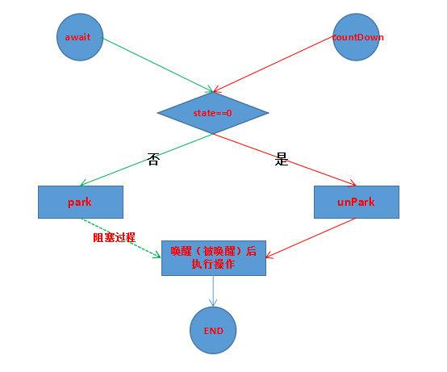

## CountDownLatch源码分析
> 基于AQS的共享节点队列实现的线程协同工具，俗称门栓，至于为什么使用共享节点，因为设置的共享变量state>=1，
在多线程情况下，非独占模式，在state>=0的情况下，每个线程都有资格获得资源，当一个线程获得资源后，有义务通知后面的线程继续获得资源。

先上图，CountDownLatch的状态流转图和流程图如下：




来自官方的实例：
### 使用示例

```
//此示例相当于实现了CyclicBarrier的功能
class Driver { // ...
  void main() throws InterruptedException {
    CountDownLatch startSignal = new CountDownLatch(1);
    CountDownLatch doneSignal = new CountDownLatch(N);

    for (int i = 0; i < N; ++i) // create and start threads
      new Thread(new Worker(startSignal, doneSignal)).start();

    doSomethingElse();            // don't let run yet
    startSignal.countDown();      // let all threads proceed
    doSomethingElse();
    doneSignal.await();           // wait for all to finish
  }
}
class Worker implements Runnable {
   private final CountDownLatch startSignal;
   private final CountDownLatch doneSignal;
   Worker(CountDownLatch startSignal, CountDownLatch doneSignal) {
     this.startSignal = startSignal;
     this.doneSignal = doneSignal;
   }
   public void run() {
     try {
       startSignal.await();
       doWork();
       doneSignal.countDown();
     } catch (InterruptedException ex) {} // return;
   }

   void doWork() { ... }
}

class Driver2 { // ...
  void main() throws InterruptedException {
    CountDownLatch doneSignal = new CountDownLatch(N);
    Executor e = ...

    for (int i = 0; i < N; ++i) // create and start threads
      e.execute(new WorkerRunnable(doneSignal, i));

    doneSignal.await();           // wait for all to finish
  }
}

class WorkerRunnable implements Runnable {
  private final CountDownLatch doneSignal;
  private final int i;
  WorkerRunnable(CountDownLatch doneSignal, int i) {
    this.doneSignal = doneSignal;
    this.i = i;
  }
  public void run() {
    try {
      doWork(i);
      doneSignal.countDown();
    } catch (InterruptedException ex) {} // return;
  }

  void doWork() { ... }
}
```

### CountDownLatch定义

```
public class CountDownLatch {

    //内部类实现AQS，初始化时设置state的初始值，不可重新开始，用完就废
    //使用共享节点实现：state>=1，非独占，可以多线程操作
    private static final class Sync extends AbstractQueuedSynchronizer {

        Sync(int count) {
            setState(count);
        }

        int getCount() {
            return getState();
        }

        //在acquireShared时都会先try下，对于CountDownLatch来说，await等待的是state==0，如果state变为0，表示资源都已经分配，可以继续接下来的工作了，否则阻塞等待
        //传入的acquires没啥意义
        protected int tryAcquireShared(int acquires) {
            return (getState() == 0) ? 1 : -1;
        }

        //每次释放资源，state=state-1，只有线程成功执行了state=state-1的操作，才能算是占有了资源，如果此时线程操作后的state变为0，那么方法返回true，
        在线程countDown执行到sync.releaseShared(1)时，就会继续执行doReleaseShared方法，其实就是唤醒共享节点队列中执行了await的线程
        //即：countDown获取资源，然后检查是否到了临界点，到了临界点，然后去通知执行了await后加入到共享节点队列的线程
        protected boolean tryReleaseShared(int releases) {
            // Decrement count; signal when transition to zero
            for (;;) {
                int c = getState();
                if (c == 0)
                    return false;
                int nextc = c-1;
                if (compareAndSetState(c, nextc))
                    return nextc == 0;
            }
        }
    }

    private final Sync sync;

    //初始化Sync，state
    public CountDownLatch(int count) {
        if (count < 0) throw new IllegalArgumentException("count < 0");
        this.sync = new Sync(count);
    }

    //可中断的等待，直到所设置的资源state==0或发生中断
    //如果state!=0，则添加到共享节点队列阻塞等待
    //执行的过程为：先tryAcquireShared，如返回值-1即<0，那么state尚未完全分配完，放入共享节点队列阻塞等待；
    //如果返回值1，则表示state变为0了，条件已经满足，直接执行下面的代码
    public void await() throws InterruptedException {
        sync.acquireSharedInterruptibly(1);
    }

    //带超时时间的等待
    public boolean await(long timeout, TimeUnit unit)
        throws InterruptedException {
        return sync.tryAcquireSharedNanos(1, unit.toNanos(timeout));
    }

    //释放资源，每次-1
    public void countDown() {
        sync.releaseShared(1);
    }

}
```

### countDown（AQS之releaseShared）

```
public final boolean releaseShared(int arg) {
    //CountDownLatch实现了此类，逻辑就是：如果state!=0就执行state-1，执行完毕后，如果state=0了，那就执行doReleaseShared（只有正常执行了-1操作的线程才有资格执行，而且只限最后一个线程）
    if (tryReleaseShared(arg)) {
        doReleaseShared();
        return true;
    }
    return false;
}

private void doReleaseShared() {
    for (;;) {
        Node h = head;
        if (h != null && h != tail) {
            int ws = h.waitStatus;
            //一般执行了CountDownLatch.await()方法的只有一个线程，会设置头结点的waitStatus=SIGNAL，并阻塞，所以走到此处，设置头结点的waitStatus=0,唤醒等待的线程（head.next）
            if (ws == Node.SIGNAL) {
                if (!compareAndSetWaitStatus(h, Node.SIGNAL, 0))
                    continue;            // loop to recheck cases
                //唤醒等待的线程，执行LockSupport.unpark(s.thread)
                unparkSuccessor(h);
            }
            //head的状态没变化，或者已经执行了唤醒，则设置头结点的waitStatus=PROPAGATE
            else if (ws == 0 &&
                     !compareAndSetWaitStatus(h, 0, Node.PROPAGATE))
                continue;                // loop on failed CAS
        }
        if (h == head)                   // loop if head changed
            break;
    }
}
```
### await（AQS之acquireSharedInterruptibly）

```
public final void acquireSharedInterruptibly(int arg)
            throws InterruptedException {
    if (Thread.interrupted())
        throw new InterruptedException();
    //tryAcquireShared只是判断当前state是否已经分配完毕，如果返回值为-1，表示还没有分配完，去执行doAcquireSharedInterruptibly操作，否则await直接结束
    if (tryAcquireShared(arg) < 0)
        doAcquireSharedInterruptibly(arg);
}

private void doAcquireSharedInterruptibly(int arg)
        throws InterruptedException {
    //创建共享节点加入到CLS队列
    final Node node = addWaiter(Node.SHARED);
    boolean failed = true;
    try {
        for (;;) {
            final Node p = node.predecessor();
            if (p == head) {
                //再次判断state的值，判断state是否已经分配完毕
                //存在这种情况：执行到此处时，最后一个执行countDown成功的的线程刚执行完tryReleaseShared，而执行await的线程恰好执行到此处，返回值r>0
                //执行countDown的线程执行doReleaseShared，执行await的线程执行setHeadAndPropagate，最终结果一样：头结点的waitStatus设为了PROPAGATE
                int r = tryAcquireShared(arg);
                //有可能第一次执行到此处时，执行countDown的线程比较快，state分配完毕速度快，就不用后面执行阻塞了，当然是理想状态下
                if (r >= 0) {
                    //将head指向执行await的线程节点，即将移除原先的head，head后移，并设置新head的waitStatus=PROPAGETE
                    setHeadAndPropagate(node, r);
                    p.next = null; // help GC
                    failed = false;
                    return;
                }
            }
            //执行到此处，肯定是state还没有分配完毕，此处代码执行情况分为第一次执行到此处和再次（包括以后多次）执行到此处
            if (shouldParkAfterFailedAcquire(p, node) &&
                parkAndCheckInterrupt())
                throw new InterruptedException();
        }
    } finally {
        if (failed)
            cancelAcquire(node);
    }
}

//执行await的线程，执行到此处，第一次头结点的waitStatus肯定为0，会执行到代码③处，设置head的waitStatus=SIGNAL，返回false，先不执行
//parkAndCheckInterrupt，以后再执行到此处时，head的waitStatus已经是SIGNAL了，那么此处返回true，接下来执行parkAndCheckInterrupt进行阻塞当前线程
private static boolean shouldParkAfterFailedAcquire(Node pred, Node node) {
    int ws = pred.waitStatus;
    if (ws == Node.SIGNAL)//①
        return true;
    if (ws > 0) {//②
        do {
            node.prev = pred = pred.prev;
        } while (pred.waitStatus > 0);
        pred.next = node;
    } else {//③
        compareAndSetWaitStatus(pred, ws, Node.SIGNAL);
    }
    return false;
}
```
