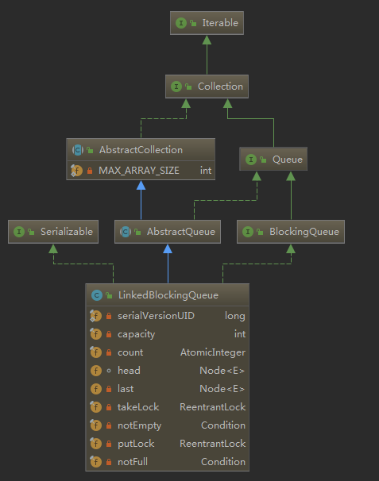
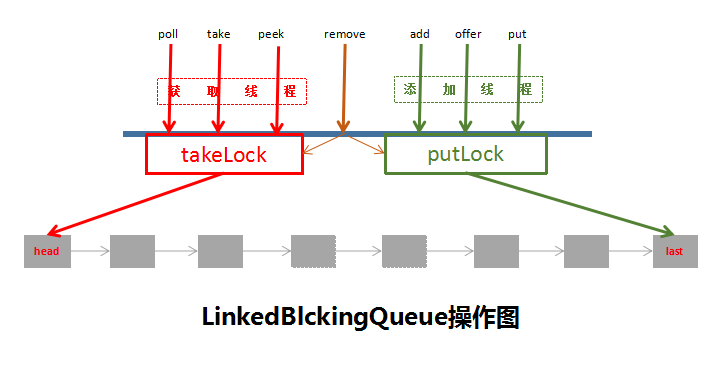

## LinkedBlockingQueue源码分析

> LinkedBlockingQueue使用链表结构实现头部元素出队，尾部添加元素入队，双端锁存取分离的有界同步阻塞容器，数据结构如下：
- capacity，final修饰，初始化后容器容量不可改变。
- count，原子计数，当前容器元素数量。
- head，链表头结点，Node结构，为标识节点，item为null。
- last，链表尾结点，Node结构。
- takeLock，头部锁，用于take/poll的操作。
- notEmpty，take等待条件。
- putLock，尾部锁，用于put/offer的操作。
- notFull，put等待条件。



LinkedBlockingQueue的方法使用特点：

| 方法名称 | 是否阻塞等待 | 是否（可）抛出异常 | 是否可设置超时 |
|:--------:|:------------:|:------------------:|:--------------:|
|   add    |      ×       |         √          |       ×        |
|   put    |      √       |         √          |       ×        |
|  offer   |      ×       |         √          |       √        |
|   take   |      √       |         √          |       ×        |
|   poll   |      ×       |         ×          |       √        |
|   peek   |      ×       |         ×          |       ×        |

#### put
> 阻塞等待；元素不能为null，否则抛出异常。

```
public void put(E e) throws InterruptedException {
    if (e == null) throw new NullPointerException();
    int c = -1;
    Node<E> node = new Node<E>(e);
    final ReentrantLock putLock = this.putLock;
    final AtomicInteger count = this.count;
    putLock.lockInterruptibly();
    try {
        //判断队列元素数量是否达到容量值，如果当前队列已满，则添加到notFull队列等待唤醒
        //此处使用while，循环判断和等待，具体原因如下：
        //因为多线程环境下，putLock只能一个线程持有，虽然takeLock的线程唤醒等待队列的线程，
        //但是被唤醒后不一定能抢到锁（使用的是非公平锁，恰巧被唤醒时有线程执行put操作，而且获得了锁），这种情况下操作失败，
        //只能继续阻塞等待
        while (count.get() == capacity) {
            notFull.await();
        }
        //入队，添加到尾结点
        enqueue(node);
        //增加容器元素数量，并返回添加此节点之前的元素个数
        c = count.getAndIncrement();
        //判断添加新节点之后元素数量是否超过容器容量值，如果容器尚有空间，唤醒等待notFull（等待执行put/offer操作）条件的线程
        if (c + 1 < capacity)
            notFull.signal();
    } finally {
        putLock.unlock();
    }
    //判断c==0，这种情况只有在本线程添加元素之前容器存在一个元素（因为初始化c=-1，此时的c表示本线程添加元素之前容器的元素数量），
    //此时唤醒那些等待notEmpty（等着执行poll等）条件的线程
    if (c == 0)
        signalNotEmpty();
}

//将新元素放到尾结点
private void enqueue(Node<E> node) {
    // assert putLock.isHeldByCurrentThread();
    // assert last.next == null;
    last = last.next = node;
}

//put线程唤醒take线程
//唤醒等待取元素的线程
private void signalNotEmpty() {
    final ReentrantLock takeLock = this.takeLock;
    //signal和await为什么在加锁条件下执行呢？
    //因为只有线程获得锁才能执行put或poll元素的操作，而在put或poll操作的时候，空间已满或者容器为空，获得锁的线程执行await或signal
    //此时的操作都是在加锁情况下完成的，只有获得了锁，才能让出锁，同样只有获得锁，往容器中添加了元素，才有资格唤醒其他线程
    takeLock.lock();
    try {
        notEmpty.signal();
    } finally {
        takeLock.unlock();
    }
}
```

#### add
> 调用了offer方法，失败抛出异常。

```
public boolean add(E e) {
    if (offer(e))
        return true;
    else
        throw new IllegalStateException("Queue full");
}
```

#### offer
> 非阻塞等待；元素不能为null；立即返回操作结果。

```
public boolean offer(E e) {
    //判断元素是否为null
    if (e == null) throw new NullPointerException();
    final AtomicInteger count = this.count;
    //当前容器已满，立即返回
    if (count.get() == capacity)
        return false;
    int c = -1;
    Node<E> node = new Node<E>(e);
    final ReentrantLock putLock = this.putLock;
    putLock.lock();
    try {
        //互斥锁，当前线程获得了锁，其他线程只能等待，所以当前容器尚有空间，则直接添加元素到尾结点
        if (count.get() < capacity) {
            enqueue(node);
            c = count.getAndIncrement();
            //判断容器是否已满，如果尚有空间，则唤醒notFull条件的线程（我要执行put/offer）
            if (c + 1 < capacity)
                notFull.signal();
        }
    } finally {
        putLock.unlock();
    }

    //同put
    if (c == 0)
        signalNotEmpty();
    return c >= 0;
}
```


#### take
> 可中断的阻塞等待。

```
public E take() throws InterruptedException {
    E x;
    int c = -1;
    final AtomicInteger count = this.count;
    final ReentrantLock takeLock = this.takeLock;
    takeLock.lockInterruptibly();
    try {
        //当前容器为空，阻塞等待，while使用同put方法
        //再说明下：即便是当前等待的线程正好是被唤醒的线程，因为是非公平锁，如果正好有线程过来也执行take/poll，而且获得了锁，那么被唤醒的线程只能继续等待
        while (count.get() == 0) {
            notEmpty.await();
        }

        //出队
        x = dequeue();
        //获得当前线程执行dequeue之前的容器元素数量
        c = count.getAndDecrement();
        //在此线程执行take之前，容器元素数量>1，当前线程取了一个元素之后，容器还有元素，可唤醒其他等到notEmpty的线程
        if (c > 1)
            notEmpty.signal();
    } finally {
        takeLock.unlock();
    }
    //当前线程执行take之前，容器已满，因为当前线程取了一个元素，有空闲空间，可以执行notFull条件队列的唤醒操作
    if (c == capacity)
        signalNotFull();
    return x;
}

//实际有意义的出队节点为head.next，head只是队列标识节点，item为null
private E dequeue() {
    // assert takeLock.isHeldByCurrentThread();
    // assert head.item == null;
    Node<E> h = head;
    Node<E> first = h.next;
    h.next = h; // help GC
    head = first;
    E x = first.item;
    first.item = null;
    return x;
}

//take线程唤醒put线程，具体分析与signalNotEmpty一致
private void signalNotFull() {
    final ReentrantLock putLock = this.putLock;
    putLock.lock();
    try {
        notFull.signal();
    } finally {
        putLock.unlock();
    }
}
```

#### poll
> 非阻塞获取元素。

```
public E poll() {
    final AtomicInteger count = this.count;
    if (count.get() == 0)
        return null;
    E x = null;
    int c = -1;
    final ReentrantLock takeLock = this.takeLock;
    takeLock.lock();
    try {
        //容器非空，执行出队操作
        if (count.get() > 0) {
            x = dequeue();
            //队列元素数量-1，并返回出队之前队列元素的数量
            c = count.getAndDecrement();
            //之前元素个数>1，本线程执行完出队操作，容器中还有元素，唤醒等待notEmpty的线程
            if (c > 1)
                notEmpty.signal();
        }
    } finally {
        takeLock.unlock();
    }

    //唤醒等待notFull的线程，执行入队操作
    if (c == capacity)
        signalNotFull();
    return x;
}
```

#### peek
> 获取队首元素，不执行移除操作。

```
public E peek() {
    if (count.get() == 0)
        return null;
    final ReentrantLock takeLock = this.takeLock;
    takeLock.lock();
    try {
        Node<E> first = head.next;
        if (first == null)
            return null;
        else
            return first.item;
    } finally {
        takeLock.unlock();
    }
}
```

#### remove
> remove操作，需要同时持有putLock和takeLock，此时不允许添加和移除元素。

```
public boolean remove(Object o) {
    if (o == null) return false;
    fullyLock();
    try {
        for (Node<E> trail = head, p = trail.next;
             p != null;
             trail = p, p = p.next) {
            if (o.equals(p.item)) {
                unlink(p, trail);
                return true;
            }
        }
        return false;
    } finally {
        fullyUnlock();
    }
}

void fullyLock() {
    putLock.lock();
    takeLock.lock();
}

void fullyUnlock() {
    takeLock.unlock();
    putLock.unlock();
}
```
同时，contains、toArray、clear操作也会阻塞住所有线程。

最后来张总览图：


