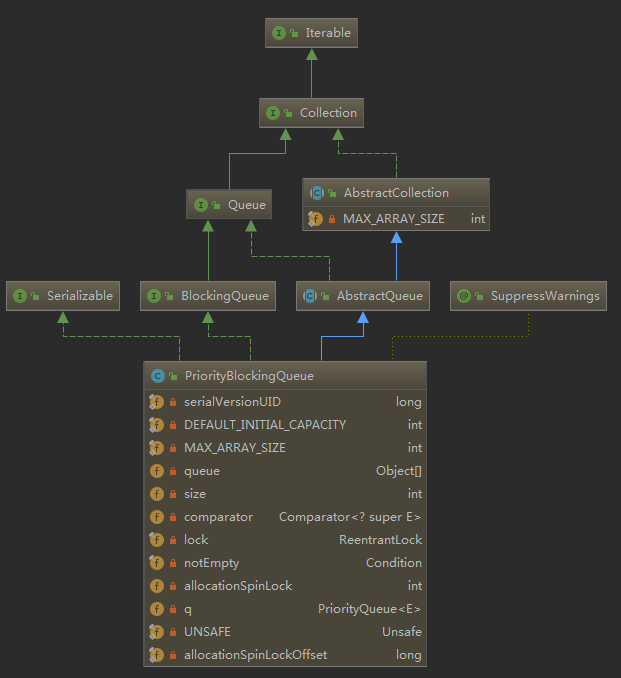
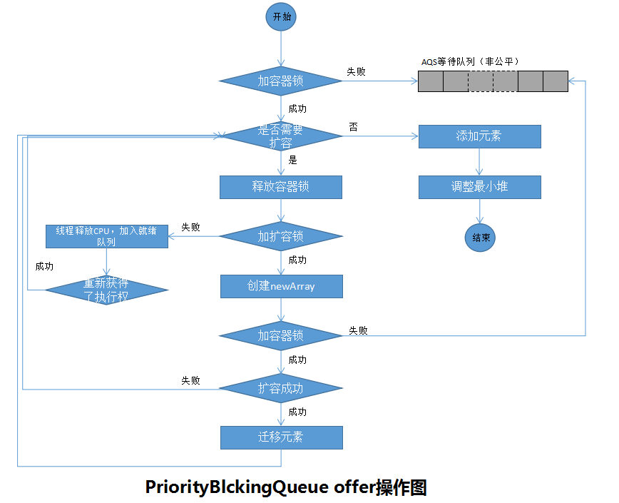
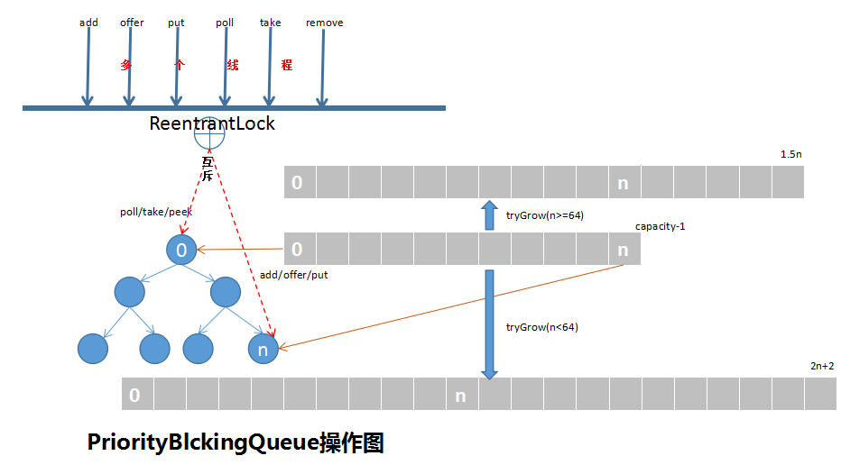

## PriorityBlockingQueue源码分析

> 优先级队列使用了二叉堆的数据结构，实现优先级排序，关于最大堆和最小堆：
最大堆：根结点的键值是所有堆结点键值中最大者，且每个结点的值都比其左右孩子的值大。
最小堆：根结点的键值是所有堆结点键值中最小者，且每个结点的值都比其左右孩子的值小。
PriorityBlockingQueue是使用最小堆来实现的可扩容的无界阻塞优先级队列，即元素值越小，优先级越高，其中添加的元素应该实现Comparable接口或者初始化时提供cmparator方法用于比较元素大小。
主要数据结构为：
- DEFAULT_INITIAL_CAPACITY，队列初始化默认容量大小。
- MAX_ARRAY_SIZE，队列容量最大值。
- queue，Object数组，非final修饰，可扩容，存放队列元素。
- size，队列元素数量。
- comparator，比较器，因为最小堆，队列对象排序比较。
- lock，ReentrantLock独占锁
- notEmpty，等待非空条件
- allocationSpinLock，volatile修饰，cas设值，值为0或1，用于扩容标识。
- q，PriorityQueue队列，序列化和反序列化使用，平常为null。

PriorityBlockingQueue类图结构如下：



PriorityBlockingQueue的方法使用特点：

| 方法名称 | 是否阻塞等待 | 是否（可）抛出异常 | 是否可设置超时 |
|:--------:|:------------:|:------------------:|:--------------:|
|   add    |      ×       |         √          |       ×        |
|   put    |      ×       |         √          |       ×        |
|  offer   |      ×       |         √          |       √        |
|   take   |      √       |         √          |       ×        |
|   poll   |      ×       |         ×          |       √        |
|   peek   |      ×       |         ×          |       ×        |

#### 初始化

```
public PriorityBlockingQueue() {
    this(DEFAULT_INITIAL_CAPACITY, null);
}
public PriorityBlockingQueue(int initialCapacity,
                                 Comparator<? super E> comparator) {
    if (initialCapacity < 1)
        throw new IllegalArgumentException();
    this.lock = new ReentrantLock();
    this.notEmpty = lock.newCondition();
    this.comparator = comparator;
    this.queue = new Object[initialCapacity];
}
```

#### add
> 内部调用offer实现。

```
public boolean add(E e) {
    return offer(e);
}
```
#### put
> 内部调用offer实现。


#### offer
> 独占锁加锁，添加值不能为null。

```
public boolean offer(E e) {
    if (e == null)
        throw new NullPointerException();
    final ReentrantLock lock = this.lock;
    lock.lock();
    int n, cap;
    Object[] array;
    //判断当前元素数量是否超出容器容量，如果超出容量，进行扩容。
    //虽然条件判断是在加锁条件下进行，且是独占锁，但是在执行tryGrow方法时会先释放锁，
    //通过使用allocationSpinLock变量cas设值获得扩容权限，然后在扩容完成后，重新获取锁。
    //为什么这么做呢？在tryGrow时再进行分析
    //while保证了容器一定满足存放元素的需求
    while ((n = size) >= (cap = (array = queue).length))
        tryGrow(array, cap);
    try {
        //添加的元素应该实现Comparable接口，优先使用配置的Comparator方法
        //每次添加元素，二叉堆会涉及到元素的排序，需要
        Comparator<? super E> cmp = comparator;
        if (cmp == null)
            siftUpComparable(n, e, array);
        else
            siftUpUsingComparator(n, e, array, cmp);
        size = n + 1;
        //唤醒执行take等待notEmpty条件的线程
        notEmpty.signal();
    } finally {
        lock.unlock();
    }
    return true;
}
```

#### tryGrow
> 用于容器扩容，扩容策略：
1、释放容器锁；
2、获得扩容锁；
3、创建扩容后的新容器；
4、获得扩容锁失败的线程，让出CPU执行权，线程进入就绪状态，等待cpu重新调度执行（Thread.yield()不可中断）；
5、扩容完成的线程或者重新获得调度执行的线程，重新获取容器锁，进行元素的迁移。
6、返回继续执行添加元素操作。

```
private void tryGrow(Object[] array, int oldCap) {
    //先释放锁（操作容器元素和扩容使用的不同锁），实现锁分离，毕竟添加元素的时候有可能存在其他线程执行poll等取元素的操作，
    //不能因为扩容导致其他线程的正常工作，避免长时间阻塞
    lock.unlock(); //①
    Object[] newArray = null;
    //获得扩容锁，即allocationSpinLock值由0变1，表示获得扩容锁
    //注意：此处可能会存在多个线程执行了创建newArray的操作，原因：
    //假设线程1添加元素的时候发现容器容量不够，需要扩容，执行到此处，释放了容器锁，获得了扩容锁进行扩容；
    //此时线程2也执行添加元素操作，因为线程1释放了锁，而线程2获得了容器锁，发现容量不够，也需要扩容，同样释放了容器锁；
    //因为此时线程1还在进行新容器newArray的创建，线程2执行if判断发现获得扩容锁失败，那么会执行③处newArray==null的代码，肯定为true，释放CPU执行权，等待重新调度；
    //等到线程2重新获得调度后，重新获得锁，会执行while循环判断是否容量足够（线程1是否执行完了扩容），扩容完了继续执行offer下面的操作；否则还会进入tryGrow方法；
    //假设线程1执行的有点慢，还没扩容完毕，线程2又进入了tryGrow方法，执行到②处时，刚好线程1创建newArray完毕，释放了allocationSpinLock锁，线程2获得了allocationSpinLock锁，
    //那么线程2就会执行newArray的创建工作，虽然后来，但是也许自己就是真正实现扩容的呢，毕竟非公平锁，万一执行完创建newArray后，线程1还在排队等待容器锁呢
    if (allocationSpinLock == 0 &&
        UNSAFE.compareAndSwapInt(this, allocationSpinLockOffset,
                                 0, 1)) {//②
        try {
            //计算扩容后容器新的容量值
            //如果当前容量<64，新容量=2*oldCap+2,即翻倍扩容，否则新容量=1.5*oldCap
            int newCap = oldCap + ((oldCap < 64) ?
                                   (oldCap + 2) : // grow faster if small
                                   (oldCap >> 1));
            //扩容后容量不能超过允许的最大容量
            if (newCap - MAX_ARRAY_SIZE > 0) {    // possible overflow
                int minCap = oldCap + 1;
                if (minCap < 0 || minCap > MAX_ARRAY_SIZE)
                    throw new OutOfMemoryError();
                newCap = MAX_ARRAY_SIZE;
            }

            //扩容
            if (newCap > oldCap && queue == array)
                newArray = new Object[newCap];
        } finally {
            //释放锁
            allocationSpinLock = 0;
        }
    }

    //多线程竞争扩容时，如果线程竞争扩容锁失败，执行到此处，释放CPU执行权，等待CPU重新调度
    //为什么这么做？线程执行到扩容，表示容器容量不够，既然本线程没有获得扩容的权限，容器容量又不够，那就等到其他线程扩容完毕后再进行后续操作
    //线程执行了Thread.yield()，并不一定能等到其他线程扩容完毕，但是在offer方法中，扩容方法tryGrow是包含在while循环中的，直到达到满足条件
    if (newArray == null)//③
        Thread.yield();
    //重新获得锁操作容器：非公平锁，有可能后来者先得
    lock.lock();//④
    //此处只有真正执行了扩容且在扩容前后容器并未发生变化的线程才会执行新旧容器赋值和元素迁移
    //因为是独占锁，加了锁，其他线程是没有办法存取元素的，阻塞住其他线程，保证了容器迁移的安全性
    //注意：此处不一定是先创建了newArray的线程一定会执行，有可能后面的线程执行速度快，先获得了容器锁，进行旧容器的迁移操作，但肯定有且只有一个线程进行元素迁移的
    if (newArray != null && queue == array) {//⑤
        queue = newArray;
        System.arraycopy(array, 0, newArray, 0, oldCap);
    }
}
```
综上，PriorityBlockingQueue的添加元素操作，因为队列时无界的，除了获得独占锁，无需执行await操作。附上offer操作流程图：



#### siftUp
> 使用堆排序的上浮操作，使添加元素后的堆重新构成最小堆。
最小堆添加了元素，需要将新元素放到合适的位置，达到最小堆，即如果新元素大于父元素，则与父元素交换，循环操作，直至找到比新元素小的节点。

```
private static <T> void siftUpComparable(int k, T x, Object[] array) {
    Comparable<? super T> key = (Comparable<? super T>) x;
    while (k > 0) {
        int parent = (k - 1) >>> 1;
        Object e = array[parent];
        if (key.compareTo((T) e) >= 0)
            break;
        array[k] = e;
        k = parent;
    }
    array[k] = key;
}

private static <T> void siftUpUsingComparator(int k, T x, Object[] array,
                                       Comparator<? super T> cmp) {
    while (k > 0) {
        int parent = (k - 1) >>> 1;
        Object e = array[parent];
        if (cmp.compare(x, (T) e) >= 0)
            break;
        array[k] = e;
        k = parent;
    }
    array[k] = x;
}
```


#### poll
> 加锁操作，获取堆顶元素，需要重新调整堆至最小堆。

```
public E poll() {
    final ReentrantLock lock = this.lock;
    lock.lock();
    try {
        return dequeue();
    } finally {
        lock.unlock();
    }
}

private E dequeue() {
    int n = size - 1;
    if (n < 0)
        return null;
    else {
        Object[] array = queue;
        E result = (E) array[0];
        E x = (E) array[n];
        array[n] = null;
        Comparator<? super E> cmp = comparator;
        if (cmp == null)
            siftDownComparable(0, x, array, n);
        else
            siftDownUsingComparator(0, x, array, n, cmp);
        size = n;
        return result;
    }
}    
```

#### siftDown
> 移除堆顶元素后，需要重新构建最小堆。
移除堆顶元素后，最后一个元素放入根节点，然后从根节点开始，与左右孩子比较，如果大于孩子，则节点下移，如此循环操作，直到父节点小于左右孩子。

```
private static <T> void siftDownComparable(int k, T x, Object[] array, int n) {
    if (n > 0) {
        Comparable<? super T> key = (Comparable<? super T>)x;
        int half = n >>> 1;           // loop while a non-leaf
        while (k < half) {
            int child = (k << 1) + 1; // assume left child is least
            Object c = array[child];
            int right = child + 1;
            if (right < n &&
                ((Comparable<? super T>) c).compareTo((T) array[right]) > 0)
                c = array[child = right];
            if (key.compareTo((T) c) <= 0)
                break;
            array[k] = c;
            k = child;
        }
        array[k] = key;
    }
}

private static <T> void siftDownUsingComparator(int k, T x, Object[] array, int n, Comparator<? super T> cmp) {
    if (n > 0) {
        int half = n >>> 1;
        while (k < half) {
            int child = (k << 1) + 1;
            Object c = array[child];
            int right = child + 1;
            if (right < n && cmp.compare((T) c, (T) array[right]) > 0)
                c = array[child = right];
            if (cmp.compare(x, (T) c) <= 0)
                break;
            array[k] = c;
            k = child;
        }
        array[k] = x;
    }
}
```

#### take
> 加锁操作，不同于添加元素，take如果发现队列为空，会阻塞等待，此操作可中断。q

```
public E take() throws InterruptedException {
    final ReentrantLock lock = this.lock;
    lock.lockInterruptibly();
    E result;
    try {
        //获取元素失败，阻塞等待
        while ( (result = dequeue()) == null)
            notEmpty.await();
    } finally {
        lock.unlock();
    }
    return result;
}
```


#### peek
> 加锁操作，返回堆顶元素，但不移除。


```
public E peek() {
    final ReentrantLock lock = this.lock;
    lock.lock();
    try {
        return itemAt(takeIndex); // null when queue is empty
    } finally {
        lock.unlock();
    }
}
```

最后，附上PriorityBlockingQueue的概览图：


