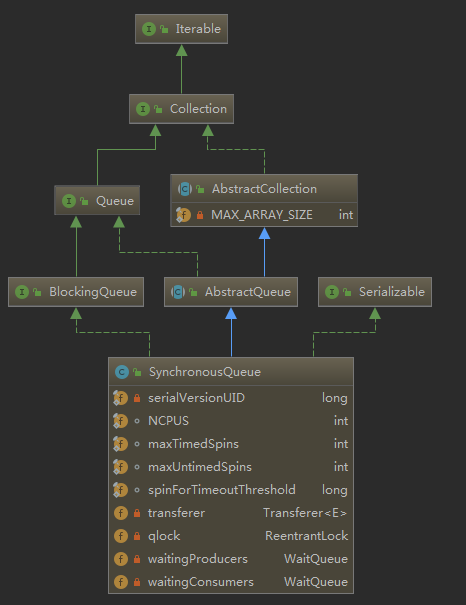
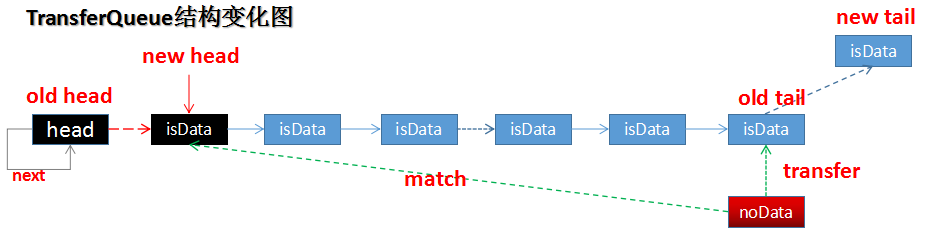
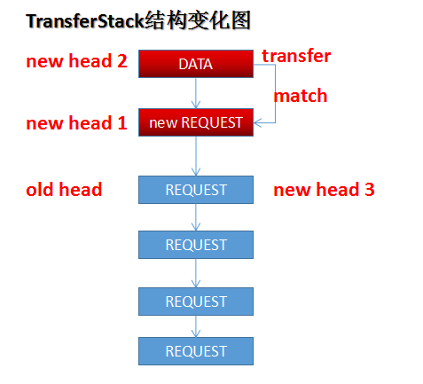

## SynchronousQueue源码分析

> 类似管道，生产-消费者模式，是一个没有容量的阻塞队列，线程添加元素，需要等待取元素的线程配对成功，才能继续操作，存与取是成对存在的。
内部数据结构为：
- NCPUS，机器CPU数目。
- maxTimedSpins，带有超时等待时的自旋次数。
- maxUntimedSpins，非超时等待的自旋次数。
- spinForTimeoutThreshold，线程从自旋到阻塞等待的自旋时间阈值。
- transferer，TransferStack（后进先出，使用栈实现非公平队列，即后来的线程先配对）或TransferQueue（先进先出，使用队列实现公平队列，即等待时间最久的线程先配对）。

SynchronousQueue的类图结构如下：


SynchronousQueue的方法使用特点：

| 方法名称 | 是否阻塞等待 | 是否（可）抛出异常 | 是否可设置超时 |
|:--------:|:------------:|:------------------:|:--------------:|
|   add    |      √       |         √          |       ×        |
|   put    |      √       |         √          |       ×        |
|  offer   |      √       |         √          |       √        |
|   take   |      √       |         √          |       ×        |
|   poll   |      √       |         ×          |       √        |

### 1、初始化
> 默认初始化为非公平队列。

```
public SynchronousQueue() {
    this(false);
}

public SynchronousQueue(boolean fair) {
    transferer = fair ? new TransferQueue<E>() : new TransferStack<E>();
}
```

### 2、add
> 添加元素，调用offer实现，但是添加失败会抛出异常。

```
public boolean add(E e) {
    if (offer(e))
        return true;
    else
        throw new IllegalStateException("Queue full");
}
```

#### 3、offer
> 元素为null抛出异常；然后调用transferer执行配对；可超时。

```
public boolean offer(E e) {
    //元素不能为null
    if (e == null) throw new NullPointerException();
    return transferer.transfer(e, true, 0) != null;
}
```

#### 4、put
> 元素为null抛出异常；与offer不同的是：不可超时，添加失败则清除中断标识，抛出中断异常。

```
public void put(E e) throws InterruptedException {
    if (e == null) throw new NullPointerException();
    if (transferer.transfer(e, false, 0) == null) {
        Thread.interrupted();
        throw new InterruptedException();
    }
}
```
### 5、TransferQueue

#### QNode
```
static final class QNode {
    volatile QNode next;          // next node in queue
    volatile Object item;         // CAS'ed to or from null
    volatile Thread waiter;       // to control park/unpark
    final boolean isData;

    QNode(Object item, boolean isData) {
        this.item = item;
        this.isData = isData;
    }

    //cas设置next节点
    boolean casNext(QNode cmp, QNode val) {
        return next == cmp &&
            UNSAFE.compareAndSwapObject(this, nextOffset, cmp, val);
    }

    //cas设置item值
    boolean casItem(Object cmp, Object val) {
        return item == cmp &&
            UNSAFE.compareAndSwapObject(this, itemOffset, cmp, val);
    }

    //cas设置节点取消状态：即next=this
    void tryCancel(Object cmp) {
        UNSAFE.compareAndSwapObject(this, itemOffset, cmp, this);
    }

    //判断节点是否已经取消
    boolean isCancelled() {
        return item == this;
    }

    //判断节点是否脱离队列
    boolean isOffList() {
        return next == this;
    }
}
```

#### 5.1 TransferQueue.transfer
> 生产者(put之类请求)的transfer请求e不为null，消费者（poll之类请求）e为null。
公平模式的请求配对，是尾部判断，头部匹配，可以这么理解：
如果新来的请求与尾部的请求相同，而当前模式下为公平模式，先来者还没有完成匹对，新来者就只能排队等待。
如果新来的请求与尾部的请求不同，说明前面有配对需求，那么直接从头部开始匹配。
这种方式，很好的处理了公平性原则。

```
E transfer(E e, boolean timed, long nanos) {
    QNode s = null;
    //判断是否数据节点
    //如果传入的为null，表示是消费者
    boolean isData = (e != null);

    //自旋，无限循环
    for (;;) {
        QNode t = tail;
        QNode h = head;
        //尚未初始化队列，返回继续自旋
        if (t == null || h == null)   
            continue;               

        // h==t表示队列为空
        // t.isData == isData表示尾部等待的线程与当前线程是同一种模式的节点（都是生产节点或者都是消费节点）
        if (h == t || t.isData == isData) {
            //获得尾结点的下一节点
            QNode tn = t.next;
            //发生了不一致读，即尾结点发生了变动（因为多线程环境，tail为volatile修饰，多线程保证可见性），重新自旋
            if (t != tail)
                continue;
            //如果尾结点的下一节点不为null（添加了相同模式的新节点，即已经执行过t.casNext，新节点已经添加到尾结点的next），则更新尾结点，重新自旋
            if (tn != null) {
                advanceTail(t, tn);
                continue;
            }

            //执行到此步：t==tail，且tail.next==null
            //设置了超时，达到超时条件，因为队列尾结点与当前节点是相同模式节点，配对失败，直接返回null
            if (timed && nanos <= 0)        // can't wait
                return null;

            //执行到此步：不允许超时或者等待时间>0

            //如果新节点尚未初始化，初始化新节点
            if (s == null)
                s = new QNode(e, isData);

            //将新节点设置为尾结点的next
            //如果添加失败（此种情况表示存在多线程竞争，有其他线程已经添加了节点），重新自旋
            if (!t.casNext(null, s))
                continue;

            //将s节点添加成功到队列中，更新尾结点，始终保持tail指向最后一个节点
            advanceTail(t, s);
            Object x = awaitFulfill(s, e, timed, nanos);
            //判断当前线程节点是否发生中断被取消等待配对（tryCancel时会将QNode.item设置为当前QNode）
            if (x == s) {
                //如果s不为尾结点，则直接移除，否则设置cleanMe变量为s的前驱                   
                clean(t, s);
                return null;
            }
            //x!=s，表示被其他请求节点完成了配对请求，并被唤醒，此时x为请求节点的item值
            //完成配对后，会设置head.next=head，释放旧的head节点，判断此节点是否已经unlinked
            if (!s.isOffList()) {          
                //如果s的前驱t为head节点，则更新head指向s
                advanceHead(t, s);       
                //如果当前节点是请求数据节点，即consumer
                if (x != null)            
                    s.item = s;//cancelled节点就是此处理方式
                //将节点的线程置为null
                s.waiter = null;
            }
            //返回配对结果
            return (x != null) ? (E)x : e;

        } else { //当前线程配对请求时，与尾结点的isData不同，即一个是数据节点一个是请求节点，正好配对                          
            QNode m = h.next;               
            //如果尾节点发生变化或者队列为空，或者头结点发生变化，发生不一致读，存在其他线程竞争，重新循环
            if (t != tail || m == null || h != head)
                continue;                  

            //取第一个请求的线程节点
            Object x = m.item;
            //如果正常匹配，最终当前请求节点与第一个节点匹配成功，并且将请求节点的item值设置到第一个节点的item中去
            if (isData == (x != null) ||    // 判断两个节点模式是否相同（配对相同后），如果为false继续
                x == m ||                   // 判断m节点是否中断取消，如果 为false继续
                !m.casItem(x, e)) {         // cas将请求节点的item值设置到第一个节点的item中，如果cas设值失败，说明有其他线程匹配第一个节点成功，重新设置head指向，然后下一次循环
                //第一个数据节点已经完成了配对，重新定位head节点，然后重试
                advanceHead(h, m);
                continue;
            }

            //新节点与第一个节点完成配对和设置item操作，修正head指向
            advanceHead(h, m);         
            //唤醒第一个节点等待的线程
            LockSupport.unpark(m.waiter);
            //返回匹配的数据
            return (x != null) ? (E)x : e;
        }
    }
}
```
#### 5.2 TransferQueue.clean
> 清理cancelled节点，清理原则：
1、如果节点为尾结点，则设置cleanMe节点，等待后续清理。
2、如果节点不是尾结点，则直接清理cancelled节点。

```
void clean(QNode pred, QNode s) {
    //清空当前QNode的等待线程值
    s.waiter = null;

    //t==pred为true
    //初始情况下pred.next==s为true，因为clean之前设置了t.casNext(null,s)，所以此处t不一定是倒数第二个节点，但肯定是s的前继节点
    //只有新加入的节点为t的next节点才执行，此处是pred.next==s为true，除非s节点已经从队列中移除
    while (pred.next == s) {
        QNode h = head;
        QNode hn = h.next;  
        //定位head节点
        //先判断head的next节点是否已经被取消，如果被取消，则更新head节点，重新循环
        if (hn != null && hn.isCancelled()) {
            advanceHead(h, hn);
            continue;
        }

        QNode t = tail;      
        //如果tail==head，表示队列空，直接返回
        if (t == h)
            return;
        QNode tn = t.next;
        //如果尾结点发生了变更，重新循环，保证t指向尾结点
        if (t != tail)
            continue;
        //尾结点插入了新的节点，更新尾结点，始终保证tail指向尾结点
        if (tn != null) {
            advanceTail(t, tn);
            continue;
        }

        //中间节点中断取消等待后，执行unlink操作
        //到此步，tail为队列的尾结点，而t也指向tail，如果s!=t为true，说明s不是最后一个节点
        if (s != t) {
            QNode sn = s.next;
            //1、如果s==s.next，表示s节点已经unlink，则clean结束；
            //2、s!=s.next，即s尚未unlink，则执行s节点的unlink操作，即设置pred的next指向，即删除s节点,clean流程结束
            if (sn == s || pred.casNext(s, sn))
                return;
        }

        //执行到此处，说明s节点为队列最后一个节点，而根据SynchronousQueue的规则，最后一个节点不能直接unlink，需要使用cleanMe变量记录它的前驱节点pred
        QNode dp = cleanMe;

        //s节点取消之前，有取消的尾结点，执行之前取消节点的unlink操作
        if (dp != null) {
            QNode d = dp.next;
            QNode dn;
            if (d == null ||               // ① d为null，即dp为尾结点，即之前cancelled节点已经unlink，dp没有关联节点了，变为无效节点，执行casCleanMe or
                d == dp ||                 // ② d不为null且dp.next==d，表示dp自身执行了unlink，变为无效节点，执行casCleanMe or
                !d.isCancelled() ||        // ③ d不为null，没有执行unlink，且d 没有被cacelled，表示dp节点有效，执行casCleanMe or
                (d != t &&                 // ④ d被取消了，并且d不是尾结点 and d.next不为null，表示d不是最后一个节点 and d.next!=d，表示d未执行unlink
                 (dn = d.next) != null &&   
                 dn != d &&                
                 dp.casNext(d, dn)))       // 因为d执行了取消，并且上面判断了d不是最后一个节点，则更新dp.next，即把d节点从队列中移除了
                casCleanMe(dp, null);      //满足①、②、③、④中任何一个条件，dp的任务已经完成，更新cleanMe变量值
            //如果cleanMe==pred，表示已经设置了s节点的前驱为cleanMe，直接返回
            if (dp == pred)
                return;      
        } else if (casCleanMe(null, pred))//设置s的前驱为cleanMe
            return;         
    }
}
```

#### 5.3 advanceTail
> 更新尾结点。

```
void advanceTail(QNode t, QNode nt) {
    if (tail == t)
        UNSAFE.compareAndSwapObject(this, tailOffset, t, nt);
}
```
#### 5.4 TransferQueue.awaitFulfill
> 当前节点如果与尾结点是同一类型（isData相同，同为生产者或者消费者），按照以下方式处理：
1、节点自旋等待；
2、自选过程中如果发生了中断，则取消当前节点；
3、如果自旋达到阈值次数，则阻塞等待。

```
Object awaitFulfill(QNode s, E e, boolean timed, long nanos) {
    //计算等待截止时间：如果允许超时，则当前时间+超时时间；否则为0
    final long deadline = timed ? System.nanoTime() + nanos : 0L;
    //获得当前线程
    Thread w = Thread.currentThread();
    //获得需要自旋的次数
    //如果当前节点==head.next，表示等待时间最久的节点
    //如果允许超时，则自旋次数为maxTimedSpins，否则为maxUntimedSpins
    //如果当前节点!=head.next，则自旋值为0，即前面有等待的其他节点，不需要自旋
    int spins = ((head.next == s) ?
                 (timed ? maxTimedSpins : maxUntimedSpins) : 0);
    //自旋，死循环，直到发生中断退出或者配对的请求达到
    for (;;) {
        //如果当前线程发生了中断，则cas设置QNode的item为s（即当前QNode）
        if (w.isInterrupted())
            s.tryCancel(e);
        Object x = s.item;
        //QNode的item发生改变，发生了中断或者配对的请求已经到达
        if (x != e)
            return x;
        //允许超时情况下
        if (timed) {
            //是否超时
            nanos = deadline - System.nanoTime();
            //当前节点等待时间已经超时了
            if (nanos <= 0L) {
                //同中断时一样，设置item为当前QNode,重新自旋，下一循环会返回
                s.tryCancel(e);
                continue;
            }
        }
        //计算自旋次数（当前节点为head.next）
        if (spins > 0)
            --spins;
        //设置QNode的等待线程值为当前线程
        else if (s.waiter == null)
            s.waiter = w;
        //设置了等待线程，但没有设置超时时间，则阻塞当前线程（不设置超时时间的阻塞）
        else if (!timed)
            LockSupport.park(this);
        //如果剩余的超时等待时间大于自旋阈值时间，则阻塞当前线程（设置超时时间的阻塞）
        else if (nanos > spinForTimeoutThreshold)
            LockSupport.parkNanos(this, nanos);
    }
}

//将当前QNode的item值设置为QNode自己
void tryCancel(Object cmp) {
    UNSAFE.compareAndSwapObject(this, itemOffset, cmp, this);
}
```

### 6、TransferStack
> 实现非公平模式的队列。

#### 6.1 SNode
> TransferStack用于匹配的数据结构，相比TransferQueue节点的QNode，多了match匹配节点，QNode判断生产消费使用的是isData，而SNode使用的是mode。

```
static final class SNode {
    //下一节点
    volatile SNode next;     
    //跟此节点匹配的Node
    volatile SNode match;      
    //当前线程
    volatile Thread waiter;    

    //item和mode非volatile修饰，因为都是初始化先写入，后面再读
    Object item;                
    int mode;

    SNode(Object item) {
        this.item = item;
    }

    boolean casNext(SNode cmp, SNode val) {
        return cmp == next &&
            UNSAFE.compareAndSwapObject(this, nextOffset, cmp, val);
    }


    //尝试与s节点匹配，完成匹配唤醒本节点
    //如果完成匹配，返回true，否则返回false
    boolean tryMatch(SNode s) {
        if (match == null &&
            UNSAFE.compareAndSwapObject(this, matchOffset, null, s)) {
            Thread w = waiter;
            if (w != null) {    // waiters need at most one unpark
                waiter = null;
                LockSupport.unpark(w);
            }
            return true;
        }
        return match == s;
    }

    //尝试取消等待，设置match节点为本节点自己
    void tryCancel() {
        UNSAFE.compareAndSwapObject(this, matchOffset, null, this);
    }

    //判断是否节点已取消匹配：match设的值为自身
    boolean isCancelled() {
        return match == this;
    }
}
```

#### 6.2 TransferStack.transfer
> 使用链表实现栈先进后出的效果，进而实现非公平模式匹配（head指向栈顶，每次新加入的节点设置成head），匹配的规则如下：
- 1、每次的请求进来要么为生产者（SNode.mode为01），要么为消费者（SNode.mode为00）。
- 2、每次新的线程进来，创建的节点都会插入到头结点（抢先匹配，非公平）。
- 3、如果栈为空或者当前节点的mode与栈顶节点的mode相同（否则进行第4步），表示有相同mode的请求在等待，那么将此节点放入栈顶（设为head），自旋然后（超时）阻塞等待。
- 4、如果当前栈不为空并且栈顶元素的mode与新请求的mode不相同，且当前请求的head尚未进行匹配（如果当前head正在进行匹配，则进行第5步），那么新请求可以尝试匹配，将新请求添加到栈顶（设为head），与next节点配对匹配，成功则返回。
- 5、如果当前栈顶head正在进行配对，则当前线程协助栈顶元素配对，配对成功，设置新的head指向。

```
E transfer(E e, boolean timed, long nanos) {
    SNode s = null;
    //生产者存入数据（传入对象），消费者请求数据（传入null）
    int mode = (e == null) ? REQUEST : DATA;

    //死循环，知道完成匹配
    for (;;) {
        SNode h = head;
        //如果队列为空或者与头结点同等模式（与头结点同为生产者或者消费者）
        if (h == null || h.mode == mode) {
            //如果设置的不允许等待
            if (timed && nanos <= 0) {  
                //判断头结点是否已取消，如果已取消，则重新设置头结点
                if (h != null && h.isCancelled())
                    casHead(h, h.next);  
                else//队列中不存在当前满足条件的节点，又不允许超时，理解返回结果
                    return null;
            } else if (casHead(h, s = snode(s, e, h, mode))) {//非公平模式，新来的节点每次都是插入到头结点位置，下次等待mode不同的节点进行匹配，即:每次进来节点插入头部
                //线程自旋匹配，达到自旋阈值则阻塞（超时）等待匹配
                SNode m = awaitFulfill(s, timed, nanos);
                //返回的s节点的match等于自身，表示节点匹配被取消了，则执行节点清理
                if (m == s) {               // wait was cancelled
                    clean(s);
                    return null;
                }
                //自旋时完成匹配，或者等待超时唤醒，或者其他线程唤醒后，判断是否匹配成功
                //如果是匹配成功，头结点肯定不为null（因为要与头结点匹配，而且被唤醒的节点是头结点的后继节点）
                if ((h = head) != null && h.next == s)
                    //设置head的指向，即移除当前节点和head节点（这两节点已经完成了匹配）
                    casHead(h, s.next);  
                //如果为当前接待你为请求节点，则返回匹配节点的数据，否则返回当前节点的数据
                return (E) ((mode == REQUEST) ? m.item : s.item);
            }
        } else if (!isFulfilling(h.mode)) { //①存在待匹配的节点，且当前节点的mode与头结点不同；②头结点的mode为REQUEST或者DATA结点，尚未进行匹配，即头结点的mode为0000或者0001，正在阻塞等待匹配
            //判断头节点被中断取消了，更新头结点指向
            if (h.isCancelled())            
                casHead(h, h.next);     
            //设置s节点的mode为FULFILLING|mode，即s.mode=0010或者s.mode=0011,然后cas将当前节点设置为head，即新的请求进来总是尝试竞争匹配节点
            else if (casHead(h, s=snode(s, e, h, FULFILLING|mode))) {
                //死循环直到完成匹配或者没有后续节点等待匹配（结束循环，回到上层循环重新创建s节点，即按照新节点去匹配）
                for (;;) {
                    SNode m = s.next;       
                    //没有了后续节点（或者后继节点完成了匹配），那么当前节点无法完成匹配，重新按照新节点请求，重新开始上层for循环
                    if (m == null) { //☆   
                        //设置head节点为null，即队列为空
                        casHead(s, null);  //☆   
                        //将s置为null，下次重新创建新节点
                        s = null;
                        break; //回到主循环
                    }
                    //s后存在后续节点
                    SNode mn = m.next;
                    //因为进入到此步，当前节点head肯定与head.next的mode不同，进行尝试匹配，匹配成功后设置m节点的match值为s，并唤醒m节点
                    if (m.tryMatch(s)) {
                        //尝试cas设置头结点指向被匹配节点的next，即移除两个匹配完成的节点
                        casHead(s, mn);
                        return (E) ((mode == REQUEST) ? m.item : s.item);
                    } else  //s与m没有匹配成功（m可能中断取消，m.match=m,那么m.tryMatch(s)就为false），那么s协助清除m节点
                        s.casNext(m, mn);
                }
            }
        } else {//当前头结点正在执行匹配，即头结点的mode为0010或者0011
            //获得头结点的下一节点
            SNode m = h.next;
            //如果头结点的后继节点为null，表示没有了等待节点，则重置head指向
            //此处发生的原因：多线程下，恰巧之前的线程执行到☆处的时候，casHead还未成功，此时head的mode还是FULFILLING状态
            if (m == null)                  
                casHead(h, null);
            else {
                //记录下第三个节点
                SNode mn = m.next;
                //协助前两个节点进行匹配
                if (m.tryMatch(h))          
                    casHead(h, mn);
                else
                    //m节点无法匹配，移除m节点
                    h.casNext(m, mn);
            }
        }
    }
}
```
#### 6.3 TransferStack.awaitFulfill
> 线程自旋，死循环等待匹配，在自旋达到一定阈值后还没有等到相应的匹配，就阻塞等待。

```
SNode awaitFulfill(SNode s, boolean timed, long nanos) {

    //计算等待截止时间
    final long deadline = timed ? System.nanoTime() + nanos : 0L;
    //当前线程
    Thread w = Thread.currentThread();
    //如果节点位于头部或者尚处于自旋状态（未阻塞），表示当前节点有可能很快就获得匹配，在阻塞之前先进行自旋。
    //1、然后根据是否设置了超时，获取自旋次数；
    //2、如果存在其他节点等待，自旋次数为0。
    int spins = (shouldSpin(s) ?
                 (timed ? maxTimedSpins : maxUntimedSpins) : 0);
    for (;;) {
        //线程如果发生了中断，则尝试取消当前节点的匹配，即将SNode的match指向自己
        if (w.isInterrupted())
            s.tryCancel();
        SNode m = s.match;
        //如果match不为空，要么中断取消，要么匹配完成，直接返回
        if (m != null)
            return m;
        //判断是否超时
        if (timed) {
            nanos = deadline - System.nanoTime();
            if (nanos <= 0L) {
                s.tryCancel();
                continue;
            }
        }
        //自旋次数计算：每次循环更新自旋变量
        if (spins > 0)
            spins = shouldSpin(s) ? (spins-1) : 0;
        //设置节点线程
        else if (s.waiter == null)
            s.waiter = w;
        else if (!timed) //不允许超时的情况，直接阻塞
            LockSupport.park(this);
        else if (nanos > spinForTimeoutThreshold)//如果剩余时间在自旋阈值时间内，则设置时间的阻塞
            LockSupport.parkNanos(this, nanos);
    }
}

//判断节点s是否进行自旋
boolean shouldSpin(SNode s) {
    SNode h = head;
    //如果s为头结点，或者队列为空，或者头节点正在匹配中，当前节点自旋等待匹配
    return (h == s || h == null || isFulfilling(h.mode));
}

//判断节点是否是FULFILLING状态（在配对时，会将头结点的mode设置为FULFILLING|mode）
static boolean isFulfilling(int m) { return (m & FULFILLING) != 0; }
```
#### 6.4 TransferStack.clean

```
void clean(SNode s) {
    //设置s节点属性
    s.item = null;
    s.waiter = null;

    //找到s的节点
    SNode past = s.next;
    if (past != null && past.isCancelled())
        past = past.next;

    // 定位到有效的head节点（非空且没有canceled）
    SNode p;
    while ((p = head) != null && p != past && p.isCancelled())
        casHead(p, p.next);

    // 移除头结点至s.next节点之间所有cancelled节点
    while (p != null && p != past) {
        SNode n = p.next;
        if (n != null && n.isCancelled())
            p.casNext(n, n.next);
        else
            p = n;
    }
}
```
### 7、poll

```
public E poll() {
    return transferer.transfer(null, true, 0);
}
```

### 8、take
```
public E take() throws InterruptedException {
    E e = transferer.transfer(null, false, 0);
    if (e != null)
        return e;
    Thread.interrupted();
    throw new InterruptedException();
}
```

最后，附上SynchronousQueue节点处理和变化结构图：




