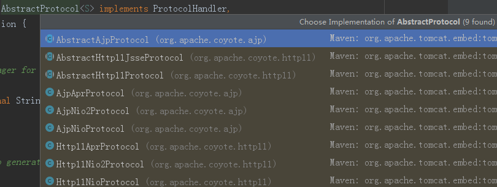

## Tomcat的启动流程分析之启动时容器初始化

### init分析

#### StandardServer的init
`StandardServer`的initInternal方法：
```java
protected void initInternal() throws LifecycleException {

    //省略...

    // 初始化StandardService，执行init方法，同样进入到LifecycleBase中的init方法，步骤同StandardServer一样，直接进入到StandardService的initInternal方法
    for (int i = 0; i < services.length; i++) {
        services[i].init();
    }
}
```
#### StandardService的init

`StandardService`的initInternal方法，service容器中组件比较多，会依次进行各组件的初始化工作，具体如下：
```java
protected void initInternal() throws LifecycleException {

    super.initInternal();

    //①执行StandardEngine的初始化
    if (engine != null) {
        engine.init();
    }

    //②执行线程池Executors的初始化
    for (Executor executor : findExecutors()) {
        if (executor instanceof JmxEnabled) {
            ((JmxEnabled) executor).setDomain(getDomain());
        }
        //执行StandardThreadExecutor的initernal方法，实际没执行什么东西
        executor.init();
    }

    //③也没执行具体的操作，实际执行的是LifecycleMBeanBase的方法
    mapperListener.init();

    //④执行Connectors的初始化
    synchronized (connectorsLock) {
        for (Connector connector : connectors) {
            try {
                //执行Connector类的initInternal方法
                connector.init();
            } catch (Exception e) {
                String message = sm.getString(
                        "standardService.connector.initFailed", connector);
                log.error(message, e);

                if (Boolean.getBoolean("org.apache.catalina.startup.EXIT_ON_INIT_FAILURE"))
                    throw new LifecycleException(message);
            }
        }
    }
}
```

#### StandardEngine的init

`StandardEngine`的initInternal方法:
```java
protected void initInternal() throws LifecycleException {
    // 获取身份认证相关
    getRealm();
    执行父类ContainerBase中的方法
    super.initInternal();
}

//ContainerBase方法，创建startStopExeutor线程池
protected void initInternal() throws LifecycleException {
    BlockingQueue<Runnable> startStopQueue = new LinkedBlockingQueue<>();
    startStopExecutor = new ThreadPoolExecutor(
            getStartStopThreadsInternal(),
            getStartStopThreadsInternal(), 10, TimeUnit.SECONDS,
            startStopQueue,
            new StartStopThreadFactory(getName() + "-startStop-"));
    startStopExecutor.allowCoreThreadTimeOut(true);
    super.initInternal();
}
```
#### Connector的init

执行Connector类的initInternal方法:
```java
protected void initInternal() throws LifecycleException {

    super.initInternal();

    // 请求处理适配器
    adapter = new CoyoteAdapter(this);
    protocolHandler.setAdapter(adapter);

    //省略...

    try {
				//调用AbstractProtocol类中的init方法，执行EndPoint初始化
        protocolHandler.init();
    } catch (Exception e) {
        throw new LifecycleException(
                sm.getString("coyoteConnector.protocolHandlerInitializationFailed"), e);
    }
}

#### Protocol的init

//AbstractProtocol的init方法
public void init() throws Exception {
  	//省略...

    String endpointName = getName();
    endpoint.setName(endpointName.substring(1, endpointName.length()-1));

    try {
				//执行socket绑定操作
        endpoint.init();
    } catch (Exception ex) {
        getLog().error(sm.getString("abstractProtocolHandler.initError",
                getName()), ex);
        throw ex;
    }
}
```
#### EndPoint的init

其中endpoint分为三类，如图：

此处protocol默认为Http11NioProtocol,AbstractProtocol的继承关系如下图：

endpoint.init()方法最终执行到AbstractEndpoint的init方法：
```java
public void init() throws Exception {
        if (bindOnInit) {
            bind();
            bindState = BindState.BOUND_ON_INIT;
        }
  }
```
以NioEndpoint为例：
```java
public void bind() throws Exception {

			//
      serverSock = ServerSocketChannel.open();
			//设置socket属性
      socketProperties.setProperties(serverSock.socket());
      InetSocketAddress addr = (getAddress()!=null?new InetSocketAddress(getAddress(),getPort()):new InetSocketAddress(getPort()));
			绑定地址
      serverSock.socket().bind(addr,getBacklog());
			//阻塞请求
      serverSock.configureBlocking(true);

      // 初始化acceptor线程数，默认值为1
      if (acceptorThreadCount == 0) {
          // FIXME: Doesn't seem to work that well with multiple accept threads
          acceptorThreadCount = 1;
      }
			//初始化Poller消费线程数，多CPU下默认为2
      if (pollerThreadCount <= 0) {
          //minimum one poller thread
          pollerThreadCount = 1;
      }
      setStopLatch(new CountDownLatch(pollerThreadCount));

      // Initialize SSL if needed
      initialiseSsl();

			//打开Selector
      selectorPool.open();
  }
```
以上是执行StandardServer的init()方法的整个流程。
